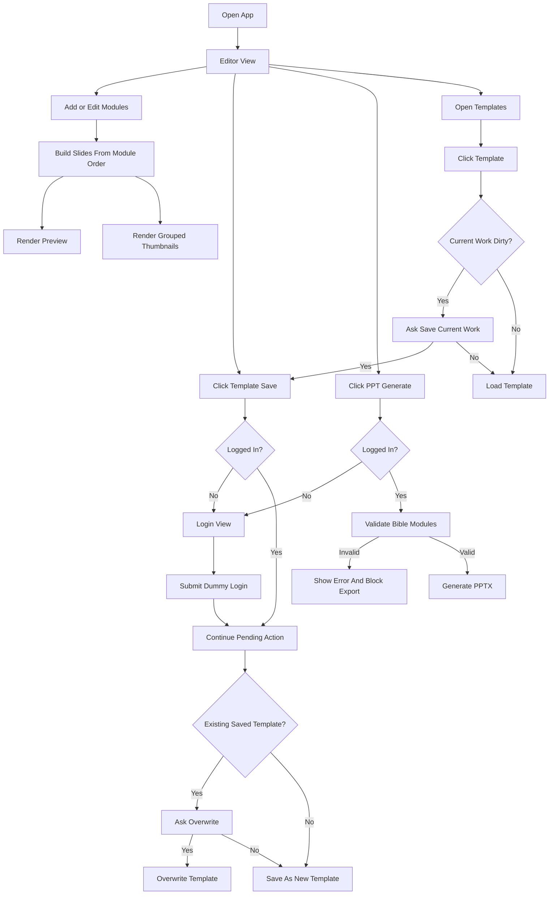

# Worship PPT Builder - AI Context

Purpose:
- Build a SaaS that helps pastors and worship staff create church worship PPT files.
- Current manual work time: 2-3 hours.
- Target work time: under 10 minutes.

Prototype:
- Live URL: https://junichikoon.github.io/worship-ppt-builder/
- Current implementation: static frontend prototype.
- Source files:
  - `index.html`
  - `styles.css`
  - `app.js`

Implementation Rule:
- Do not redesign from scratch.
- Treat the current prototype as the source of truth.
- Preserve existing UX and behavior unless a task explicitly changes it.
- Preview, thumbnails, and PPTX export must stay visually consistent.

---

## 1. Current Prototype Analysis

Screens:
- EditorView
  - Topbar
  - SideNav
  - BuilderPanel
  - PreviewPane
- LoginView
- TemplateBrowser
- SettingsPanel
- TemplateSaveModal
- ShareModal

Topbar:
- Template Save button
- PPT Generate button
- Share button
- Auth badge
- Project summary

SideNav:
- Builder
- Templates
- Settings
- My(disabled)

BuilderPanel:
- Template name input
- Panel template save button
- Module count
- Reset button
- Module list
- Add module grid

PreviewPane:
- Current slide preview
- Slide counter
- Module-grouped thumbnail strip

TemplateBrowser:
- Saved templates section
- Recommended templates section
- Saved template rename
- Saved template delete
- Template click target

SettingsPanel:
- PPT aspect ratio
  - 16:9
  - 4:3
- Global logo
  - ON/OFF
  - Upload
  - Change
  - Delete
  - Position: top-left, top-right, bottom-left, bottom-right

Auth:
- Dummy email login.
- Auth state stored in localStorage.
- Auth-gated actions:
  - Template Save
  - PPT Generate
  - Share

Storage:
- Editor state: localStorage key `church-ppt-builder-state-v1`
- Templates: localStorage key `church-ppt-builder-templates-v1`
- Auth: localStorage key `church-ppt-builder-auth-v1`

---

## 2. IA

Worship PPT Builder
├ Builder
│ ├ Template Name
│ ├ Module List
│ │ ├ Praise Module
│ │ ├ Hymn Module
│ │ ├ Bible Module
│ │ ├ Sermon Module
│ │ ├ Announcement Module
│ │ └ Custom Module
│ ├ Add Module
│ ├ Preview
│ └ Thumbnails
├ Templates
│ ├ Saved Templates
│ │ ├ Load
│ │ ├ Rename
│ │ └ Delete
│ └ Recommended Templates
│   └ Load
├ Settings
│ ├ PPT Aspect Ratio
│ │ ├ 16:9
│ │ └ 4:3
│ └ Global Logo
│   ├ Enable
│   ├ Disable
│   ├ Upload
│   ├ Change
│   ├ Delete
│   └ Position
├ Auth
│ ├ Login
│ └ Continue Pending Action
└ Export
  ├ Generate PPTX
  └ Share Dummy Link

---

## 3. Menu Structure

App
├ Topbar
│ ├ TemplateSaveButton
│ ├ PptGenerateButton
│ └ ShareButton
├ SideNav
│ ├ Builder
│ ├ Templates
│ ├ Settings
│ └ My(disabled)
├ ModulePanel
│ ├ BuilderPanel
│ ├ TemplateBrowser
│ └ SettingsPanel
└ PreviewPane
  ├ PreviewStage
  └ ThumbnailGroups

---

## 4. User Flow



---

## 5. ASCII Wireframe

```text
+--------------------------------------------------------------------------------+
| Brand / Summary                           [Template Save] [PPT Generate] [Share]|
+---------+-------------------------------+--------------------------------------+
| Menu    | Builder / Templates / Settings| Preview                              |
|         |                               |                                      |
| Builder | Template Name   [Save]        | +----------------------------------+ |
| Template|                               | | Current PPT Slide Preview        | |
| Settings| Modules [count] [Reset]       | |                                  | |
| My      | +---------------------------+ | +----------------------------------+ |
|         | | Module Card               | |                                      |
|         | | Inputs / Style / BG       | | Thumbnail Groups                    |
|         | +---------------------------+ | +----Group A----+ +----Group B----+ |
|         | Add Module Grid              | | 1 | 2 | 3     | | 4 | 5        | |
+---------+-------------------------------+--------------------------------------+
```

---

## 6. Feature Specification

### Feature: Module System

Purpose:
- Compose worship PPT by adding, duplicating, deleting, and reordering modules.

Inputs:
- Module type
- Module order
- Module settings

Outputs:
- Ordered slide list
- Preview
- Thumbnail groups
- PPTX slides

Business Rules:
- Slide order follows module order.
- All slides from one module must finish before the next module starts.
- One module can generate one or more slides.
- Module duplicate must copy the same content and settings.
- Module reorder uses drag-and-drop.

Validation Rules:
- Module list can be empty, but PPT generation must block if no slides exist.

Future Extension:
- Server-side persisted worship documents.
- Multi-user editing.

### Feature: Praise Module

Purpose:
- Generate lyric slides from praise song lyrics.

Inputs:
- Search query
- Selected song
- Manual lyrics text
- Split mode
- Font settings
- Background settings

Outputs:
- One or more lyric slides.

Business Rules:
- Search results appear only after typing.
- Selecting a song keeps the song title in the search input.
- Selecting a song hides the dropdown.
- Manual lyrics split by blank line / double Enter.
- Font settings affect preview, thumbnails, and PPTX.

Validation Rules:
- Empty text must not break slide rendering.

Future Extension:
- Real praise DB.
- Copyright metadata.
- Auto/manual line-break policy per template.

### Feature: Hymn Module

Purpose:
- Insert hymn score image as PPT slide.

Inputs:
- Hymn number or title search
- Selected hymn

Outputs:
- One image-based hymn slide.

Business Rules:
- Hymn module is image insertion only.
- No split/font/background setting for hymn score content.
- Current score image is dummy data URL / DB placeholder.

Validation Rules:
- Invalid hymn search should show no selectable result.

Future Extension:
- Real hymn score image DB.
- Multiple score pages.

### Feature: Bible Module

Purpose:
- Generate Bible passage slides.

Inputs:
- Testament
- Book
- Chapter
- Verse range
- Translation version
- Manual passage text
- Font settings
- Background settings

Outputs:
- One or more Bible slides.

Business Rules:
- DB passage uses selected testament/book/chapter/range.
- Manual passage text splits by blank line / double Enter.
- Translation version is dummy data in MVP.

Validation Rules:
- Book must exist.
- Chapter must exist.
- Verse start must exist.
- Verse end must exist.
- Verse start must be less than or equal to verse end.
- Invalid Bible range blocks PPT generation and shows error.

Future Extension:
- Real Bible DB/API.
- Multi-passage input.
- Overflow-based auto pagination.

### Feature: Sermon Module

Purpose:
- Generate sermon title slide.

Inputs:
- Sermon title
- Sermon series
- Title font settings
- Series font settings
- Background settings

Outputs:
- One sermon slide.

Business Rules:
- Sermon title maps to main large text.
- Sermon series maps to smaller supporting text.
- Title and series have independent font settings.

Validation Rules:
- Empty title uses fallback text.

Future Extension:
- Speaker name.
- Sermon date.
- Scripture reference.

### Feature: Announcement Module

Purpose:
- Generate church announcement cover and announcement list slides.

Inputs:
- Announcement item title
- Announcement item detail
- Item font settings
- Box background color
- Module background settings

Outputs:
- One cover slide.
- One or more announcement list slides.

Business Rules:
- Cover slide is always generated.
- Max 3 announcement items per list slide.
- 4th item starts the next announcement list slide.
- Item settings can be collapsed.

Validation Rules:
- Empty item title/detail must not break layout.

Future Extension:
- Image announcements.
- Structured date/location fields.
- Announcement-specific templates.

### Feature: Custom Module

Purpose:
- Generate reusable title or content slide.

Inputs:
- Custom slide type: title or content
- Title
- Subtitle
- Content title
- Content body
- Frequently used content preset
- Font settings
- Background settings

Outputs:
- One custom slide.

Business Rules:
- Title slide renders title and subtitle.
- Content slide renders content title and content body.
- Selecting preset fills title/body from dummy data.

Validation Rules:
- Empty content must preserve slide layout.

Future Extension:
- Organization-specific saved content.
- Multiple custom layouts.

### Feature: Template Management

Purpose:
- Save and reuse module composition and all settings.

Inputs:
- Template name
- Current modules
- Module order
- Module settings
- Presentation settings

Outputs:
- Saved template record
- Loaded editor state

Business Rules:
- Templates are stored in localStorage in MVP.
- Saved template and recommended template data are separated.
- Duplicate names append `(1)`, `(2)`.
- Existing saved template can be overwritten after confirm.
- Loading template applies modules, module order, module settings, and presentation settings.

Validation Rules:
- Template must contain valid modules.

Future Extension:
- Backend persistence.
- Organization-level template ownership.
- Version history.

### Feature: Global Settings

Purpose:
- Apply PPT-wide settings like slide master.

Inputs:
- Aspect ratio: 16:9 or 4:3
- Logo enabled
- Logo image
- Logo position

Outputs:
- Updated preview.
- Updated thumbnails.
- Updated PPTX.

Business Rules:
- Logo appears only when ON.
- Logo is semi-transparent.
- Logo is placed below other slide content.
- Aspect ratio affects preview, thumbnails, and PPTX dimensions.

Validation Rules:
- Logo upload accepts image files only.

Future Extension:
- Logo opacity.
- Logo size.
- Global font/theme.

### Feature: PPT Generate

Purpose:
- Export current worship document as PPTX.

Inputs:
- Current slides
- Presentation settings

Outputs:
- Downloaded `.pptx` file.

Business Rules:
- Requires login.
- Validates Bible modules before export.
- Generates PPTX in browser.

Validation Rules:
- No slides: block export.
- Invalid Bible range: block export.

Future Extension:
- Server-side PPT rendering.
- Export history.
- Google Slides export.

### Feature: Share

Purpose:
- Show dummy share flow in MVP.

Inputs:
- Current template id or demo id.

Outputs:
- Dummy share link.

Business Rules:
- Requires login.

Validation Rules:
- None in MVP.

Future Extension:
- Real share URL.
- Role-based permissions.
- Expiring links.

---

## 7. Domain Model Draft

Entity: User
- Responsibility: authenticated actor.
- Fields:
  - id
  - email
  - name
  - organizationIds
- Current Prototype:
  - dummy localStorage auth only.

Entity: Organization
- Responsibility: church/team workspace owner.
- Fields:
  - id
  - name
  - members
  - templates
  - worshipDocuments
- Current Prototype:
  - not implemented.

Entity: Membership
- Responsibility: relation between User and Organization.
- Fields:
  - id
  - userId
  - organizationId
  - role
- Current Prototype:
  - not implemented.

Entity: WorshipDocument
- Responsibility: current editable PPT composition.
- Fields:
  - id
  - name
  - modules
  - selectedModuleId
  - selectedSlideId
  - presentationSettings
- Current Prototype:
  - localStorage state.

Entity: Template
- Responsibility: reusable worship package.
- Fields:
  - id
  - name
  - source
  - schemaVersion
  - moduleOrder
  - modules
  - presentationSettings
  - createdAt
  - updatedAt
- Current Prototype:
  - localStorage saved templates and dummy recommended templates.

Entity: Module
- Responsibility: editable content block that generates slides.
- Fields:
  - id
  - type
  - collapsed
  - style
  - moduleSpecificSettings
- Types:
  - praise
  - hymn
  - bible
  - sermon
  - announcement
  - custom

Entity: Slide
- Responsibility: renderable/exportable PPT page.
- Fields:
  - id
  - moduleId
  - moduleName
  - localIndex
  - kind
  - lines
  - style
  - contentPayload

Entity: PresentationSettings
- Responsibility: global PPT settings.
- Fields:
  - aspectRatio
  - logoEnabled
  - logoDataUrl
  - logoPosition

Entity: ContentSource
- Responsibility: origin of worship content.
- Types:
  - dummyPraise
  - dummyHymn
  - dummyBible
  - customInput
- Future Types:
  - backendPraiseDb
  - backendHymnDb
  - backendBibleDb
  - organizationCustomDb

---

## 8. Development Notes For AI Agents

Current Architecture:
- Static single page app.
- No build step.
- No framework.
- Main state and logic live in `app.js`.
- UI shell lives in `index.html`.
- Visual system lives in `styles.css`.

Core Functions:
- `createModule(type)`
- `buildSlides()`
- `render()`
- `renderModules()`
- `renderPreview()`
- `renderThumbnails()`
- `validateBibleModule(module)`
- `requireAuth(action)`
- `createTemplateSnapshot(...)`
- `createTemplateRecord(...)`
- `downloadPpt()`
- `createPptxBlob(slides)`

Do Not Break:
- Existing module add/delete/duplicate/reorder.
- Preview and thumbnail consistency.
- PPTX generation.
- Template save/load.
- Dummy login continuation flow.
- localStorage persistence.

When Adding A Feature:
- Update state shape.
- Update createModule defaults if module-specific.
- Update render controls.
- Update event handlers.
- Update buildSlides if output changes.
- Update preview rendering.
- Update thumbnail rendering.
- Update PPTX XML rendering if visual output changes.
- Verify existing modules.

Testing Checklist:
- Open `index.html` in browser.
- Add each module type.
- Edit each module.
- Reorder modules.
- Duplicate modules.
- Delete modules.
- Select thumbnails.
- Save template.
- Load template.
- Change settings.
- Generate PPTX.

---

## 9. Future Documentation Order

1. PRD
- Lock MVP scope.
- Define release boundaries.
- Define acceptance criteria.

2. User / Organization Structure
- Define account and church/team model.

3. Data Ownership
- Define who owns templates, uploaded assets, worship documents.

4. RBAC
- Define owner/admin/editor/viewer permissions.

5. ERD
- Convert domain model into database schema.

6. API Specification
- Define backend/frontend contracts.

7. AI Implementation Task Breakdown
- Convert PRD into task-by-task implementation prompts.
