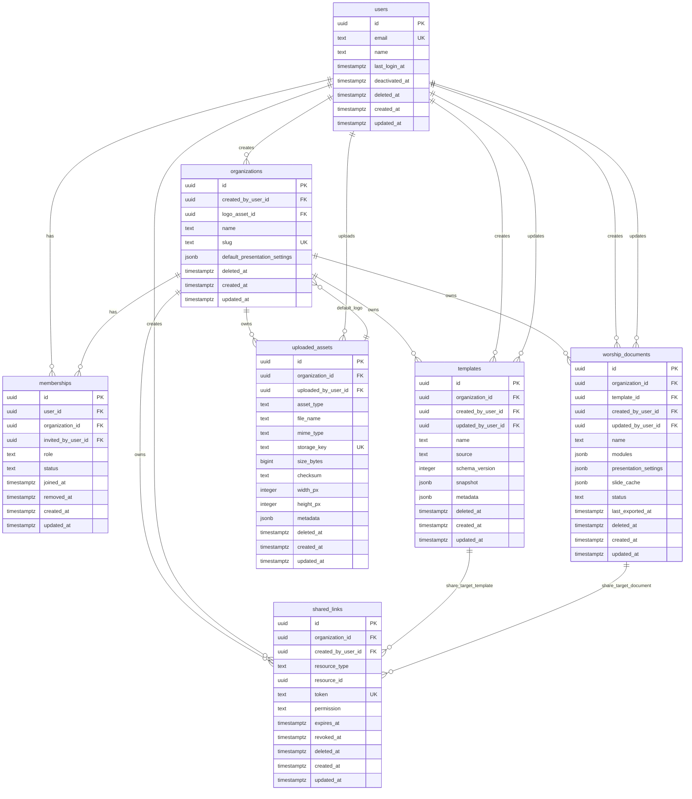

# Worship PPT Builder - Backend MVP ERD

Document Type:
- AI-friendly backend ERD document.

Database:
- PostgreSQL.

Source Policy Document:
- `docs/ORG_OWNERSHIP_RBAC.md`

Scope:
- Backend MVP.
- Organization-owned resource model.
- Membership-based RBAC.
- JSONB-based Module, Slide, and PresentationSettings.

Core Entities:
- User
- Organization
- Membership
- Template
- WorshipDocument
- UploadedAsset
- SharedLink

JSONB Concepts:
- Module: stored in `templates.snapshot` and `worship_documents.modules`.
- Slide: generated/derived; optionally cached in `worship_documents.slide_cache`.
- PresentationSettings: stored in `organizations.default_presentation_settings`, `templates.snapshot`, and `worship_documents.presentation_settings`.

---

## 1. Structure Decision

Selected Structure:
- Organization-first ownership.
- User access through Membership.
- Core resources include `organization_id`.
- Modules and presentation settings remain JSONB in MVP.
- Slides are derived from modules; not normalized as table rows in MVP.

Reason:
- Matches current prototype state model.
- Preserves frontend iteration speed.
- Avoids premature normalization of each module type.
- Prevents data loss when a staff member leaves a church.
- Supports future SaaS billing and RBAC by organization boundary.

Main Tradeoff:
- JSONB is less strict than fully normalized module tables.
- Application-level validation is required for module schemas.
- This is acceptable for MVP because module shapes are still evolving.

---

## 2. Mermaid ERD



Note:
- Mermaid cannot express polymorphic FK constraints for `shared_links.resource_id`.
- PostgreSQL implementation should enforce shared link target validation in application code or with trigger functions.

---

## 3. PostgreSQL Conventions

Required Extensions:

```sql
CREATE EXTENSION IF NOT EXISTS pgcrypto;
```

ID Strategy:
- Use UUID primary keys.
- Default: `gen_random_uuid()`.

Timestamp Strategy:
- `created_at timestamptz NOT NULL DEFAULT now()`
- `updated_at timestamptz NOT NULL DEFAULT now()`
- Application or trigger updates `updated_at`.

Soft Delete Strategy:
- Use nullable `deleted_at`.
- Normal queries must filter `deleted_at IS NULL`.
- Use partial indexes to keep active-resource uniqueness.

JSONB Strategy:
- Use JSONB for evolving product configuration:
  - template snapshot
  - document modules
  - document presentation settings
  - generated slide cache
  - metadata
- Add GIN indexes only where query is expected.
- Do not over-index JSONB in MVP.

RBAC Strategy:
- Authorization checks use:
  - `memberships.organization_id`
  - `memberships.user_id`
  - `memberships.status = 'active'`
  - `memberships.role`
  - `organizations.deleted_at IS NULL`

---

## 4. Table Definitions

### Table: users

Purpose:
- Stores authenticated people.

Ownership:
- User owns identity only.
- User does not own church resources directly in MVP.

Columns:

| Column | Type | Constraints | Description |
| ------ | ---- | ----------- | ----------- |
| id | uuid | PK, default gen_random_uuid() | User ID |
| email | text | NOT NULL | Login email |
| name | text | NOT NULL | Display name |
| last_login_at | timestamptz | nullable | Last successful login |
| deactivated_at | timestamptz | nullable | Account disabled timestamp |
| deleted_at | timestamptz | nullable | Soft delete timestamp |
| created_at | timestamptz | NOT NULL default now() | Created timestamp |
| updated_at | timestamptz | NOT NULL default now() | Updated timestamp |

Primary Key:
- `users.id`

Unique Constraints:
- Active email uniqueness:
  - `UNIQUE (lower(email)) WHERE deleted_at IS NULL`

Indexes:
- `idx_users_email_active` on `lower(email)` where `deleted_at IS NULL`
- `idx_users_deleted_at` on `deleted_at`

DDL:

```sql
CREATE TABLE users (
  id uuid PRIMARY KEY DEFAULT gen_random_uuid(),
  email text NOT NULL,
  name text NOT NULL,
  last_login_at timestamptz,
  deactivated_at timestamptz,
  deleted_at timestamptz,
  created_at timestamptz NOT NULL DEFAULT now(),
  updated_at timestamptz NOT NULL DEFAULT now(),
  CONSTRAINT users_email_not_blank CHECK (length(trim(email)) > 0),
  CONSTRAINT users_name_not_blank CHECK (length(trim(name)) > 0)
);

CREATE UNIQUE INDEX ux_users_email_active
  ON users (lower(email))
  WHERE deleted_at IS NULL;

CREATE INDEX idx_users_deleted_at
  ON users (deleted_at);
```

---

### Table: organizations

Purpose:
- Stores church/team workspaces.
- Primary ownership boundary for resources.

Columns:

| Column | Type | Constraints | Description |
| ------ | ---- | ----------- | ----------- |
| id | uuid | PK, default gen_random_uuid() | Organization ID |
| created_by_user_id | uuid | FK users(id), NOT NULL | Creator user |
| logo_asset_id | uuid | FK uploaded_assets(id), nullable | Default logo asset |
| name | text | NOT NULL | Organization name |
| slug | text | NOT NULL | URL-safe unique slug |
| default_presentation_settings | jsonb | NOT NULL default '{}' | Organization-level PPT settings |
| deleted_at | timestamptz | nullable | Soft delete timestamp |
| created_at | timestamptz | NOT NULL default now() | Created timestamp |
| updated_at | timestamptz | NOT NULL default now() | Updated timestamp |

Primary Key:
- `organizations.id`

Foreign Keys:
- `created_by_user_id` -> `users.id`
- `logo_asset_id` -> `uploaded_assets.id`

Important:
- `logo_asset_id` creates a circular logical dependency with `uploaded_assets.organization_id`.
- Implement FK after both tables exist with `ALTER TABLE`.

Indexes:
- `ux_organizations_slug_active` on `lower(slug)` where `deleted_at IS NULL`
- `idx_organizations_created_by_user_id`
- `idx_organizations_logo_asset_id`
- `idx_organizations_default_presentation_settings_gin`

DDL:

```sql
CREATE TABLE organizations (
  id uuid PRIMARY KEY DEFAULT gen_random_uuid(),
  created_by_user_id uuid NOT NULL REFERENCES users(id),
  logo_asset_id uuid,
  name text NOT NULL,
  slug text NOT NULL,
  default_presentation_settings jsonb NOT NULL DEFAULT '{}'::jsonb,
  deleted_at timestamptz,
  created_at timestamptz NOT NULL DEFAULT now(),
  updated_at timestamptz NOT NULL DEFAULT now(),
  CONSTRAINT organizations_name_not_blank CHECK (length(trim(name)) > 0),
  CONSTRAINT organizations_slug_not_blank CHECK (length(trim(slug)) > 0),
  CONSTRAINT organizations_default_presentation_settings_object CHECK (jsonb_typeof(default_presentation_settings) = 'object')
);

CREATE UNIQUE INDEX ux_organizations_slug_active
  ON organizations (lower(slug))
  WHERE deleted_at IS NULL;

CREATE INDEX idx_organizations_created_by_user_id
  ON organizations (created_by_user_id);

CREATE INDEX idx_organizations_logo_asset_id
  ON organizations (logo_asset_id);

CREATE INDEX idx_organizations_default_presentation_settings_gin
  ON organizations USING gin (default_presentation_settings);
```

---

### Table: memberships

Purpose:
- Stores User-to-Organization relationship.
- Stores organization role and membership status.

Columns:

| Column | Type | Constraints | Description |
| ------ | ---- | ----------- | ----------- |
| id | uuid | PK, default gen_random_uuid() | Membership ID |
| user_id | uuid | FK users(id), NOT NULL | Member user |
| organization_id | uuid | FK organizations(id), NOT NULL | Organization |
| invited_by_user_id | uuid | FK users(id), nullable | Inviter |
| role | text | NOT NULL | owner/admin/editor/viewer |
| status | text | NOT NULL | invited/active/removed |
| joined_at | timestamptz | nullable | Accepted/joined timestamp |
| removed_at | timestamptz | nullable | Removed timestamp |
| created_at | timestamptz | NOT NULL default now() | Created timestamp |
| updated_at | timestamptz | NOT NULL default now() | Updated timestamp |

Primary Key:
- `memberships.id`

Foreign Keys:
- `user_id` -> `users.id`
- `organization_id` -> `organizations.id`
- `invited_by_user_id` -> `users.id`

Unique Constraints:
- One current non-removed membership per user per organization:
  - `UNIQUE (user_id, organization_id) WHERE status <> 'removed'`

Indexes:
- `idx_memberships_user_active`
- `idx_memberships_organization_active`
- `idx_memberships_role_active`

DDL:

```sql
CREATE TABLE memberships (
  id uuid PRIMARY KEY DEFAULT gen_random_uuid(),
  user_id uuid NOT NULL REFERENCES users(id),
  organization_id uuid NOT NULL REFERENCES organizations(id),
  invited_by_user_id uuid REFERENCES users(id),
  role text NOT NULL,
  status text NOT NULL DEFAULT 'active',
  joined_at timestamptz,
  removed_at timestamptz,
  created_at timestamptz NOT NULL DEFAULT now(),
  updated_at timestamptz NOT NULL DEFAULT now(),
  CONSTRAINT memberships_role_check CHECK (role IN ('owner', 'admin', 'editor', 'viewer')),
  CONSTRAINT memberships_status_check CHECK (status IN ('invited', 'active', 'removed')),
  CONSTRAINT memberships_removed_at_check CHECK (
    (status = 'removed' AND removed_at IS NOT NULL)
    OR (status <> 'removed')
  )
);

CREATE UNIQUE INDEX ux_memberships_user_org_current
  ON memberships (user_id, organization_id)
  WHERE status <> 'removed';

CREATE INDEX idx_memberships_user_active
  ON memberships (user_id, organization_id, role)
  WHERE status = 'active';

CREATE INDEX idx_memberships_organization_active
  ON memberships (organization_id, role, user_id)
  WHERE status = 'active';

CREATE INDEX idx_memberships_invited_by_user_id
  ON memberships (invited_by_user_id);
```

Operational Rule:
- Application must prevent removing the last active Owner of an organization.
- This is easier to enforce in service logic than in a simple SQL constraint.

---

### Table: templates

Purpose:
- Stores reusable worship PPT packages.
- Stores module order, modules, and presentation settings as JSONB snapshot.

Ownership:
- Organization-owned.

Columns:

| Column | Type | Constraints | Description |
| ------ | ---- | ----------- | ----------- |
| id | uuid | PK, default gen_random_uuid() | Template ID |
| organization_id | uuid | FK organizations(id), NOT NULL | Owning organization |
| created_by_user_id | uuid | FK users(id), NOT NULL | Creator |
| updated_by_user_id | uuid | FK users(id), nullable | Last updater |
| name | text | NOT NULL | Template name |
| source | text | NOT NULL | saved/recommended/system |
| schema_version | integer | NOT NULL default 1 | Snapshot schema version |
| snapshot | jsonb | NOT NULL | Full template snapshot |
| metadata | jsonb | NOT NULL default '{}' | Non-critical metadata |
| deleted_at | timestamptz | nullable | Soft delete timestamp |
| created_at | timestamptz | NOT NULL default now() | Created timestamp |
| updated_at | timestamptz | NOT NULL default now() | Updated timestamp |

Snapshot JSONB Expected Shape:

```json
{
  "schemaVersion": 1,
  "name": "Sunday Worship",
  "moduleOrder": ["module-id-1"],
  "moduleTypes": ["praise", "bible", "sermon"],
  "selectedModuleId": "module-id-1",
  "selectedSlideId": "module-id-1-slide-0",
  "presentationSettings": {
    "aspectRatio": "16:9",
    "logoEnabled": true,
    "logoAssetId": "uuid-or-null",
    "logoPosition": "top-right"
  },
  "modules": []
}
```

Primary Key:
- `templates.id`

Foreign Keys:
- `organization_id` -> `organizations.id`
- `created_by_user_id` -> `users.id`
- `updated_by_user_id` -> `users.id`

Indexes:
- Active templates by organization:
  - `(organization_id, updated_at DESC) WHERE deleted_at IS NULL`
- Name lookup:
  - `(organization_id, lower(name)) WHERE deleted_at IS NULL`
- JSONB search:
  - GIN on `snapshot`

DDL:

```sql
CREATE TABLE templates (
  id uuid PRIMARY KEY DEFAULT gen_random_uuid(),
  organization_id uuid NOT NULL REFERENCES organizations(id),
  created_by_user_id uuid NOT NULL REFERENCES users(id),
  updated_by_user_id uuid REFERENCES users(id),
  name text NOT NULL,
  source text NOT NULL DEFAULT 'saved',
  schema_version integer NOT NULL DEFAULT 1,
  snapshot jsonb NOT NULL,
  metadata jsonb NOT NULL DEFAULT '{}'::jsonb,
  deleted_at timestamptz,
  created_at timestamptz NOT NULL DEFAULT now(),
  updated_at timestamptz NOT NULL DEFAULT now(),
  CONSTRAINT templates_name_not_blank CHECK (length(trim(name)) > 0),
  CONSTRAINT templates_source_check CHECK (source IN ('saved', 'recommended', 'system')),
  CONSTRAINT templates_schema_version_positive CHECK (schema_version > 0),
  CONSTRAINT templates_snapshot_object CHECK (jsonb_typeof(snapshot) = 'object'),
  CONSTRAINT templates_metadata_object CHECK (jsonb_typeof(metadata) = 'object')
);

CREATE INDEX idx_templates_org_active_updated
  ON templates (organization_id, updated_at DESC)
  WHERE deleted_at IS NULL;

CREATE INDEX idx_templates_org_name_active
  ON templates (organization_id, lower(name))
  WHERE deleted_at IS NULL;

CREATE INDEX idx_templates_created_by_user_id
  ON templates (created_by_user_id);

CREATE INDEX idx_templates_updated_by_user_id
  ON templates (updated_by_user_id);

CREATE INDEX idx_templates_snapshot_gin
  ON templates USING gin (snapshot);
```

Name Policy:
- MVP allows same name only if application appends `(1)`, `(2)`.
- Do not enforce unique template name at DB level unless product requires strict uniqueness.
- If strict uniqueness is desired, add:

```sql
CREATE UNIQUE INDEX ux_templates_org_name_active
  ON templates (organization_id, lower(name))
  WHERE deleted_at IS NULL;
```

---

### Table: worship_documents

Purpose:
- Stores editable worship PPT documents.
- Represents current working PPT composition.

Ownership:
- Organization-owned.

Columns:

| Column | Type | Constraints | Description |
| ------ | ---- | ----------- | ----------- |
| id | uuid | PK, default gen_random_uuid() | Document ID |
| organization_id | uuid | FK organizations(id), NOT NULL | Owning organization |
| template_id | uuid | FK templates(id), nullable | Source template |
| created_by_user_id | uuid | FK users(id), NOT NULL | Creator |
| updated_by_user_id | uuid | FK users(id), nullable | Last updater |
| name | text | NOT NULL | Document name |
| modules | jsonb | NOT NULL | Current module list |
| presentation_settings | jsonb | NOT NULL | Current global PPT settings |
| slide_cache | jsonb | NOT NULL default '[]' | Optional derived slide cache |
| status | text | NOT NULL | draft/ready/archived |
| last_exported_at | timestamptz | nullable | Last PPT export time |
| deleted_at | timestamptz | nullable | Soft delete timestamp |
| created_at | timestamptz | NOT NULL default now() | Created timestamp |
| updated_at | timestamptz | NOT NULL default now() | Updated timestamp |

Modules JSONB Expected Shape:

```json
[
  {
    "id": "module-id",
    "type": "praise",
    "collapsed": false,
    "style": {},
    "moduleSpecificSettings": {}
  }
]
```

PresentationSettings JSONB Expected Shape:

```json
{
  "aspectRatio": "16:9",
  "logoEnabled": false,
  "logoAssetId": null,
  "logoPosition": "top-right"
}
```

Slide Cache JSONB Expected Shape:

```json
[
  {
    "id": "module-id-slide-0",
    "moduleId": "module-id",
    "moduleName": "Praise",
    "localIndex": 0,
    "kind": "lyric",
    "lines": []
  }
]
```

Primary Key:
- `worship_documents.id`

Foreign Keys:
- `organization_id` -> `organizations.id`
- `template_id` -> `templates.id`
- `created_by_user_id` -> `users.id`
- `updated_by_user_id` -> `users.id`

Indexes:
- Active documents by organization:
  - `(organization_id, updated_at DESC) WHERE deleted_at IS NULL`
- Recent drafts:
  - `(organization_id, status, updated_at DESC) WHERE deleted_at IS NULL`
- JSONB module search:
  - GIN on `modules`

DDL:

```sql
CREATE TABLE worship_documents (
  id uuid PRIMARY KEY DEFAULT gen_random_uuid(),
  organization_id uuid NOT NULL REFERENCES organizations(id),
  template_id uuid REFERENCES templates(id),
  created_by_user_id uuid NOT NULL REFERENCES users(id),
  updated_by_user_id uuid REFERENCES users(id),
  name text NOT NULL,
  modules jsonb NOT NULL DEFAULT '[]'::jsonb,
  presentation_settings jsonb NOT NULL DEFAULT '{}'::jsonb,
  slide_cache jsonb NOT NULL DEFAULT '[]'::jsonb,
  status text NOT NULL DEFAULT 'draft',
  last_exported_at timestamptz,
  deleted_at timestamptz,
  created_at timestamptz NOT NULL DEFAULT now(),
  updated_at timestamptz NOT NULL DEFAULT now(),
  CONSTRAINT worship_documents_name_not_blank CHECK (length(trim(name)) > 0),
  CONSTRAINT worship_documents_modules_array CHECK (jsonb_typeof(modules) = 'array'),
  CONSTRAINT worship_documents_presentation_settings_object CHECK (jsonb_typeof(presentation_settings) = 'object'),
  CONSTRAINT worship_documents_slide_cache_array CHECK (jsonb_typeof(slide_cache) = 'array'),
  CONSTRAINT worship_documents_status_check CHECK (status IN ('draft', 'ready', 'archived'))
);

CREATE INDEX idx_worship_documents_org_active_updated
  ON worship_documents (organization_id, updated_at DESC)
  WHERE deleted_at IS NULL;

CREATE INDEX idx_worship_documents_org_status_active
  ON worship_documents (organization_id, status, updated_at DESC)
  WHERE deleted_at IS NULL;

CREATE INDEX idx_worship_documents_template_id
  ON worship_documents (template_id);

CREATE INDEX idx_worship_documents_created_by_user_id
  ON worship_documents (created_by_user_id);

CREATE INDEX idx_worship_documents_updated_by_user_id
  ON worship_documents (updated_by_user_id);

CREATE INDEX idx_worship_documents_modules_gin
  ON worship_documents USING gin (modules);
```

Note:
- `slide_cache` is optional derived data.
- The canonical source is `modules` + `presentation_settings`.
- If slide generation remains fast, `slide_cache` can be omitted or left empty.

---

### Table: uploaded_assets

Purpose:
- Stores metadata for uploaded files.
- Used for logos, background images, hymn score images later, and custom uploads.

Ownership:
- Organization-owned.

Columns:

| Column | Type | Constraints | Description |
| ------ | ---- | ----------- | ----------- |
| id | uuid | PK, default gen_random_uuid() | Asset ID |
| organization_id | uuid | FK organizations(id), NOT NULL | Owning organization |
| uploaded_by_user_id | uuid | FK users(id), NOT NULL | Uploader |
| asset_type | text | NOT NULL | logo/background/hymn_score/custom_image/export |
| file_name | text | NOT NULL | Original filename |
| mime_type | text | NOT NULL | MIME type |
| storage_key | text | NOT NULL, unique | Object storage key |
| size_bytes | bigint | NOT NULL | File size |
| checksum | text | nullable | Optional checksum |
| width_px | integer | nullable | Image width |
| height_px | integer | nullable | Image height |
| metadata | jsonb | NOT NULL default '{}' | Additional metadata |
| deleted_at | timestamptz | nullable | Soft delete timestamp |
| created_at | timestamptz | NOT NULL default now() | Created timestamp |
| updated_at | timestamptz | NOT NULL default now() | Updated timestamp |

Primary Key:
- `uploaded_assets.id`

Foreign Keys:
- `organization_id` -> `organizations.id`
- `uploaded_by_user_id` -> `users.id`

Indexes:
- `(organization_id, asset_type, created_at DESC) WHERE deleted_at IS NULL`
- Unique `storage_key`
- GIN on `metadata` only if needed

DDL:

```sql
CREATE TABLE uploaded_assets (
  id uuid PRIMARY KEY DEFAULT gen_random_uuid(),
  organization_id uuid NOT NULL REFERENCES organizations(id),
  uploaded_by_user_id uuid NOT NULL REFERENCES users(id),
  asset_type text NOT NULL,
  file_name text NOT NULL,
  mime_type text NOT NULL,
  storage_key text NOT NULL,
  size_bytes bigint NOT NULL,
  checksum text,
  width_px integer,
  height_px integer,
  metadata jsonb NOT NULL DEFAULT '{}'::jsonb,
  deleted_at timestamptz,
  created_at timestamptz NOT NULL DEFAULT now(),
  updated_at timestamptz NOT NULL DEFAULT now(),
  CONSTRAINT uploaded_assets_asset_type_check CHECK (asset_type IN ('logo', 'background', 'hymn_score', 'custom_image', 'export')),
  CONSTRAINT uploaded_assets_file_name_not_blank CHECK (length(trim(file_name)) > 0),
  CONSTRAINT uploaded_assets_mime_type_not_blank CHECK (length(trim(mime_type)) > 0),
  CONSTRAINT uploaded_assets_storage_key_not_blank CHECK (length(trim(storage_key)) > 0),
  CONSTRAINT uploaded_assets_size_bytes_positive CHECK (size_bytes >= 0),
  CONSTRAINT uploaded_assets_width_positive CHECK (width_px IS NULL OR width_px > 0),
  CONSTRAINT uploaded_assets_height_positive CHECK (height_px IS NULL OR height_px > 0),
  CONSTRAINT uploaded_assets_metadata_object CHECK (jsonb_typeof(metadata) = 'object')
);

CREATE UNIQUE INDEX ux_uploaded_assets_storage_key
  ON uploaded_assets (storage_key);

CREATE INDEX idx_uploaded_assets_org_type_active
  ON uploaded_assets (organization_id, asset_type, created_at DESC)
  WHERE deleted_at IS NULL;

CREATE INDEX idx_uploaded_assets_uploaded_by_user_id
  ON uploaded_assets (uploaded_by_user_id);
```

After `uploaded_assets` table exists, add organization logo FK:

```sql
ALTER TABLE organizations
  ADD CONSTRAINT organizations_logo_asset_id_fkey
  FOREIGN KEY (logo_asset_id)
  REFERENCES uploaded_assets(id)
  ON DELETE SET NULL;
```

Application Rule:
- Ensure `organizations.logo_asset_id` references an asset from the same organization.
- This cross-row organization consistency can be enforced with service logic or a trigger.

---

### Table: shared_links

Purpose:
- Stores share links for templates or worship documents.
- MVP can keep dummy share UI, but backend schema prepares real sharing.

Ownership:
- Organization-owned.

Columns:

| Column | Type | Constraints | Description |
| ------ | ---- | ----------- | ----------- |
| id | uuid | PK, default gen_random_uuid() | Shared link ID |
| organization_id | uuid | FK organizations(id), NOT NULL | Owning organization |
| created_by_user_id | uuid | FK users(id), NOT NULL | Creator |
| resource_type | text | NOT NULL | template/worship_document |
| resource_id | uuid | NOT NULL | Target resource ID |
| token | text | NOT NULL | Public opaque token |
| permission | text | NOT NULL | view/download |
| expires_at | timestamptz | nullable | Link expiration |
| revoked_at | timestamptz | nullable | Revocation timestamp |
| deleted_at | timestamptz | nullable | Soft delete timestamp |
| created_at | timestamptz | NOT NULL default now() | Created timestamp |
| updated_at | timestamptz | NOT NULL default now() | Updated timestamp |

Primary Key:
- `shared_links.id`

Foreign Keys:
- `organization_id` -> `organizations.id`
- `created_by_user_id` -> `users.id`

Polymorphic Target:
- `resource_type = 'template'` means `resource_id` points to `templates.id`.
- `resource_type = 'worship_document'` means `resource_id` points to `worship_documents.id`.

Validation:
- Enforce target existence in application service.
- Optional future trigger can enforce DB-level validation.

Indexes:
- Unique token where not deleted.
- Resource lookup.
- Active links by organization.

DDL:

```sql
CREATE TABLE shared_links (
  id uuid PRIMARY KEY DEFAULT gen_random_uuid(),
  organization_id uuid NOT NULL REFERENCES organizations(id),
  created_by_user_id uuid NOT NULL REFERENCES users(id),
  resource_type text NOT NULL,
  resource_id uuid NOT NULL,
  token text NOT NULL,
  permission text NOT NULL DEFAULT 'view',
  expires_at timestamptz,
  revoked_at timestamptz,
  deleted_at timestamptz,
  created_at timestamptz NOT NULL DEFAULT now(),
  updated_at timestamptz NOT NULL DEFAULT now(),
  CONSTRAINT shared_links_resource_type_check CHECK (resource_type IN ('template', 'worship_document')),
  CONSTRAINT shared_links_permission_check CHECK (permission IN ('view', 'download')),
  CONSTRAINT shared_links_token_not_blank CHECK (length(trim(token)) > 0)
);

CREATE UNIQUE INDEX ux_shared_links_token_active
  ON shared_links (token)
  WHERE deleted_at IS NULL;

CREATE INDEX idx_shared_links_org_active
  ON shared_links (organization_id, created_at DESC)
  WHERE deleted_at IS NULL;

CREATE INDEX idx_shared_links_resource
  ON shared_links (resource_type, resource_id)
  WHERE deleted_at IS NULL;

CREATE INDEX idx_shared_links_created_by_user_id
  ON shared_links (created_by_user_id);

CREATE INDEX idx_shared_links_expiration
  ON shared_links (expires_at)
  WHERE deleted_at IS NULL AND revoked_at IS NULL;
```

Active Link Condition:
- `deleted_at IS NULL`
- `revoked_at IS NULL`
- `expires_at IS NULL OR expires_at > now()`

---

## 5. Index Strategy Summary

Primary Access Patterns:
- Find user by email.
- List organizations for user.
- Check active membership and role.
- List templates for organization.
- List worship documents for organization.
- List assets for organization.
- Resolve shared link by token.

Index Plan:

| Query | Index |
| ----- | ----- |
| Login by email | `ux_users_email_active` |
| User organization list | `idx_memberships_user_active` |
| Organization member list | `idx_memberships_organization_active` |
| Template list | `idx_templates_org_active_updated` |
| Template name search | `idx_templates_org_name_active` |
| Document list | `idx_worship_documents_org_active_updated` |
| Draft document list | `idx_worship_documents_org_status_active` |
| Asset library | `idx_uploaded_assets_org_type_active` |
| Share token lookup | `ux_shared_links_token_active` |
| Share target lookup | `idx_shared_links_resource` |

JSONB Index Strategy:
- Add GIN on `templates.snapshot` for future module/type search.
- Add GIN on `worship_documents.modules` for future module/type search.
- Avoid GIN on every JSONB field by default.
- Add expression indexes later if specific filters become common.

Example Future JSONB Expression Index:

```sql
CREATE INDEX idx_worship_documents_first_module_type
  ON worship_documents ((modules #>> '{0,type}'))
  WHERE deleted_at IS NULL;
```

---

## 6. Soft Delete Strategy

Soft Deleted Tables:
- users
- organizations
- templates
- worship_documents
- uploaded_assets
- shared_links

Not Soft Deleted By Default:
- memberships uses `status = 'removed'` and `removed_at`.
- Membership can also be kept forever for audit/history.

Rules:
- Normal reads must include `deleted_at IS NULL`.
- Organization deletion should not immediately hard-delete child resources.
- Deleted organization disables access to all child resources.
- Shared links under deleted organization are invalid.
- Uploaded assets should remain in storage if referenced by non-deleted resources.

Cascade Policy:
- Do not use `ON DELETE CASCADE` for core organization resources in MVP.
- Use soft delete and application-level cleanup.

Retention:
- MVP: retain indefinitely.
- Future: retention job hard-deletes after configured period.

Deletion Examples:
- Delete Template:
  - Set `templates.deleted_at = now()`.
- Delete WorshipDocument:
  - Set `worship_documents.deleted_at = now()`.
- Delete Organization:
  - Set `organizations.deleted_at = now()`.
  - Revoke active shared links or treat as invalid in access check.

---

## 7. Authorization Query Pattern

Use this pattern before organization-scoped action:

```sql
SELECT m.role
FROM memberships m
JOIN organizations o ON o.id = m.organization_id
WHERE m.user_id = :user_id
  AND m.organization_id = :organization_id
  AND m.status = 'active'
  AND o.deleted_at IS NULL;
```

Application Decision:
- If no row: deny.
- If role lacks permission: deny.
- If role passes permission table: allow.

Role Rank:
- owner: 40
- admin: 30
- editor: 20
- viewer: 10

Recommended Implementation:
- Keep role permission mapping in backend service code.
- Do not create custom permission tables in MVP.

---

## 8. Why This Structure

Reason 1: Organization Ownership Fits Product
- Church PPT resources belong to church/team, not individual staff.
- Prevents asset loss when staff changes.

Reason 2: Membership Enables Multi-Church Users
- One user can work across multiple organizations.
- Role can differ per organization.

Reason 3: JSONB Fits MVP Module Evolution
- Current prototype stores modules as state objects.
- Module schema changes frequently.
- JSONB avoids migration churn.

Reason 4: Slides Are Derived
- Slide output is generated from modules.
- Persisting slides separately introduces sync risk.
- Optional `slide_cache` can improve performance without becoming canonical.

Reason 5: Operationally Safe Soft Delete
- Soft delete avoids accidental destructive loss.
- Supports recovery and future audit requirements.

---

## 9. Alternative Structures

### Alternative A: Personal Ownership First

Shape:
- templates.user_id
- worship_documents.user_id
- assets.user_id

Pros:
- Simpler signup.
- Fewer tables initially.

Cons:
- Poor team fit.
- Hard migration to church ownership later.
- Data ownership unclear when user leaves church.

Decision:
- Not recommended for MVP.

---

### Alternative B: Fully Normalized Module Tables

Shape:
- modules table.
- praise_modules table.
- bible_modules table.
- sermon_modules table.
- announcement_items table.
- custom_modules table.
- slides table.

Pros:
- Strong relational validation.
- Easier SQL analytics by module field.

Cons:
- Too much schema churn while UI is changing.
- Slower iteration.
- More complex implementation for frontend/backend.

Decision:
- Not recommended for MVP.
- Consider after module schema stabilizes.

---

### Alternative C: Separate PresentationSettings Table

Shape:
- presentation_settings table.
- organizations.default_presentation_settings_id.
- templates.presentation_settings_id.
- worship_documents.presentation_settings_id.

Pros:
- Reusable/versioned settings.
- Cleaner if settings become complex.

Cons:
- Adds joins and lifecycle complexity.
- Current settings are small.

Decision:
- Store as JSONB in MVP.
- Extract later if settings become reusable or versioned.

---

### Alternative D: Persist Generated Slides

Shape:
- slides table with document_id, order, kind, content.

Pros:
- Fast loading of preview.
- Potential manual slide edits later.

Cons:
- Sync complexity with modules.
- Current product says individual slide editing is not MVP.

Decision:
- Do not persist slides as table in MVP.
- Use optional `slide_cache` JSONB if needed.

---

## 10. MVP 이후 확장 방법

### Extension: Invitation

Add Table:
- invitations

Purpose:
- Invite users by email before account exists.

Fields:
- id
- organization_id
- email
- role
- token
- invited_by_user_id
- accepted_by_user_id
- expires_at
- accepted_at
- revoked_at
- created_at
- updated_at

---

### Extension: Audit Log

Add Table:
- audit_logs

Purpose:
- Track organization-critical actions.

Events:
- member.invited
- member.removed
- member.role_changed
- template.deleted
- logo.changed
- organization.deleted
- shared_link.created
- shared_link.revoked

---

### Extension: Server-Side PPT Export

Add Tables:
- export_jobs
- ppt_exports

Purpose:
- Queue PPT generation.
- Store generated files.

---

### Extension: Content Database

Add Tables:
- songs
- hymns
- hymn_score_images
- bible_translations
- bible_books
- bible_chapters
- bible_verses
- custom_content_presets

Purpose:
- Replace dummy content data.

---

### Extension: Template Marketplace

Add Fields or Tables:
- templates.visibility
- templates.publisher_organization_id
- template_categories
- template_category_links

Purpose:
- Recommended/public templates.

---

### Extension: Advanced RBAC

Add Tables:
- roles
- permissions
- role_permissions

Decision:
- Do not add in MVP.
- Current four-role enum is enough.

---

## 11. MVP Migration Order

Recommended migration sequence:

1. Enable `pgcrypto`.
2. Create `users`.
3. Create `organizations` without logo FK.
4. Create `memberships`.
5. Create `templates`.
6. Create `worship_documents`.
7. Create `uploaded_assets`.
8. Add `organizations.logo_asset_id` FK.
9. Create `shared_links`.
10. Add updated_at trigger if desired.

Reason:
- Avoid circular FK issue between organizations and uploaded_assets.

---

## 12. Minimal Backend API Resource Mapping

API Resource:
- `/users/me`
  - table: users

API Resource:
- `/organizations`
  - table: organizations
  - access: memberships

API Resource:
- `/organizations/:organizationId/members`
  - table: memberships

API Resource:
- `/organizations/:organizationId/templates`
  - table: templates

API Resource:
- `/organizations/:organizationId/worship-documents`
  - table: worship_documents

API Resource:
- `/organizations/:organizationId/assets`
  - table: uploaded_assets

API Resource:
- `/organizations/:organizationId/shared-links`
  - table: shared_links

---

## 13. Final ERD Entity List

Required MVP Tables:
- users
- organizations
- memberships
- templates
- worship_documents
- uploaded_assets
- shared_links

JSONB Concepts:
- Module
- Slide
- PresentationSettings
- TemplateSnapshot
- AssetMetadata

Future Tables:
- invitations
- audit_logs
- export_jobs
- ppt_exports
- songs
- hymns
- hymn_score_images
- bible_translations
- bible_books
- bible_chapters
- bible_verses
- custom_content_presets
- billing_accounts
- subscriptions
- payment_methods
