# IA 4번 동작 Mermaid

> 기준 문서: [IA_TEMPLATE_ACTIONS.md](IA_TEMPLATE_ACTIONS.md)의 `4. 동작`  
> 목적: 버튼 클릭, 조건 분기, 상태 변경, 화면 변경, 토스트/확인창 흐름을 Mermaid로 빠르게 확인한다.  
> 작성 기준: 독립 동작은 `4.n.n` 단위로 분리하고, 연속 사용 흐름은 한 다이어그램으로 묶는다.

## 4.1 미리보기 동작

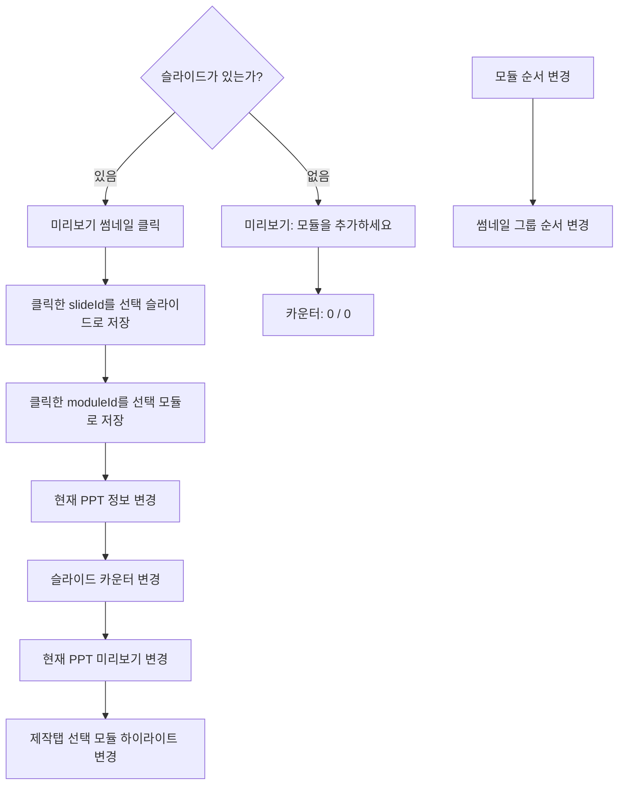
```mermaid
flowchart TD
  A["미리보기 썸네일 클릭"] --> B["클릭한 slideId를 선택 슬라이드로 저장"]
  B --> C["클릭한 moduleId를 선택 모듈로 저장"]
  C --> D["현재 PPT 정보 변경"]
  D --> E["슬라이드 카운터 변경"]
  E --> F["현재 PPT 미리보기 변경"]
  F --> G["제작탭 선택 모듈 하이라이트 변경"]

  H{"슬라이드가 있는가?"}
  H -- "없음" --> I["미리보기: 모듈을 추가하세요"]
  I --> J["카운터: 0 / 0"]
  H -- "있음" --> A

  K["모듈 순서 변경"] --> L["썸네일 그룹 순서 변경"]
```

## 4.2 제작탭 - 모듈 동작

### 4.2.1 모듈 선택 시

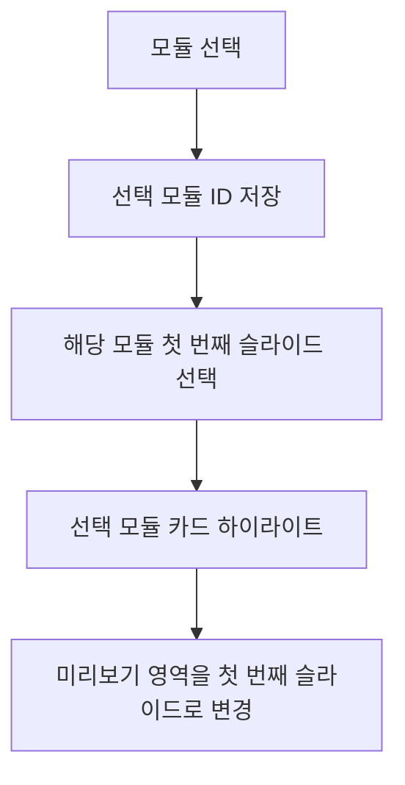
```mermaid
flowchart TD
  A["모듈 선택"] --> B["선택 모듈 ID 저장"]
  B --> C["해당 모듈 첫 번째 슬라이드 선택"]
  C --> D["선택 모듈 카드 하이라이트"]
  D --> E["미리보기 영역을 첫 번째 슬라이드로 변경"]
```

### 4.2.2 모듈 추가 버튼 클릭 시

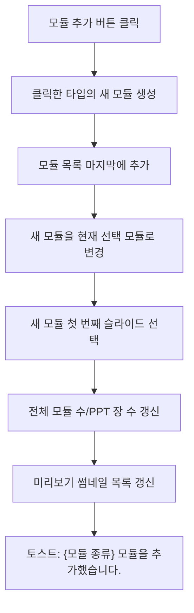
```mermaid
flowchart TD
  A["모듈 추가 버튼 클릭"] --> B["클릭한 타입의 새 모듈 생성"]
  B --> C["모듈 목록 마지막에 추가"]
  C --> D["새 모듈을 현재 선택 모듈로 변경"]
  D --> E["새 모듈 첫 번째 슬라이드 선택"]
  E --> F["전체 모듈 수/PPT 장 수 갱신"]
  F --> G["미리보기 썸네일 목록 갱신"]
  G --> H["토스트: {모듈 종류} 모듈을 추가했습니다."]
```

### 4.2.3 모듈 이동 드래그앤드롭 시

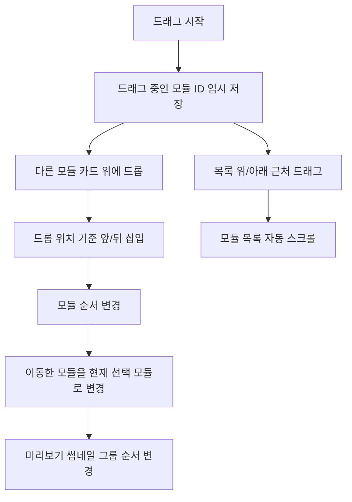
```mermaid
flowchart TD
  A["드래그 시작"] --> B["드래그 중인 모듈 ID 임시 저장"]
  B --> C["다른 모듈 카드 위에 드롭"]
  C --> D["드롭 위치 기준 앞/뒤 삽입"]
  D --> E["모듈 순서 변경"]
  E --> F["이동한 모듈을 현재 선택 모듈로 변경"]
  F --> G["미리보기 썸네일 그룹 순서 변경"]
  B --> H["목록 위/아래 근처 드래그"]
  H --> I["모듈 목록 자동 스크롤"]
```

### 4.2.4 모듈 복제 버튼 클릭 시

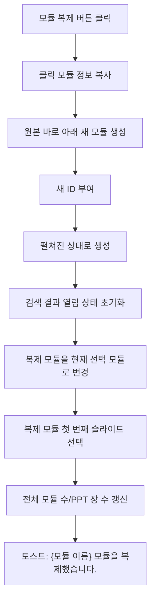
```mermaid
flowchart TD
  A["모듈 복제 버튼 클릭"] --> B["클릭 모듈 정보 복사"]
  B --> C["원본 바로 아래 새 모듈 생성"]
  C --> D["새 ID 부여"]
  D --> E["펼쳐진 상태로 생성"]
  E --> F["검색 결과 열림 상태 초기화"]
  F --> G["복제 모듈을 현재 선택 모듈로 변경"]
  G --> H["복제 모듈 첫 번째 슬라이드 선택"]
  H --> I["전체 모듈 수/PPT 장 수 갱신"]
  I --> J["토스트: {모듈 이름} 모듈을 복제했습니다."]
```

### 4.2.5 모듈 삭제 버튼 클릭 시

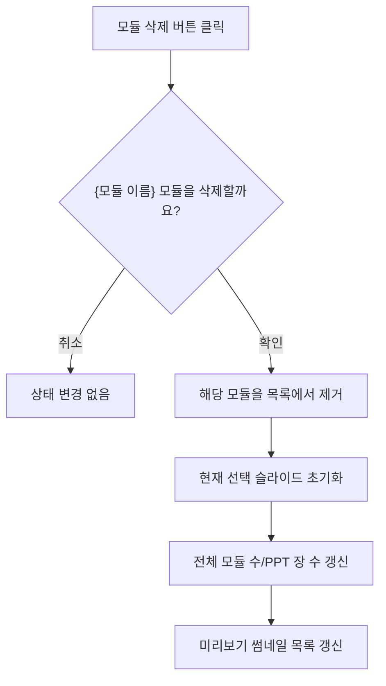
```mermaid
flowchart TD
  A["모듈 삭제 버튼 클릭"] --> B{"{모듈 이름} 모듈을 삭제할까요?"}
  B -- "취소" --> C["상태 변경 없음"]
  B -- "확인" --> D["해당 모듈을 목록에서 제거"]
  D --> E["현재 선택 슬라이드 초기화"]
  E --> F["전체 모듈 수/PPT 장 수 갱신"]
  F --> G["미리보기 썸네일 목록 갱신"]
```

### 4.2.6 모듈 토글 버튼 클릭 시

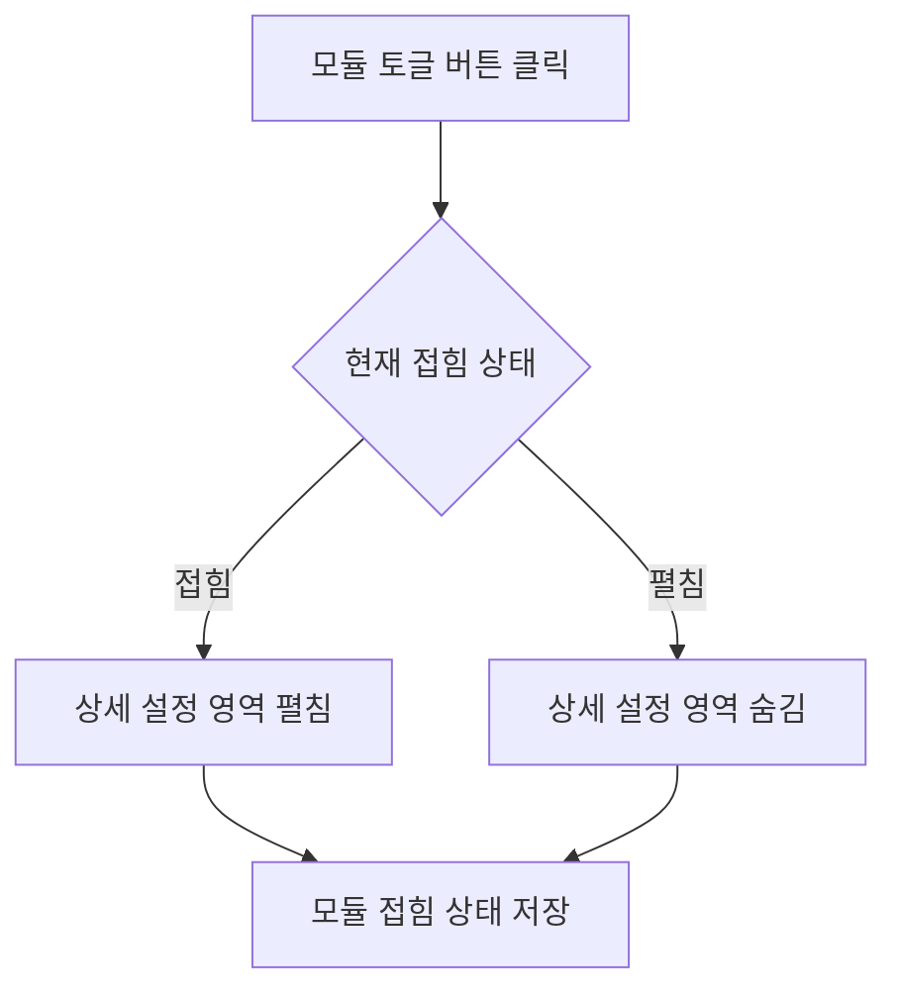
```mermaid
flowchart TD
  A["모듈 토글 버튼 클릭"] --> B{"현재 접힘 상태"}
  B -- "접힘" --> C["상세 설정 영역 펼침"]
  B -- "펼침" --> D["상세 설정 영역 숨김"]
  C --> E["모듈 접힘 상태 저장"]
  D --> E
```

### 4.2.7 모듈 섹션 토글 클릭 시

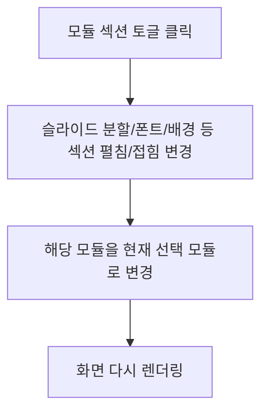
```mermaid
flowchart TD
  A["모듈 섹션 토글 클릭"] --> B["슬라이드 분할/폰트/배경 등 섹션 펼침/접힘 변경"]
  B --> C["해당 모듈을 현재 선택 모듈로 변경"]
  C --> D["화면 다시 렌더링"]
```

## 4.3 제작탭 - 입력 및 스타일 동작

### 4.3.1 찬양/찬송가 검색어 입력 시

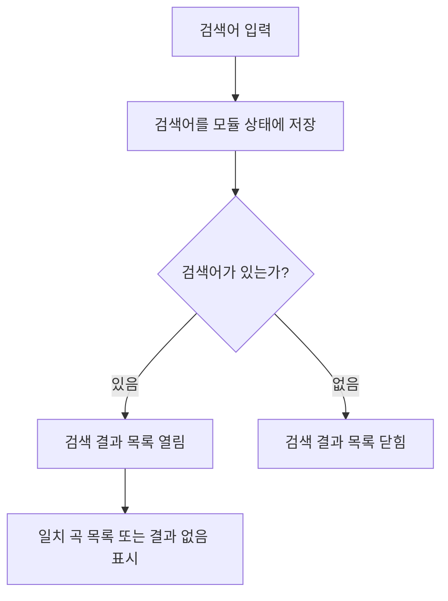
```mermaid
flowchart TD
  A["검색어 입력"] --> B["검색어를 모듈 상태에 저장"]
  B --> C{"검색어가 있는가?"}
  C -- "있음" --> D["검색 결과 목록 열림"]
  D --> E["일치 곡 목록 또는 결과 없음 표시"]
  C -- "없음" --> F["검색 결과 목록 닫힘"]
```

### 4.3.2 찬양/찬송가 검색 결과 클릭 시

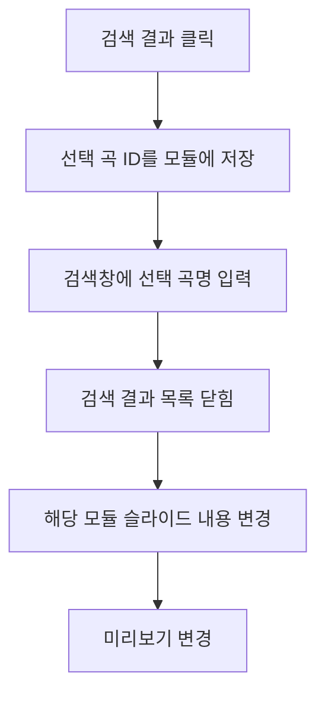
```mermaid
flowchart TD
  A["검색 결과 클릭"] --> B["선택 곡 ID를 모듈에 저장"]
  B --> C["검색창에 선택 곡명 입력"]
  C --> D["검색 결과 목록 닫힘"]
  D --> E["해당 모듈 슬라이드 내용 변경"]
  E --> F["미리보기 변경"]
```

### 4.3.3 성경 구약/신약 버튼 클릭 시

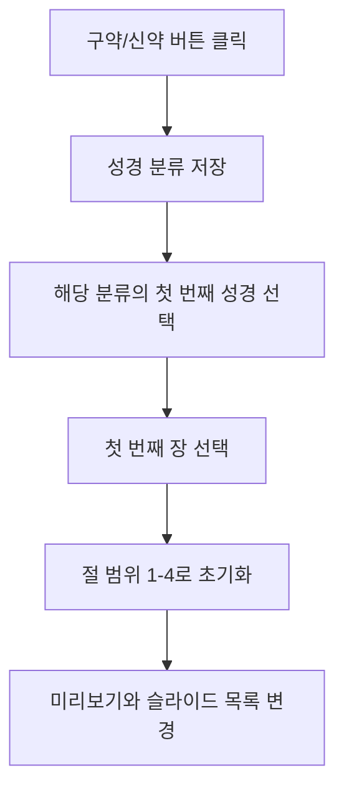
```mermaid
flowchart TD
  A["구약/신약 버튼 클릭"] --> B["성경 분류 저장"]
  B --> C["해당 분류의 첫 번째 성경 선택"]
  C --> D["첫 번째 장 선택"]
  D --> E["절 범위 1-4로 초기화"]
  E --> F["미리보기와 슬라이드 목록 변경"]
```

### 4.3.4 성경 번역본/성경/장/절 범위 변경 시

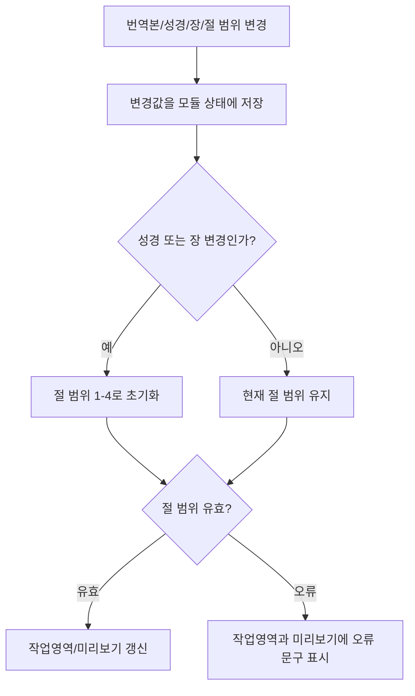
```mermaid
flowchart TD
  A["번역본/성경/장/절 범위 변경"] --> B["변경값을 모듈 상태에 저장"]
  B --> C{"성경 또는 장 변경인가?"}
  C -- "예" --> D["절 범위 1-4로 초기화"]
  C -- "아니오" --> E["현재 절 범위 유지"]
  D --> F{"절 범위 유효?"}
  E --> F
  F -- "유효" --> G["작업영역/미리보기 갱신"]
  F -- "오류" --> H["작업영역과 미리보기에 오류 문구 표시"]
```

### 4.3.5 슬라이드 분할 버튼 클릭 시

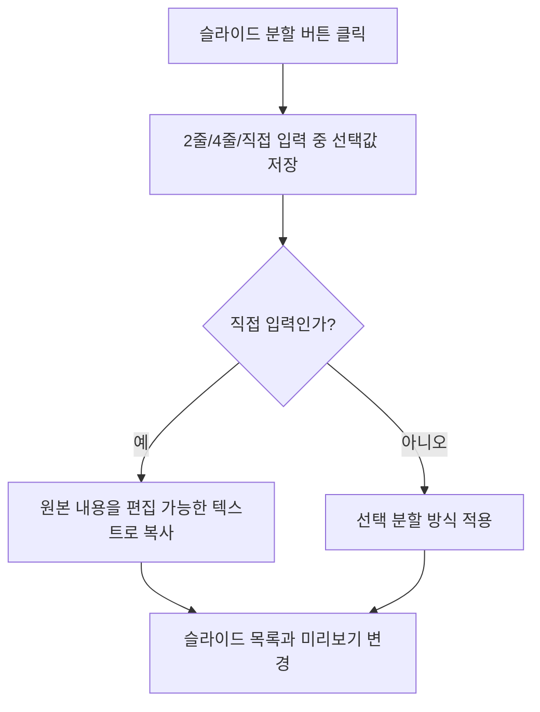
```mermaid
flowchart TD
  A["슬라이드 분할 버튼 클릭"] --> B["2줄/4줄/직접 입력 중 선택값 저장"]
  B --> C{"직접 입력인가?"}
  C -- "예" --> D["원본 내용을 편집 가능한 텍스트로 복사"]
  C -- "아니오" --> E["선택 분할 방식 적용"]
  D --> F["슬라이드 목록과 미리보기 변경"]
  E --> F
```

### 4.3.6 폰트/크기/굵기/색상/정렬 변경 시

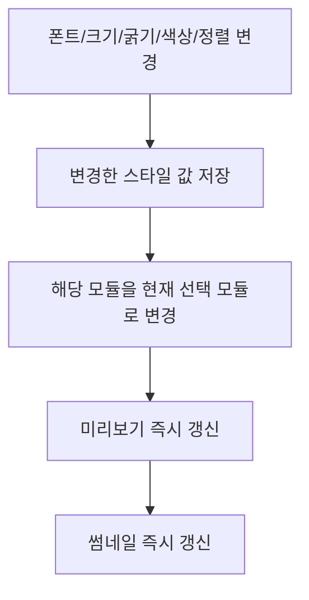
```mermaid
flowchart TD
  A["폰트/크기/굵기/색상/정렬 변경"] --> B["변경한 스타일 값 저장"]
  B --> C["해당 모듈을 현재 선택 모듈로 변경"]
  C --> D["미리보기 즉시 갱신"]
  D --> E["썸네일 즉시 갱신"]
```

### 4.3.7 배경색 선택 시

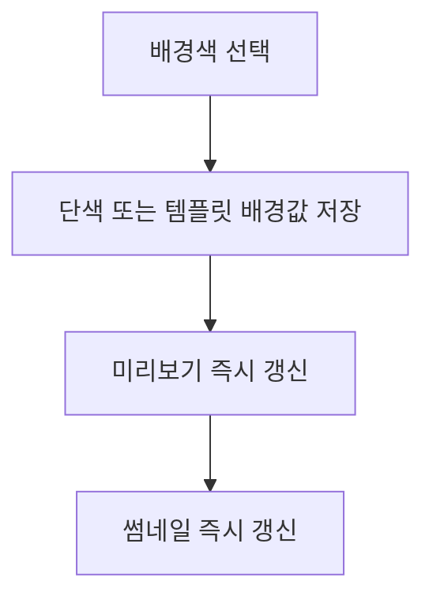
```mermaid
flowchart TD
  A["배경색 선택"] --> B["단색 또는 템플릿 배경값 저장"]
  B --> C["미리보기 즉시 갱신"]
  C --> D["썸네일 즉시 갱신"]
```

### 4.3.8 배경 이미지 업로드 시

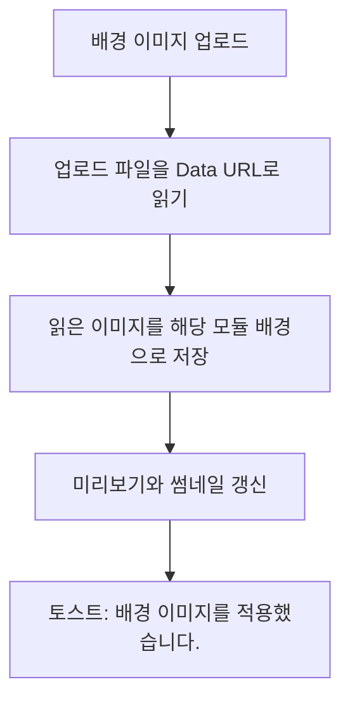
```mermaid
flowchart TD
  A["배경 이미지 업로드"] --> B["업로드 파일을 Data URL로 읽기"]
  B --> C["읽은 이미지를 해당 모듈 배경으로 저장"]
  C --> D["미리보기와 썸네일 갱신"]
  D --> E["토스트: 배경 이미지를 적용했습니다."]
```

## 4.4 광고 모듈 동작

### 4.4.1 광고 항목 토글 클릭 시

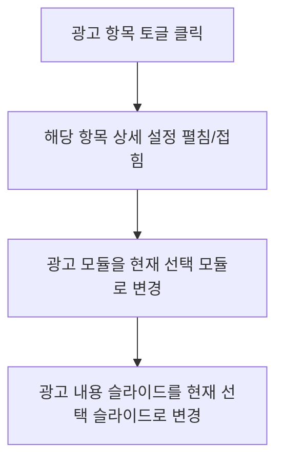
```mermaid
flowchart TD
  A["광고 항목 토글 클릭"] --> B["해당 항목 상세 설정 펼침/접힘"]
  B --> C["광고 모듈을 현재 선택 모듈로 변경"]
  C --> D["광고 내용 슬라이드를 현재 선택 슬라이드로 변경"]
```

### 4.4.2 광고 추가 버튼 클릭 시

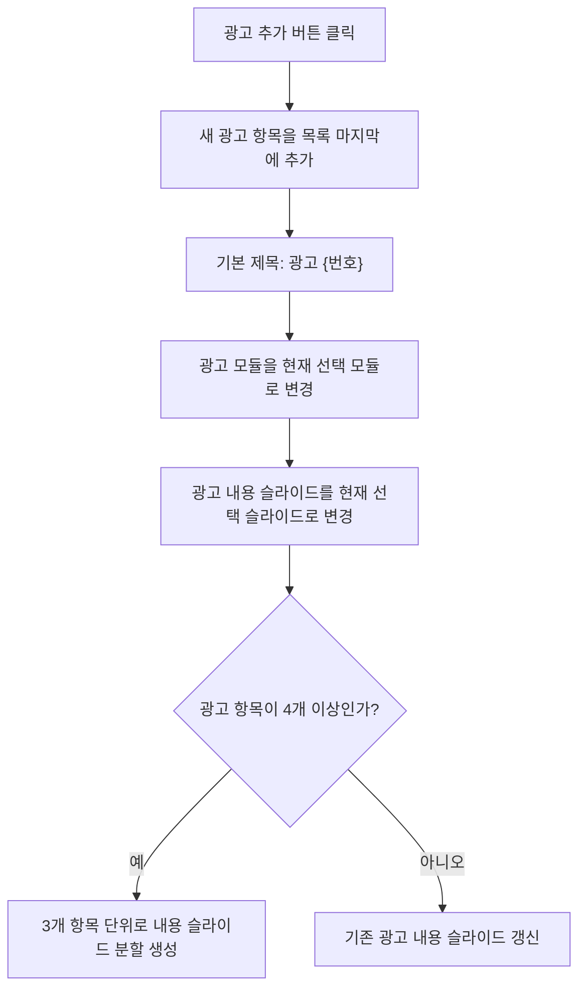
```mermaid
flowchart TD
  A["광고 추가 버튼 클릭"] --> B["새 광고 항목을 목록 마지막에 추가"]
  B --> C["기본 제목: 광고 {번호}"]
  C --> D["광고 모듈을 현재 선택 모듈로 변경"]
  D --> E["광고 내용 슬라이드를 현재 선택 슬라이드로 변경"]
  E --> F{"광고 항목이 4개 이상인가?"}
  F -- "예" --> G["3개 항목 단위로 내용 슬라이드 분할 생성"]
  F -- "아니오" --> H["기존 광고 내용 슬라이드 갱신"]
```

### 4.4.3 광고 항목 삭제 버튼 클릭 시

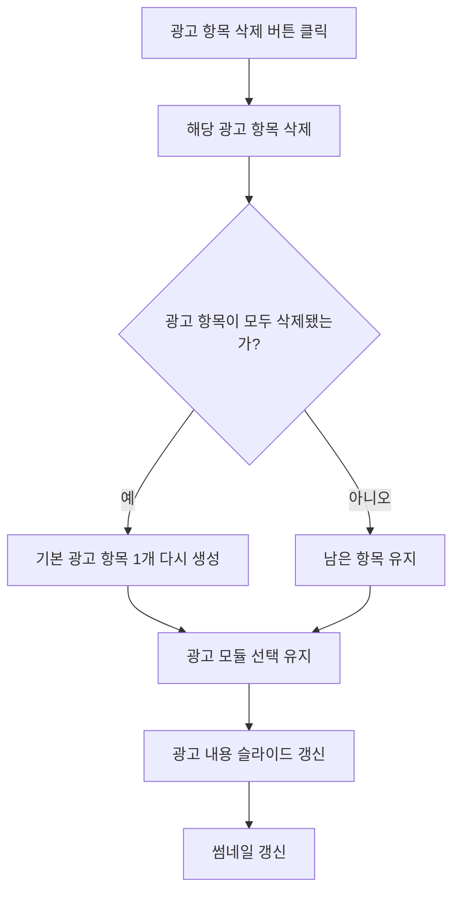
```mermaid
flowchart TD
  A["광고 항목 삭제 버튼 클릭"] --> B["해당 광고 항목 삭제"]
  B --> C{"광고 항목이 모두 삭제됐는가?"}
  C -- "예" --> D["기본 광고 항목 1개 다시 생성"]
  C -- "아니오" --> E["남은 항목 유지"]
  D --> F["광고 모듈 선택 유지"]
  E --> F
  F --> G["광고 내용 슬라이드 갱신"]
  G --> H["썸네일 갱신"]
```

### 4.4.4 광고 제목/세부 내용 입력 시

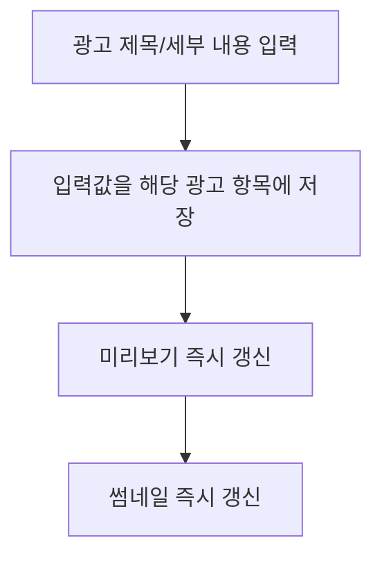
```mermaid
flowchart TD
  A["광고 제목/세부 내용 입력"] --> B["입력값을 해당 광고 항목에 저장"]
  B --> C["미리보기 즉시 갱신"]
  C --> D["썸네일 즉시 갱신"]
```

## 4.5 커스텀 모듈 동작

### 4.5.1 제목 슬라이드/내용 슬라이드 선택 시

```mermaid
flowchart TD
  A["제목/내용 슬라이드 선택"] --> B["선택 슬라이드 타입 저장"]
  B --> C["커스텀 모듈을 현재 선택 모듈로 변경"]
  C --> D["커스텀 모듈 첫 번째 슬라이드 선택"]
  D --> E["타입에 맞는 입력 필드 표시"]
  E --> F["미리보기 표시"]
```

### 4.5.2 자주 쓰는 내용 프리셋 클릭 시

```mermaid
flowchart TD
  A["자주 쓰는 내용 프리셋 클릭"] --> B["커스텀 모듈 타입을 내용 슬라이드로 변경"]
  B --> C["선택 프리셋 ID 저장"]
  C --> D["프리셋 제목 저장"]
  D --> E["프리셋 내용 저장"]
  E --> F["미리보기 갱신"]
  F --> G["썸네일 갱신"]
```

### 4.5.3 커스텀 제목/부제목/내용 입력 시

```mermaid
flowchart TD
  A["커스텀 제목/부제목/내용 입력"] --> B["입력값을 커스텀 모듈에 저장"]
  B --> C{"프리셋 내용을 직접 수정했는가?"}
  C -- "예" --> D["프리셋 선택 상태 해제"]
  C -- "아니오" --> E["프리셋 선택 상태 유지"]
  D --> F["미리보기 즉시 갱신"]
  E --> F
  F --> G["썸네일 즉시 갱신"]
```

## 4.6 제작탭 - 초기화 동작

```mermaid
flowchart TD
  A["초기화 버튼 클릭"] --> B{"현재 저장 템플릿이 있고 변경사항이 있는가?"}
  B -- "예" --> C{"초기화 전에 현재 템플릿에 덮어쓸까요?"}
  C -- "덮어쓰기" --> D["현재 저장 템플릿 갱신"]
  D --> H{"현재 작업을 초기 샘플로 되돌릴까요?"}
  C -- "덮어쓰지 않음" --> E{"변경된 내용을 새 템플릿으로 저장할까요?"}
  E -- "저장" --> F["템플릿 저장 모달 열기"]
  F --> G["저장 완료"]
  G --> H
  E -- "저장 안 함" --> H
  B -- "아니오" --> H

  H -- "취소" --> I["초기화하지 않음"]
  H -- "확인" --> J["기본 상태로 초기화"]
  J --> K["제작탭으로 이동"]
  K --> L["템플릿 이름: 새로운 템플릿"]
  L --> M["기본 모듈: 찬양 1개, 성경 1개"]
  M --> N["첫 번째 모듈 선택"]
  N --> O["PPT 설정 기본값 복원"]
  O --> P["토스트: 초기 샘플로 되돌렸습니다."]
```

## 4.7 템플릿 저장 동작

```mermaid
flowchart TD
  A["템플릿 저장 버튼 클릭"] --> B{"로그인 상태인가?"}
  B -- "아니오" --> C["로그인 화면 이동"]
  C --> D["pending action = save 저장"]
  D --> E["로그인 완료"]
  E --> F["저장 흐름 재개"]
  B -- "예" --> F

  F --> G{"기존 저장 템플릿에서 시작한 작업인가?"}
  G -- "예" --> H{"{템플릿 이름} 템플릿에 덮어쓸까요?"}
  H -- "확인" --> I["기존 템플릿 덮어쓰기"]
  I --> J["토스트: 템플릿을 덮어썼습니다."]
  H -- "취소" --> K["새 템플릿 저장 모달 열기"]
  G -- "아니오" --> K

  K --> L["템플릿 이름 기본값 입력"]
  L --> M["입력창 포커스/텍스트 선택"]
  M --> N["저장 버튼 클릭"]
  N --> O["입력 이름으로 새 템플릿 생성"]
  O --> P{"이름이 비었는가?"}
  P -- "예" --> Q["이름 없는 템플릿으로 저장"]
  P -- "아니오" --> R["입력 이름 사용"]
  Q --> S["중복 이름이면 번호 자동 부여"]
  R --> S
  S --> T["저장 목록 맨 앞에 추가"]
  T --> U["현재 템플릿 이름/ID 갱신"]
  U --> V["토스트: 템플릿을 저장했습니다."]

  K --> W["닫기/취소 클릭"]
  W --> X["모달 닫힘"]
  X --> Y["불러오기/초기화 중 저장 흐름이면 대기 작업 취소"]
```

## 4.8 템플릿탭 동작

### 4.8.1, 4.8.2, 4.8.4, 4.8.5 저장된 템플릿 목록/미리보기/삭제 흐름

```mermaid
flowchart TD
  A["템플릿 메뉴 클릭"] --> B["작업영역을 템플릿탭으로 전환"]
  B --> C["제작탭 패널 숨김"]
  C --> D["템플릿 브라우저 표시"]
  D --> E["메뉴 활성 상태를 템플릿으로 변경"]
  E --> F{"사용자 액션"}
  F -- "저장된 템플릿 카드 클릭" --> G["클릭 템플릿 미리보기 화면으로 이동"]
  G --> H["템플릿 이름 표시"]
  H --> I["템플릿 설명 표시"]
  I --> J["적용하기 버튼 표시"]
  J --> K["슬라이드 미리보기 목록 표시"]

  K --> L{"미리보기 화면 액션"}
  L -- "뒤로가기 버튼 클릭" --> M["템플릿 미리보기 상태 해제"]
  M --> N["저장된 템플릿/추천 템플릿 목록 화면으로 복귀"]
  N --> F

  L -- "저장 템플릿 삭제 버튼 클릭" --> O{"{템플릿 이름} 템플릿을 삭제할까요?"}
  F -- "저장 템플릿 삭제 버튼 클릭" --> O
  O -- "취소" --> P["상태 변경 없음"]
  O -- "확인" --> Q["저장 템플릿 목록에서 삭제"]
  Q --> R{"삭제 템플릿이 현재 적용 중인가?"}
  R -- "예" --> S["현재 템플릿 ID 초기화"]
  R -- "아니오" --> T["현재 템플릿 ID 유지"]
  S --> U{"삭제 템플릿을 미리보기 중인가?"}
  T --> U
  U -- "예" --> V["미리보기 상태 해제"]
  U -- "아니오" --> W["미리보기 상태 유지"]
  V --> X["토스트: 템플릿을 삭제했습니다."]
  W --> X
  X --> F
```

### 4.8.3 추천 템플릿 카드 클릭 시

```mermaid
flowchart TD
  A["추천 템플릿 카드 클릭"] --> B["추천 템플릿 미리보기 화면으로 이동"]
  B --> C["삭제 버튼 없이 미리보기 제공"]
  C --> D["적용하기 버튼 제공"]
```

### 4.8.6 적용하기 버튼 클릭 시

```mermaid
flowchart TD
  A["적용하기 버튼 클릭"] --> B{"저장하지 않은 변경사항이 있는가?"}
  B -- "없음" --> I["선택 템플릿 불러오기"]
  B -- "있음" --> C{"현재 저장 템플릿이 있고 작업이 다른가?"}
  C -- "예" --> D{"현재 템플릿에 덮어쓸까요?"}
  D -- "덮어쓰기" --> E["현재 템플릿 갱신"]
  E --> I
  D -- "덮어쓰지 않음" --> F{"변경된 내용을 새 템플릿으로 저장할까요?"}
  C -- "아니오" --> F
  F -- "저장" --> G["저장 모달 열기"]
  G --> H["저장 완료"]
  H --> I
  F -- "저장 안 함" --> I
  I --> J["제작탭으로 이동"]
  J --> K["템플릿 이름 변경"]
  K --> L["모듈 목록/순서 변경"]
  L --> M["선택 모듈/슬라이드 변경"]
  M --> N["PPT 설정 변경"]
  N --> O["토스트: 템플릿을 불러왔습니다."]
```

## 4.9 설정탭 동작

### 4.9.1 설정 메뉴 클릭 시

```mermaid
flowchart TD
  A["설정 메뉴 클릭"] --> B["작업영역을 설정탭으로 전환"]
  B --> C["제작탭 패널 숨김"]
  C --> D["템플릿 브라우저 숨김"]
  D --> E["설정 패널 표시"]
```

### 4.9.2 PPT 비율 섹션 토글 클릭 시

```mermaid
flowchart TD
  A["PPT 비율 섹션 토글 클릭"] --> B["PPT 비율 설정 영역 펼침/접힘"]
  B --> C["접힘 상태 저장"]
```

### 4.9.3 16:9 버튼 클릭 시

```mermaid
flowchart TD
  A["16:9 버튼 클릭"] --> B["PPT 비율을 16:9로 저장"]
  B --> C["미리보기 슬라이드 비율 갱신"]
  C --> D["PPT 생성 시 16:9 비율 적용"]
```

### 4.9.4 4:3 버튼 클릭 시

```mermaid
flowchart TD
  A["4:3 버튼 클릭"] --> B["PPT 비율을 4:3으로 저장"]
  B --> C["미리보기 슬라이드 비율 갱신"]
  C --> D["PPT 생성 시 4:3 비율 적용"]
```

### 4.9.5 로고 섹션 토글 클릭 시

```mermaid
flowchart TD
  A["로고 섹션 토글"] --> B["로고 설정 영역 펼침/접힘"]
  B --> C["접힘 상태 저장"]
```

### 4.9.6 로고 ON 및 이미지 설정 시

```mermaid
flowchart TD
  A["로고 ON 버튼 클릭"] --> B["로고 사용 여부 켜짐"]
  B --> C["로고 상세 설정 영역 표시"]
  C --> D{"로고 이미지가 있는가?"}
  D -- "있음" --> E["미리보기와 PPT 생성 결과에 로고 표시"]
  D -- "없음" --> F["로고 이미지 업로드 대기"]

  F --> G["로고 이미지 업로드"]
  G --> H{"이미지 파일인가?"}
  H -- "아니오" --> I["토스트: 이미지 파일만 업로드할 수 있습니다."]
  I --> F
  H -- "예" --> J["이미지를 Data URL로 읽기"]
  J --> K["로고 이미지로 저장"]
  K --> L["로고 사용 여부 자동 ON"]
  L --> M{"로고 위치가 있는가?"}
  M -- "없음" --> N["기본 위치로 설정"]
  M -- "있음" --> O["기존 위치 유지"]
  N --> P["토스트: 로고를 적용했습니다."]
  O --> P

  E --> Q{"다음 로고 이미지 액션"}
  P --> Q
  Q -- "로고 위치 선택" --> R["좌상단/우상단/좌하단/우하단 중 선택 위치 저장"]
  R --> S["미리보기 로고 위치 변경"]
  S --> T["PPT 생성 결과의 로고 위치 변경"]
  T --> Q

  Q -- "로고 삭제" --> U["저장된 로고 이미지 삭제"]
  U --> V["토스트: 로고를 삭제했습니다."]
  V --> F
```

### 4.9.7 로고 OFF 버튼 클릭 시

```mermaid
flowchart TD
  A["로고 OFF 버튼 클릭"] --> B["로고 사용 여부 꺼짐"]
  B --> C["로고 상세 설정 영역 숨김"]
  C --> D["미리보기와 PPT 생성 결과에서 로고 제외"]
```

## 4.10 로그인/로그아웃 동작

```mermaid
flowchart TD
  A["로그인 버튼 클릭"] --> B["로그인 화면으로 이동"]
  B --> C["기존 대기 중인 템플릿 불러오기 작업 초기화"]
  C --> D{"로그인 화면에서 사용자 액션"}

  D -- "돌아가기 버튼 클릭" --> E["로그인하지 않고 에디터 화면으로 복귀"]
  E --> F["대기 중인 작업 취소"]

  D -- "로그인 폼 제출" --> G["입력 이메일을 로그인 사용자 이메일로 저장"]
  G --> H["인증 상태를 로그인으로 변경"]
  H --> I["해당 이메일 기준 저장 템플릿 목록 불러오기"]
  I --> J["에디터 화면으로 복귀"]
  J --> K["토스트: 로그인되었습니다."]
  K --> L{"로그인 전 pending action이 있는가?"}
  L -- "save" --> M["템플릿 저장 실행"]
  L -- "save-before-template-load" --> N["템플릿 불러오기 전 저장 모달 열기"]
  L -- "ppt" --> O["PPT 생성 실행"]
  L -- "share" --> P["공유 모달 열기"]
  L -- "없음" --> Q["추가 실행 없음"]

  M --> R["로그인 상태 유지"]
  N --> R
  O --> R
  P --> R
  Q --> R

  R --> S["로그아웃 버튼 클릭"]
  S --> T["인증 상태를 로그아웃으로 변경"]
  T --> U["저장 템플릿 목록 비우기"]
  U --> V["현재 템플릿 ID 초기화"]
  V --> W["템플릿 미리보기 상태 초기화"]
  W --> X["대기 중인 작업 초기화"]
  X --> Y["에디터 화면으로 복귀"]
  Y --> Z["토스트: 로그아웃되었습니다."]
```

## 4.11 PPT 생성 동작

```mermaid
flowchart TD
  A["PPT 생성 버튼 클릭"] --> B{"로그인 상태인가?"}
  B -- "아니오" --> C["로그인 화면 이동"]
  C --> D["pending action = ppt 저장"]
  D --> E["로그인 완료"]
  E --> F["PPT 생성 재개"]
  B -- "예" --> F

  F --> G{"성경 모듈 절 범위가 유효한가?"}
  G -- "아니오" --> H["유효하지 않은 성경 모듈 선택"]
  H --> I["해당 모듈 첫 슬라이드 선택"]
  I --> J["미리보기/작업영역 갱신"]
  J --> K["토스트: 성경 범위를 확인하세요: {오류 문구}"]
  K --> L["PPT 파일 생성 안 함"]

  G -- "예" --> M{"생성할 슬라이드가 있는가?"}
  M -- "없음" --> N["토스트: 생성할 슬라이드가 없습니다."]
  N --> L
  M -- "있음" --> O["현재 모듈 목록 기준 슬라이드 생성"]
  O --> P["비율/배경/텍스트/이미지/로고 설정 반영"]
  P --> Q["worship-ppt-{날짜}.pptx 다운로드"]
  Q --> R["토스트: PPT 파일을 생성했습니다."]
```

## 4.12 공유하기 동작

### 4.12.1 공유하기 버튼 클릭 시

```mermaid
flowchart TD
  A["공유하기 버튼 클릭"] --> B{"로그인 상태인가?"}
  B -- "예" --> C["공유 모달 열기"]
  B -- "아니오" --> D["로그인 화면으로 이동"]
  D --> E["pending action = share 저장"]
  E --> F["로그인 완료"]
  F --> C
```

### 4.12.2 공유 모달 열림 시

```mermaid
flowchart TD
  A["공유 모달 열림"] --> B["현재 슬라이드 목록 재계산"]
  B --> C["현재 템플릿 이름 표시"]
  C --> D["모듈 수/슬라이드 수 요약 표시"]
  D --> E{"현재 템플릿 ID가 있는가?"}
  E -- "있음" --> F["공유 URL 끝에 템플릿 ID 사용"]
  E -- "없음" --> G["공유 URL 끝에 demo 사용"]
  F --> H["공유 링크 입력창에 URL 표시"]
  G --> H
  H --> I["공유 링크 입력창 포커스"]
  I --> J["공유 링크 텍스트 선택"]
```

### 4.12.3 링크 복사 버튼 클릭 시

```mermaid
flowchart TD
  A["링크 복사 버튼 클릭"] --> B["공유 링크 입력창 URL 선택"]
  B --> C{"브라우저 클립보드 API가 있는가?"}
  C -- "있음" --> D["URL을 클립보드에 복사"]
  C -- "없음" --> E["선택 상태 유지"]
  D --> F["토스트: 공유 링크를 복사했습니다."]
  E --> F
```

### 4.12.4 닫기 버튼 클릭 시

```mermaid
flowchart TD
  A["닫기 버튼 클릭"] --> B["공유 모달 닫힘"]
```

## 4.13 메뉴 동작

### 4.13.1 제작 메뉴 클릭 시

```mermaid
flowchart TD
  A["제작 메뉴 클릭"] --> B["제작탭 패널 표시"]
  B --> C["템플릿 브라우저 숨김"]
  C --> D["설정 패널 숨김"]
  D --> E["메뉴 활성 상태를 제작으로 변경"]
```

### 4.13.2 템플릿 메뉴 클릭 시

```mermaid
flowchart TD
  A["템플릿 메뉴 클릭"] --> B["템플릿 브라우저 표시"]
  B --> C["제작탭 패널 숨김"]
  C --> D["설정 패널 숨김"]
  D --> E["메뉴 활성 상태를 템플릿으로 변경"]
```

### 4.13.3 설정 메뉴 클릭 시

```mermaid
flowchart TD
  A["설정 메뉴 클릭"] --> B["설정 패널 표시"]
  B --> C["제작탭 패널 숨김"]
  C --> D["템플릿 브라우저 숨김"]
  D --> E["메뉴 활성 상태를 설정으로 변경"]
```

### 4.13.4 My 메뉴 클릭 시

```mermaid
flowchart TD
  A["My 메뉴 클릭"] --> B["MVP 비활성 메뉴"]
  B --> C["토스트: MVP에서는 제작 메뉴만 사용합니다."]
  C --> D["화면 전환 없음"]
```

## 작성 메모

- `4.2`, `4.3`, `4.4`, `4.5`, `4.12`, `4.13`은 `4.n.n` 단위로 Mermaid를 분리했다.
- `4.8`은 저장 템플릿 목록/미리보기/삭제 흐름, 추천 템플릿 미리보기, 적용하기 흐름 세 묶음으로 정리했다.
- `4.9`는 설정 진입/PPT 비율을 `4.n.n` 단위로 유지하고, 로고는 `로고 섹션 토글`, `로고 ON 및 이미지 설정`, `로고 OFF` 세 흐름으로 나눴다.
- `4.10`은 로그인/로그아웃 및 pending action 흐름을 하나의 Mermaid로 통합했다.
- `4.1`, `4.6`, `4.7`, `4.11`은 사용자가 지정한 분리 대상이 아니므로 기존처럼 섹션 단위 흐름으로 유지했다.
- 확인창은 조건 노드로 표현했다.
- `pending action`은 로그인 후 이어서 실행되는 작업 흐름으로 표현했다.
