# IA 화면/모듈/템플릿 스토리보드

> 기준 문서: [IA_TEMPLATE_ACTIONS.md](IA_TEMPLATE_ACTIONS.md)의 `1. 전체화면구성 보강`, `2. 모듈 설명 보강`, `3. 템플릿 설명`  
> 화면 기준: 데스크톱 1440x1000 캡쳐  
> 이미지 위치: [storyboard](storyboard)
> 동작 플로우: [IA_STORYBOARD_ACTIONS.md](IA_STORYBOARD_ACTIONS.md)에서 별도 설명

## 01. 상단바 세부 항목

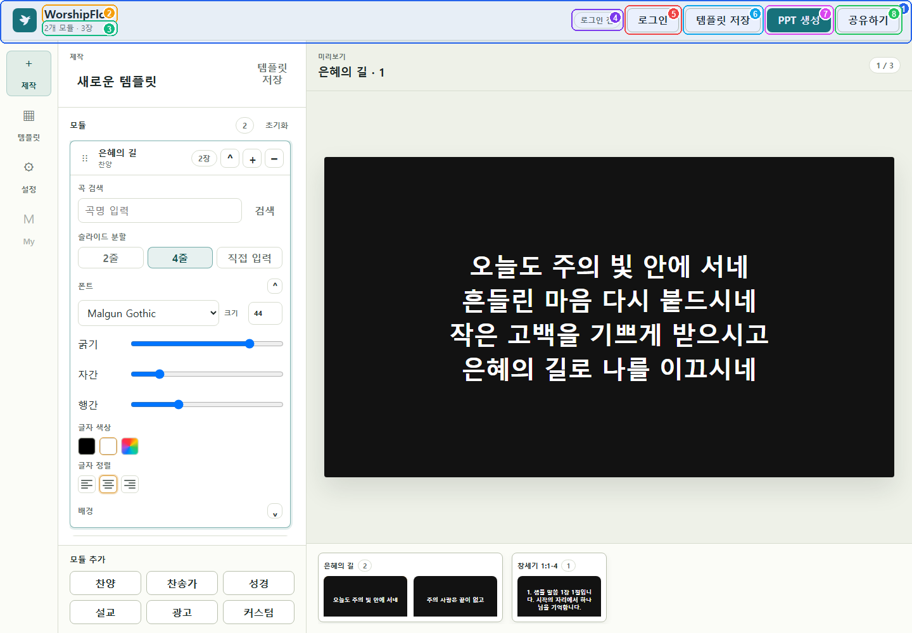

| 번호 | 화면 항목 | IA 위치 | 설명 |
|---:|---|---|---|
| 1 | 상단바 전체 | 1.1.1 | 브랜드, 작업 요약, 로그인 상태, 주요 실행 버튼을 포함하는 상단 영역이다. |
| 2 | 앱 이름 | 1.1.2.1 | `WorshipFlow` 앱 이름을 표시한다. |
| 3 | 프로젝트 요약 | 1.1.2.2 | 현재 작업 요약을 `n개 모듈 · n장` 형식으로 표시한다. |
| 4 | 로그인 상태 | 1.1.3.1 | 로그아웃 상태에서는 `로그인 전`으로 표시한다. |
| 5 | 로그인/로그아웃 버튼 | 1.1.4.1 | 로그아웃 상태에서는 `로그인` 버튼으로 표시된다. |
| 6 | 템플릿 저장 버튼 | 1.1.5.1 | 현재 작업 상태를 저장 템플릿으로 저장하는 버튼이다. |
| 7 | PPT 생성 버튼 | 1.1.6.1 | 현재 모듈 목록과 설정값 기준으로 PPT 파일을 생성한다. |
| 8 | 공유하기 버튼 | 1.1.7.1 | 현재 템플릿 정보와 공유 링크를 표시하는 공유 모달을 연다. |

## 02. 메뉴 세부 항목

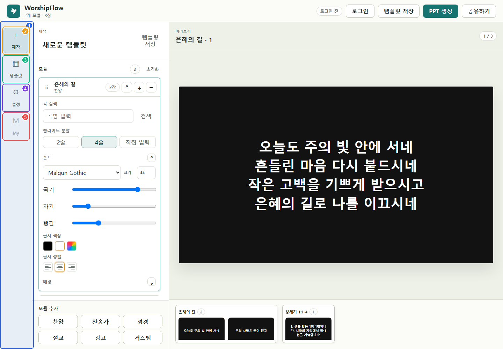

| 번호 | 화면 항목 | IA 위치 | 설명 |
|---:|---|---|---|
| 1 | 메뉴 전체 | 1.2.1 | 제작, 템플릿, 설정, My 항목으로 구성된다. |
| 2 | 제작 메뉴 | 1.2.2.1 | 예배 순서와 모듈을 편집하는 제작탭으로 이동한다. |
| 3 | 템플릿 메뉴 | 1.2.3.1 | 저장된 템플릿과 추천 템플릿을 확인하는 템플릿탭으로 이동한다. |
| 4 | 설정 메뉴 | 1.2.4.1 | PPT 비율과 로고 설정을 조정하는 설정탭으로 이동한다. |
| 5 | My 메뉴 | 1.2.5.1 | 현재 MVP에서는 비활성 메뉴이다. |

## 03. 제작탭 헤더 세부 항목

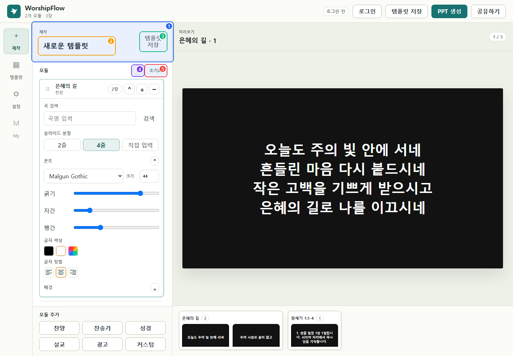

| 번호 | 화면 항목 | IA 위치 | 설명 |
|---:|---|---|---|
| 1 | 제작탭 헤더 | 1.3.2 | 제작탭의 현재 템플릿과 모듈 목록 제어 요소를 표시한다. |
| 2 | 템플릿 이름 입력 | 1.3.2.1 | 현재 템플릿 이름 입력창을 표시한다. |
| 3 | 제작탭 템플릿 저장 | 1.3.2.2 | 제작탭 내부의 `템플릿 저장` 버튼을 표시한다. |
| 4 | 전체 모듈 수 | 1.3.2.3 | 현재 모듈 수를 숫자 배지로 표시한다. |
| 5 | 초기화 버튼 | 1.3.2.4 | 현재 작업을 초기 샘플로 되돌리는 초기화 버튼이다. |

## 04. 모듈 목록 세부 항목

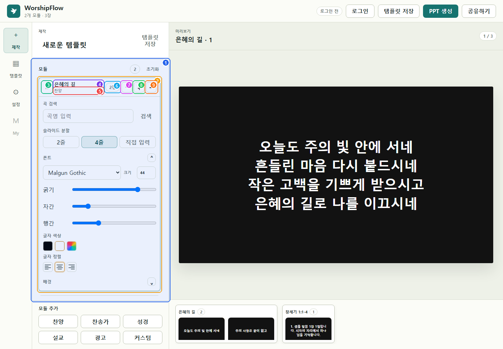

| 번호 | 화면 항목 | IA 위치 | 설명 |
|---:|---|---|---|
| 1 | 모듈 목록 영역 | 1.3.2.5 | 제작탭에서 현재 예배 순서 모듈 목록을 표시한다. |
| 2 | 모듈 카드 | 1.3.2.5 | 개별 모듈의 이름, 종류, 장 수, 액션 버튼을 담는 카드이다. |
| 3 | 드래그 핸들 | 1.3.2.5 | 모듈 순서를 바꾸기 위한 드래그 시작 위치이다. |
| 4 | 모듈 이름 | 1.3.2.5 | 선택된 곡명, 성경 범위, 설교 제목 등 모듈 이름을 표시한다. |
| 5 | 모듈 종류 | 1.3.2.5 | 찬양, 찬송가, 성경 등 모듈 타입을 표시한다. |
| 6 | PPT 장 수 | 1.3.2.5 | 해당 모듈에서 생성되는 PPT 장 수를 표시한다. |
| 7 | 접기/펼치기 버튼 | 1.3.2.5 | 모듈 상세 설정 영역을 접거나 펼친다. |
| 8 | 모듈 복제 버튼 | 1.3.2.5 | 같은 설정을 가진 모듈을 바로 아래에 복제한다. |
| 9 | 모듈 삭제 버튼 | 1.3.2.5 | 해당 모듈을 목록에서 삭제한다. |

## 05. 모듈 추가 버튼 세부 항목

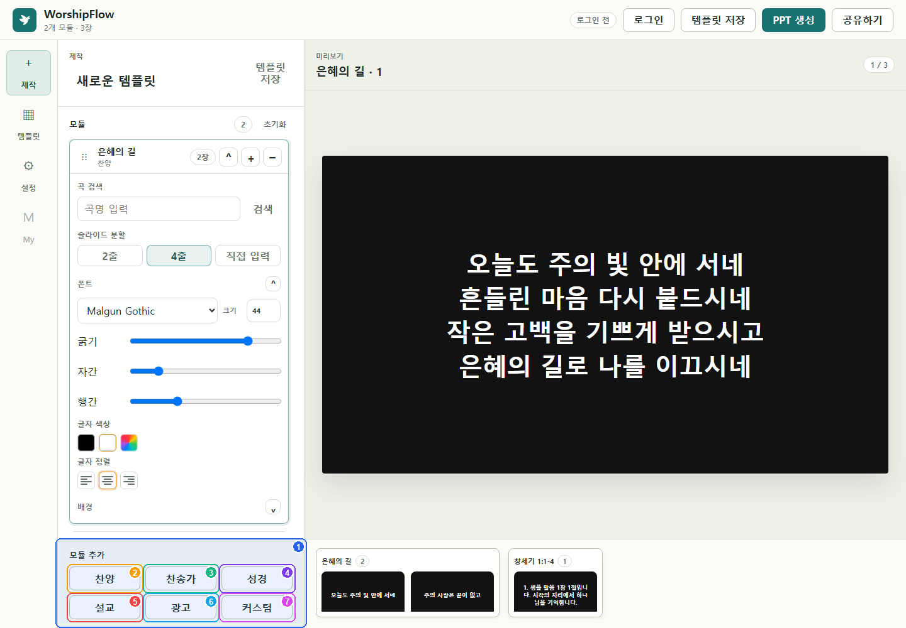

| 번호 | 화면 항목 | IA 위치 | 설명 |
|---:|---|---|---|
| 1 | 모듈 추가 영역 | 1.3.2.6 | 새 모듈을 추가하는 버튼 그룹이다. |
| 2 | 찬양 추가 | 1.3.2.6.1 | 찬양 모듈을 추가한다. |
| 3 | 찬송가 추가 | 1.3.2.6.2 | 찬송가 모듈을 추가한다. |
| 4 | 성경 추가 | 1.3.2.6.3 | 성경 모듈을 추가한다. |
| 5 | 설교 추가 | 1.3.2.6.4 | 설교 모듈을 추가한다. |
| 6 | 광고 추가 | 1.3.2.6.5 | 광고 모듈을 추가한다. |
| 7 | 커스텀 추가 | 1.3.2.6.6 | 커스텀 모듈을 추가한다. |

## 06. 템플릿탭 세부 항목

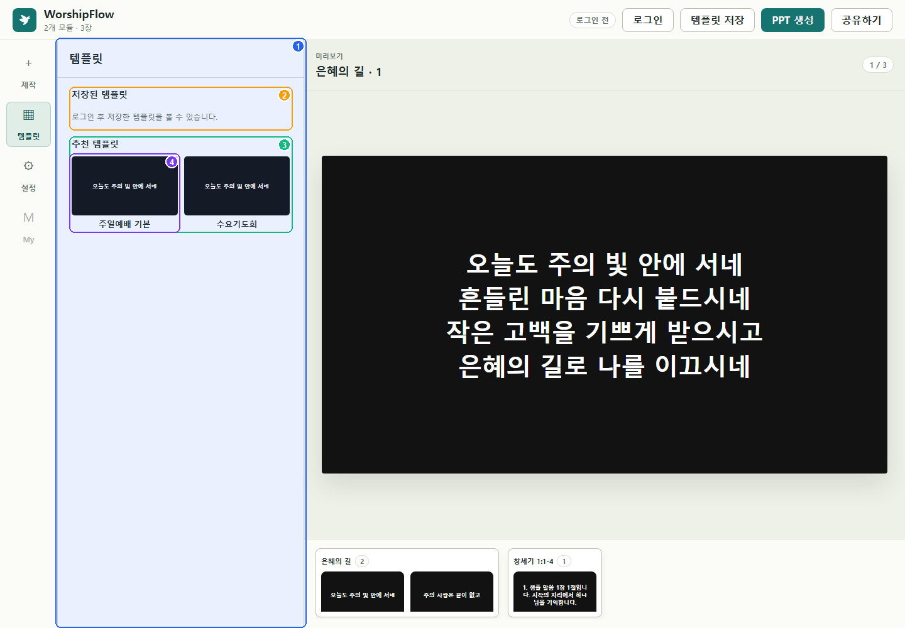

| 번호 | 화면 항목 | IA 위치 | 설명 |
|---:|---|---|---|
| 1 | 템플릿탭 작업영역 | 1.3.3 | 저장된 템플릿과 추천 템플릿을 확인하는 영역이다. |
| 2 | 저장된 템플릿 섹션 | 1.3.3.1 | 저장된 템플릿 섹션을 표시한다. |
| 3 | 추천 템플릿 섹션 | 1.3.3.2 | 추천 템플릿 섹션을 표시한다. |
| 4 | 템플릿 카드 | 1.3.3.3 | 템플릿 카드를 클릭하면 목록 대신 템플릿 미리보기 화면을 표시한다. |

## 07. 템플릿 미리보기 세부 항목

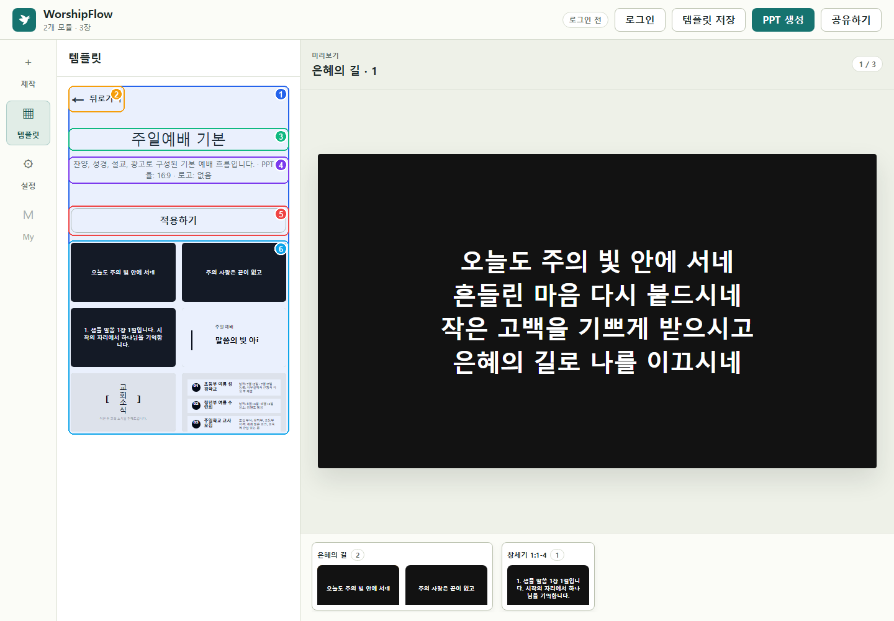

| 번호 | 화면 항목 | IA 위치 | 설명 |
|---:|---|---|---|
| 1 | 템플릿 미리보기 화면 | 1.3.3.3 | 템플릿 카드를 클릭한 뒤 표시되는 상세 미리보기 영역이다. |
| 2 | 뒤로가기 버튼 | 1.3.3.3 | 템플릿 목록 화면으로 돌아간다. |
| 3 | 템플릿 이름 | 1.3.3.3 | 선택한 템플릿 이름을 표시한다. |
| 4 | 템플릿 설명 | 1.3.3.3 | 추천 템플릿 설명 또는 모듈/슬라이드 요약을 표시한다. |
| 5 | 적용하기 버튼 | 1.3.3.3 | 선택한 템플릿을 현재 작업에 적용한다. |
| 6 | 슬라이드 미리보기 목록 | 1.3.3.3 | 해당 템플릿으로 생성되는 슬라이드 미리보기들을 표시한다. |

## 08. 설정탭 세부 항목

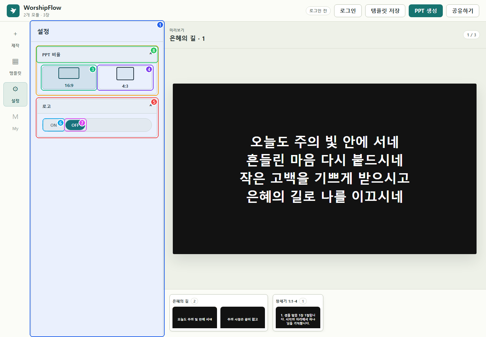

| 번호 | 화면 항목 | IA 위치 | 설명 |
|---:|---|---|---|
| 1 | 설정탭 작업영역 | 1.3.4 | PPT 비율과 로고 설정을 조정하는 영역이다. |
| 2 | PPT 비율 섹션 | 1.3.4.1 | PPT 비율 섹션을 표시한다. |
| 3 | 16:9 버튼 | 1.3.4.1 | 16:9 비율을 선택하는 버튼이다. |
| 4 | 4:3 버튼 | 1.3.4.1 | 4:3 비율을 선택하는 버튼이다. |
| 5 | 로고 섹션 | 1.3.4.2 | 로고 설정 섹션을 표시한다. |
| 6 | 로고 ON 버튼 | 1.3.4.2 | 로고 사용 여부를 켜는 버튼이다. |
| 7 | 로고 OFF 버튼 | 1.3.4.2 | 로고 사용 여부를 끄는 버튼이다. |
| 8 | 설정 섹션 토글 | 1.3.4.3 | 각 설정 섹션은 토글로 접고 펼 수 있다. |

## 09. 미리보기 헤더 세부 항목

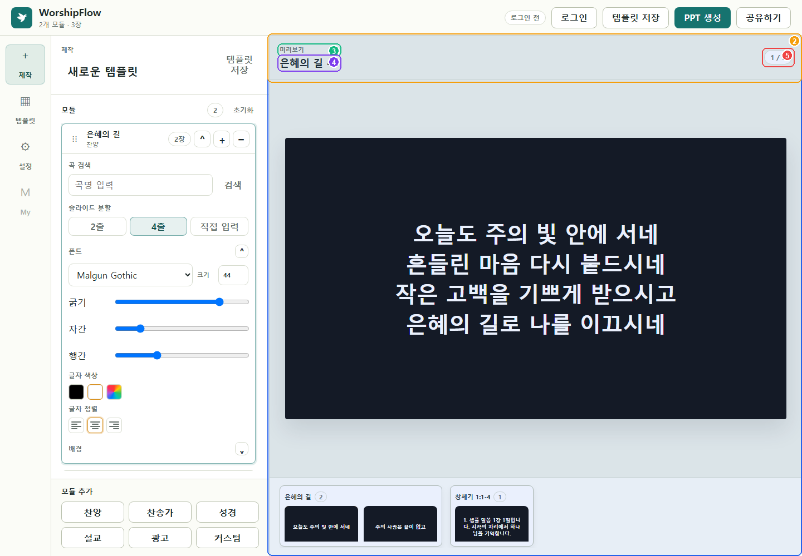

| 번호 | 화면 항목 | IA 위치 | 설명 |
|---:|---|---|---|
| 1 | 미리보기 영역 전체 | 1.4.1 | 현재 선택된 슬라이드를 크게 보여주는 영역이다. |
| 2 | 미리보기 헤더 | 1.4.2 | 현재 미리보기 중인 PPT 정보를 표시하는 헤더이다. |
| 3 | 영역 라벨 | 1.4.2 | 미리보기 영역임을 알려주는 보조 라벨이다. |
| 4 | 현재 PPT 정보 | 1.4.2.1 | `모듈 이름 · 모듈 내 순번` 형식으로 표시된다. |
| 5 | 슬라이드 카운터 | 1.4.3.1 | `현재 순번 / 전체 PPT 장 수` 형식으로 표시된다. |

## 10. 현재 PPT 미리보기 세부 항목

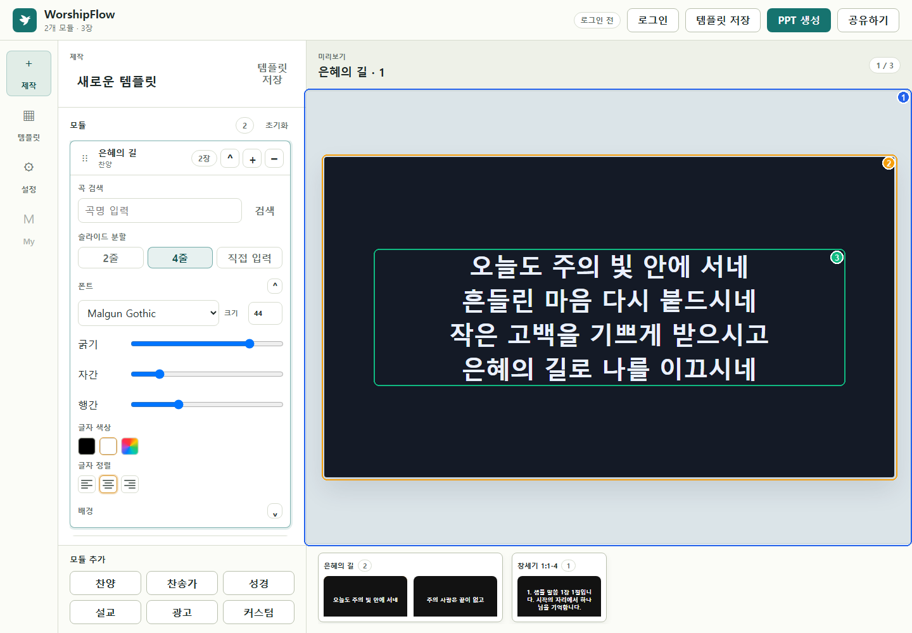

| 번호 | 화면 항목 | IA 위치 | 설명 |
|---:|---|---|---|
| 1 | 슬라이드 표시 영역 | 1.4.4 | 현재 PPT 미리보기 화면을 담는 영역이다. |
| 2 | 현재 PPT 미리보기 | 1.4.4.1 | 찬양/성경은 텍스트 슬라이드로 표시된다. |
| 3 | 텍스트 슬라이드 내용 | 1.4.4.1 | 현재 선택된 찬양 가사 또는 성경 구절을 표시한다. |

## 11. 미리보기 썸네일 세부 항목

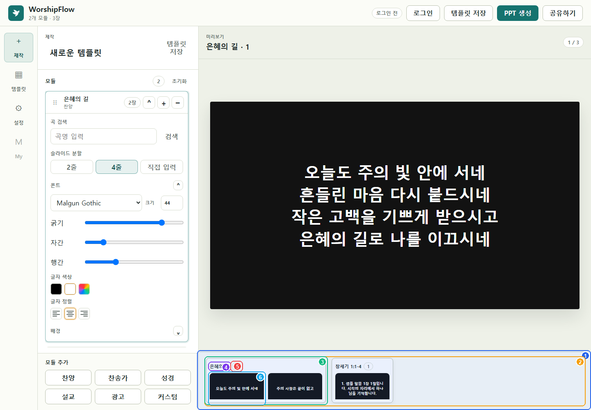

| 번호 | 화면 항목 | IA 위치 | 설명 |
|---:|---|---|---|
| 1 | 썸네일 영역 | 1.4.5 | 슬라이드 선택용 썸네일을 표시하는 영역이다. |
| 2 | 썸네일 그룹 목록 | 1.4.5.1 | 슬라이드를 모듈 그룹별로 묶어 표시한다. |
| 3 | 모듈 그룹 | 1.4.5.1 | 특정 모듈에 속한 슬라이드 썸네일 묶음이다. |
| 4 | 그룹 모듈 이름 | 1.4.5.2 | 각 그룹에는 모듈 이름이 표시된다. |
| 5 | 그룹 슬라이드 수 | 1.4.5.2 | 각 그룹에는 해당 모듈의 슬라이드 수가 표시된다. |
| 6 | 슬라이드 썸네일 | 1.4.5.3 | 썸네일을 클릭하면 해당 슬라이드와 모듈이 선택된다. |

## 12. 로그인 화면 세부 항목

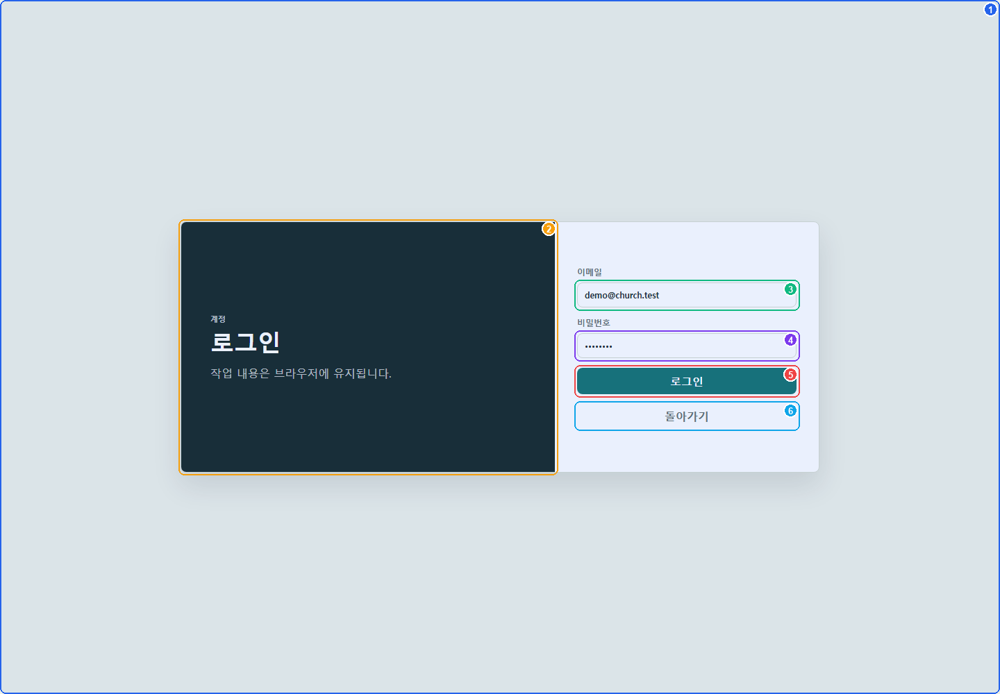

| 번호 | 화면 항목 | IA 위치 | 설명 |
|---:|---|---|---|
| 1 | 로그인 화면 | 1.5.1 | 이메일, 비밀번호, 로그인/돌아가기 버튼을 제공하는 화면이다. |
| 2 | 로그인 안내 | 1.5.1.3 | 현재 구현에서는 입력값을 브라우저 로컬 인증 상태로 저장하는 MVP 흐름임을 안내한다. |
| 3 | 이메일 입력 필드 | 1.5.1.1 | 이메일 입력 필드를 표시한다. |
| 4 | 비밀번호 입력 필드 | 1.5.1.1 | 비밀번호 입력 필드를 표시한다. |
| 5 | 로그인 버튼 | 1.5.1.2 | 로그인 버튼을 제공한다. |
| 6 | 돌아가기 버튼 | 1.5.1.2 | 돌아가기 버튼을 제공한다. |

## 13. 템플릿 저장 모달 세부 항목

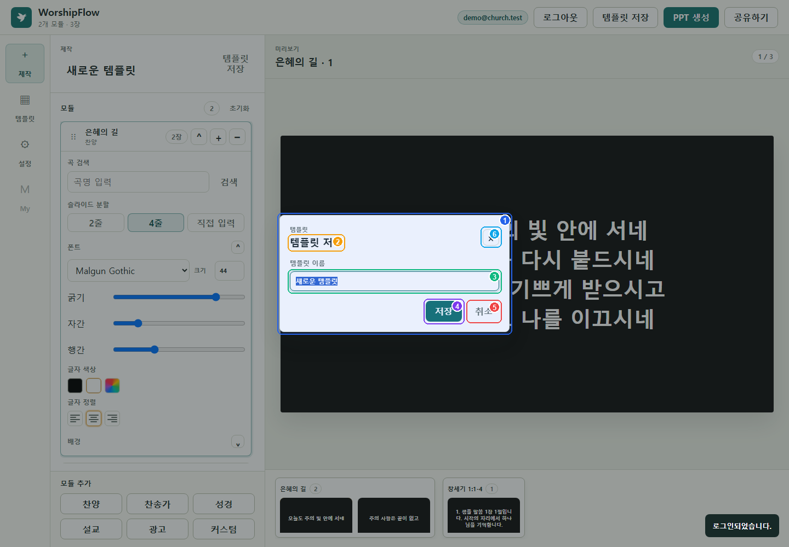

| 번호 | 화면 항목 | IA 위치 | 설명 |
|---:|---|---|---|
| 1 | 템플릿 저장 모달 | 1.5.2 | 템플릿 이름과 저장/취소/닫기 버튼을 제공하는 모달이다. |
| 2 | 모달 제목 | 1.5.2 | 템플릿 저장 작업임을 표시한다. |
| 3 | 템플릿 이름 입력 필드 | 1.5.2.1 | 템플릿 이름 입력 필드를 표시한다. |
| 4 | 저장 버튼 | 1.5.2.2 | 저장 버튼을 제공한다. |
| 5 | 취소 버튼 | 1.5.2.2 | 취소 버튼을 제공한다. |
| 6 | 닫기 버튼 | 1.5.2.2 | 닫기 버튼을 제공한다. |

## 14. 공유 모달 세부 항목

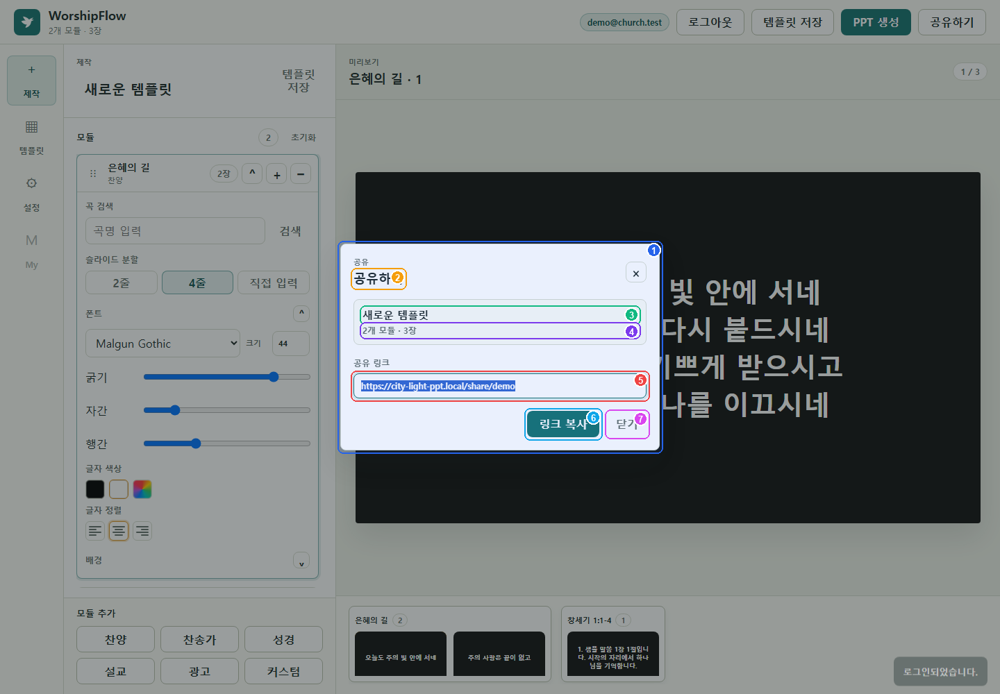

| 번호 | 화면 항목 | IA 위치 | 설명 |
|---:|---|---|---|
| 1 | 공유 모달 | 1.5.3 | 공유 대상과 공유 링크를 제공하는 모달이다. |
| 2 | 모달 제목 | 1.5.3 | 공유하기 작업임을 표시한다. |
| 3 | 공유 대상 템플릿 이름 | 1.5.3.1 | 공유 대상 템플릿 이름을 표시한다. |
| 4 | 모듈/슬라이드 수 | 1.5.3.2 | 모듈 수와 슬라이드 수를 표시한다. |
| 5 | 공유 링크 입력 필드 | 1.5.3.3 | 공유 링크 입력 필드를 표시한다. |
| 6 | 링크 복사 버튼 | 1.5.3.4 | 링크 복사 버튼을 제공한다. |
| 7 | 닫기 버튼 | 1.5.3.4 | 닫기 버튼을 제공한다. |

## 15. 토스트 세부 항목

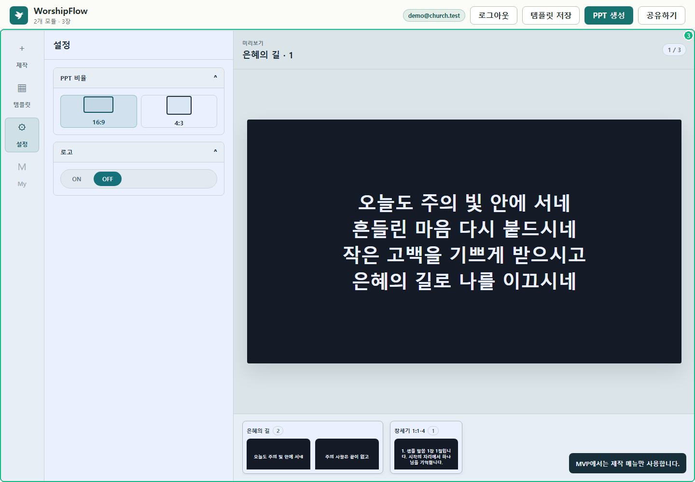

| 번호 | 화면 항목 | IA 위치 | 설명 |
|---:|---|---|---|
| 1 | 비활성 My 메뉴 | 1.2.5.1 | 현재 MVP에서는 비활성 메뉴이다. |
| 2 | 토스트 | 1.5.4.1, 1.5.4.2 | 주요 결과 안내 문구를 표시하며, 화면 하단 안내 영역으로 동작한다. |
| 3 | 화면 유지 | 1.2.5.2 | My 메뉴 클릭 시 화면 전환 없이 기존 작업영역이 유지된다. |

## 2. 모듈 설명 스토리보드

### 16. 공통 모듈 카드

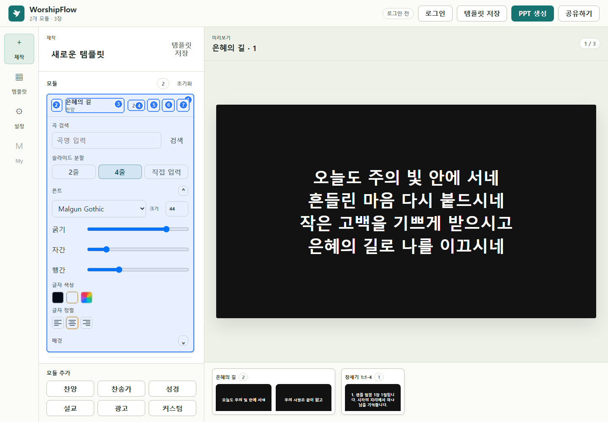

| 번호 | 화면 항목 | IA 위치 | 설명 | 관련 동작 |
|---:|---|---|---|---|
| 1 | 모듈 카드 전체 | 2.1.2 | 개별 모듈의 헤더, 상세 설정, 액션 버튼을 담는 카드이다. | 4.2.1 |
| 2 | 드래그 핸들 | 2.1.2.1 | 모듈 순서를 바꾸기 위한 드래그 시작 위치이다. | 4.2.3 |
| 3 | 모듈 이름/종류 | 2.1.2.2, 2.1.2.3 | 선택한 데이터 또는 입력값 기준 이름과 모듈 타입을 표시한다. | 4.2.1 |
| 4 | PPT 장 수 | 2.1.2.4 | 해당 모듈에서 생성되는 슬라이드 수를 표시한다. | 4.2.2 |
| 5 | 접기/펼치기 | 2.1.2.5 | 모듈 상세 설정 영역 표시 여부를 제어한다. | 4.2.6 |
| 6 | 복제 | 2.1.2.6 | 같은 설정의 모듈을 바로 아래에 복제한다. | 4.2.4 |
| 7 | 삭제 | 2.1.2.7 | 브라우저 확인창 후 모듈을 삭제한다. | 4.2.5 |

### 17. 공통 슬라이드 분할

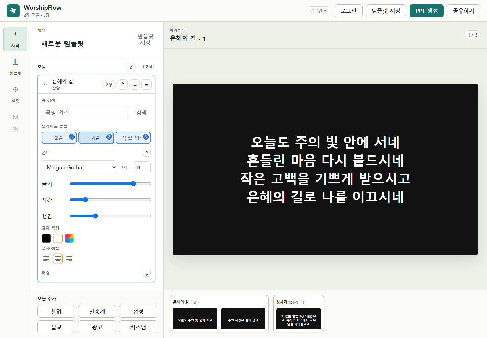

| 번호 | 화면 항목 | IA 위치 | 설명 | 관련 동작 |
|---:|---|---|---|---|
| 1 | 2줄 | 2.1.3.2 | 가사/구절을 2줄 단위로 슬라이드 분할한다. | 4.3.5 |
| 2 | 4줄 | 2.1.3.2 | 가사/구절을 4줄 단위로 슬라이드 분할한다. | 4.3.5 |
| 3 | 직접 입력 | 2.1.3.2 | 사용자가 직접 슬라이드 단위를 작성하는 모드이다. | 4.3.5 |

### 18. 직접 입력 분할

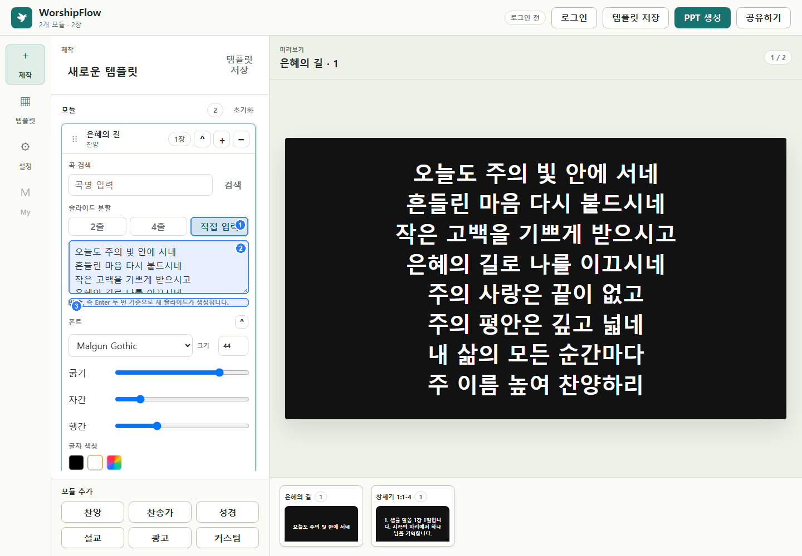

| 번호 | 화면 항목 | IA 위치 | 설명 | 관련 동작 |
|---:|---|---|---|---|
| 1 | 직접 입력 선택 상태 | 2.1.3.3 | 직접 입력 모드가 활성화된 상태이다. | 4.3.5 |
| 2 | 직접 입력 textarea | 2.1.3.3 | 원본 가사/구절을 편집해 슬라이드를 직접 나눈다. | 4.3.5 |
| 3 | 분할 기준 안내 | 2.1.3.4 | 빈 줄, 즉 Enter 두 번 기준으로 새 슬라이드가 생성됨을 안내한다. | 4.3.5 |

### 19. 공통 폰트

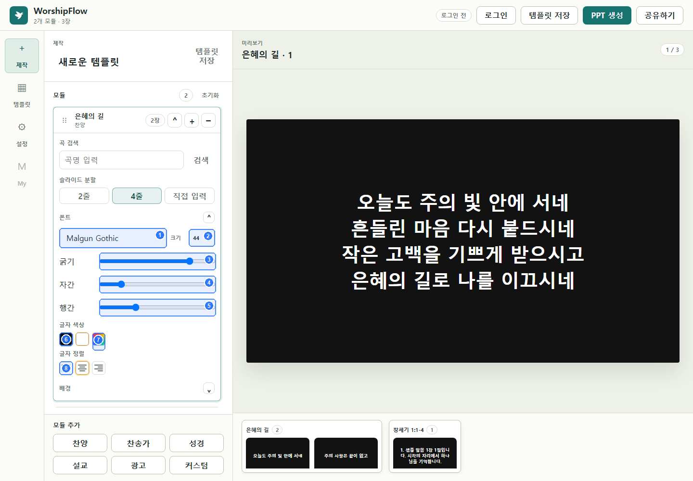

| 번호 | 화면 항목 | IA 위치 | 설명 | 관련 동작 |
|---:|---|---|---|---|
| 1 | 폰트 패밀리 | 2.1.4.2 | 슬라이드 텍스트 폰트를 선택한다. | 4.3.6 |
| 2 | 크기 | 2.1.4.3 | 글자 크기 숫자 값을 조정한다. | 4.3.6 |
| 3 | 굵기 | 2.1.4.4 | 글자 굵기를 범위 슬라이더로 조정한다. | 4.3.6 |
| 4 | 자간 | 2.1.4.5 | 글자 간격을 조정한다. | 4.3.6 |
| 5 | 행간 | 2.1.4.6 | 줄 간격을 조정한다. | 4.3.6 |
| 6 | 기본 색상 | 2.1.4.7 | 검정/흰색 글자 색상을 빠르게 선택한다. | 4.3.6 |
| 7 | 직접 색상 | 2.1.4.7 | 색상 선택기로 임의 글자 색상을 지정한다. | 4.3.6 |
| 8 | 글자 정렬 | 2.1.4.8 | 왼쪽/가운데/오른쪽 정렬을 선택한다. | 4.3.6 |

### 20. 공통 배경

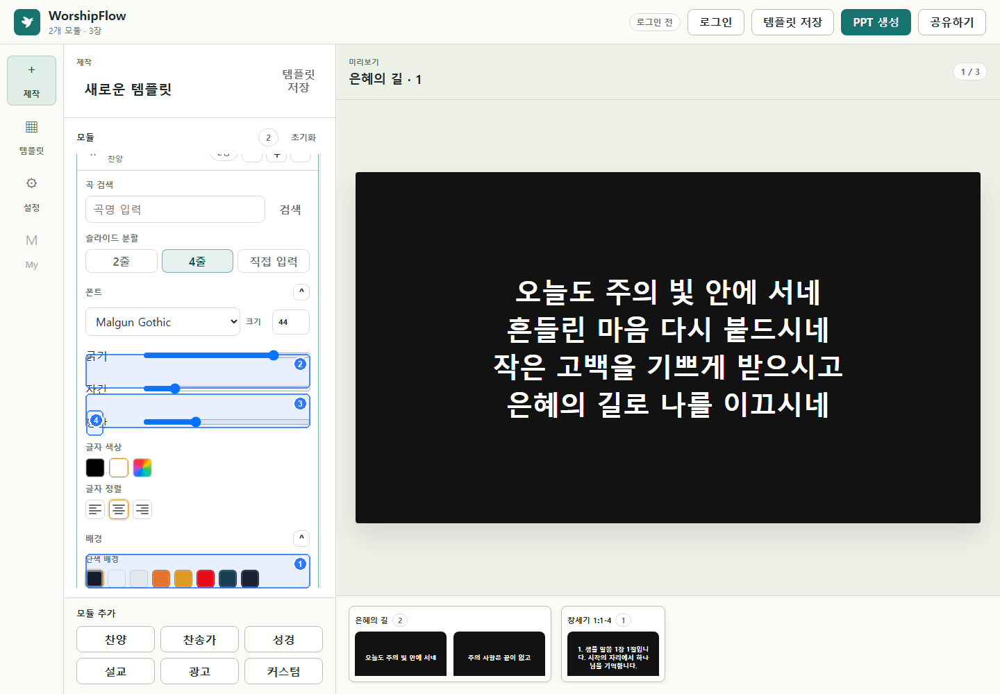

| 번호 | 화면 항목 | IA 위치 | 설명 | 관련 동작 |
|---:|---|---|---|---|
| 1 | 단색 배경 | 2.1.5.1 | 코드에 정의된 단색 배경을 선택한다. | 4.3.7 |
| 2 | 템플릿 배경 | 2.1.5.2 | 저장 템플릿이 아니라 프리셋 그라데이션 배경을 선택한다. | 4.3.7 |
| 3 | 이미지 배경 | 2.1.5.3 | 업로드 이미지 배경을 적용하는 영역이다. | 4.3.8 |
| 4 | 이미지 업로드 | 2.1.5.3 | 이미지 파일 선택 후 해당 모듈 배경으로 저장한다. | 4.3.8 |

### 21. 찬양 검색 결과

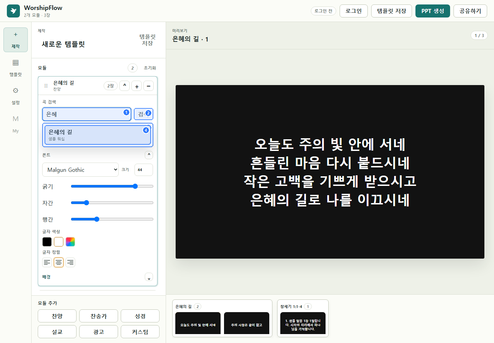

| 번호 | 화면 항목 | IA 위치 | 설명 | 관련 동작 |
|---:|---|---|---|---|
| 1 | 곡 검색 입력 | 2.2.3.1.1 | 샘플 찬양 데이터에서 곡명을 검색한다. | 4.3.1 |
| 2 | 검색 버튼 | 2.2.3.1.4 | 현재 검색어 기준으로 결과 목록을 연다. | 4.3.1 |
| 3 | 결과 목록 | 2.2.3.1.1 | 일치하는 찬양 목록 또는 결과 없음 문구를 표시한다. | 4.3.1 |
| 4 | 검색 결과 항목 | 2.2.3.1.2 | 클릭하면 해당 찬양이 선택된다. | 4.3.2 |

### 22. 찬양 선택 완료

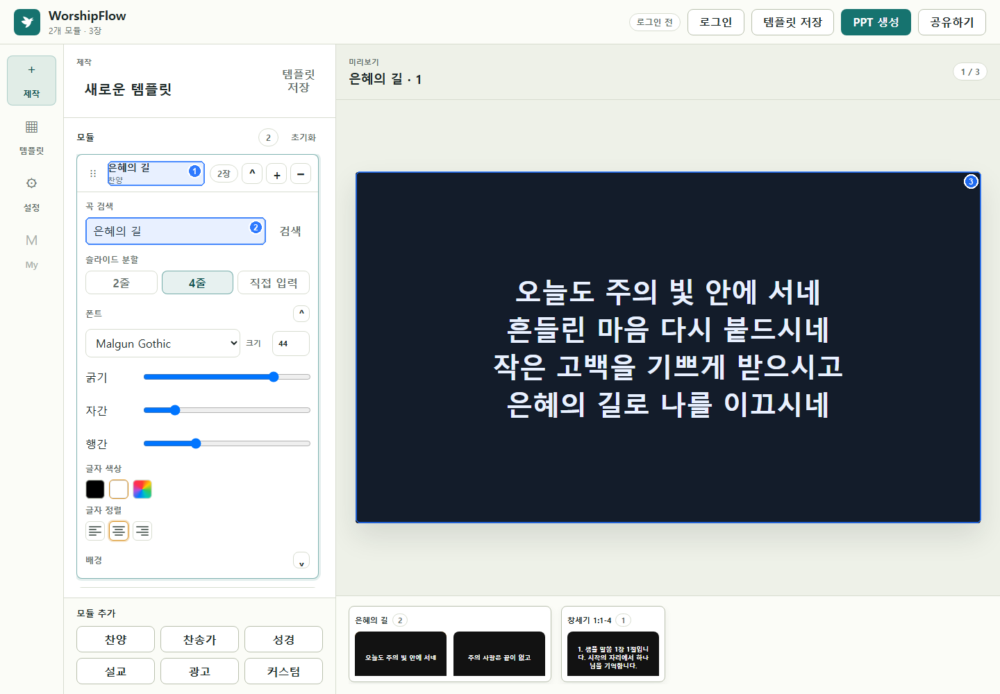

| 번호 | 화면 항목 | IA 위치 | 설명 | 관련 동작 |
|---:|---|---|---|---|
| 1 | 선택 곡 모듈명 | 2.2.2.1 | 선택한 찬양 곡명이 모듈 이름으로 표시된다. | 4.3.2 |
| 2 | 검색창 선택값 | 2.2.3.1.2 | 검색창에는 선택한 곡명이 입력된다. | 4.3.2 |
| 3 | 미리보기 반영 | 2.2.3.2, 2.2.3.3, 2.2.3.4 | 선택 곡의 가사, 폰트, 배경이 미리보기에 반영된다. | 4.3.2 |

### 23. 찬송가 검색/악보

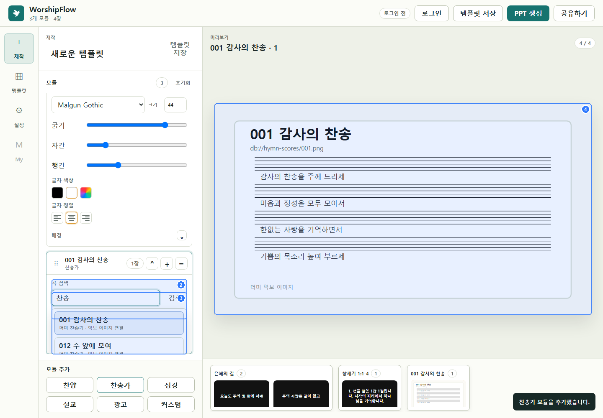

| 번호 | 화면 항목 | IA 위치 | 설명 | 관련 동작 |
|---:|---|---|---|---|
| 1 | 곡 검색 입력 | 2.3.3.1.1 | 샘플 찬송가 데이터에서 곡명을 검색한다. | 4.3.1 |
| 2 | 검색 결과 | 2.3.3.1.2 | 찬송가 메타 정보와 악보 이미지 연결 여부를 표시한다. | 4.3.2 |
| 3 | 악보 이미지 상태 | 2.3.3.2.1 | 선택한 찬송가의 악보 이미지 경로 상태를 표시한다. | 4.3.2 |
| 4 | 악보 미리보기 | 2.3.3.2.2 | 텍스트가 아니라 악보 이미지 중심 슬라이드로 표시된다. | 4.3.2 |

### 24. 성경 선택

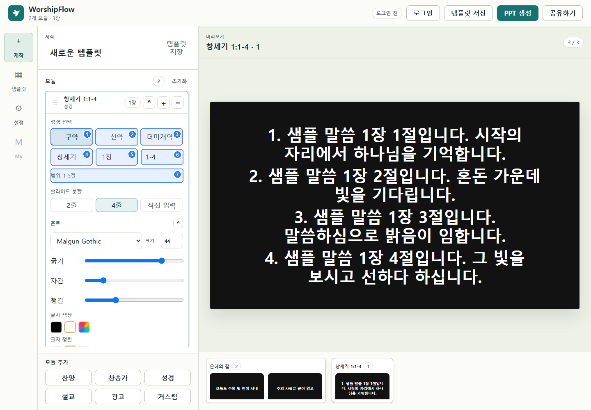

| 번호 | 화면 항목 | IA 위치 | 설명 | 관련 동작 |
|---:|---|---|---|---|
| 1 | 구약 | 2.4.3.1.1 | 구약 성경 목록을 선택한다. | 4.3.3 |
| 2 | 신약 | 2.4.3.1.1 | 신약 성경 목록을 선택한다. | 4.3.3 |
| 3 | 번역본 | 2.4.3.1.2 | 번역본 드롭다운을 표시한다. | 4.3.4 |
| 4 | 성경 | 2.4.3.1.3 | 성경 이름 드롭다운을 표시한다. | 4.3.4 |
| 5 | 장 | 2.4.3.1.4 | 장 드롭다운을 표시한다. | 4.3.4 |
| 6 | 절 범위 | 2.4.3.1.5 | 시작 절과 끝 절 범위를 입력한다. | 4.3.4 |
| 7 | 유효 범위 안내 | 2.4.3.2.1 | 현재 장의 데이터 범위를 안내한다. | 4.3.4 |

### 25. 성경 범위 오류

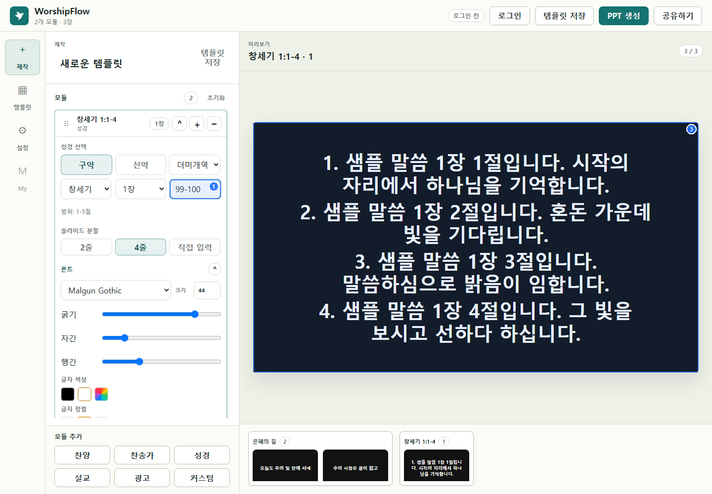

| 번호 | 화면 항목 | IA 위치 | 설명 | 관련 동작 |
|---:|---|---|---|---|
| 1 | 오류 입력값 | 2.4.3.1.5 | 데이터 범위를 벗어난 절 범위가 입력된 상태이다. | 4.3.4 |
| 2 | 오류 문구 | 2.4.3.2.4 | 현재 DB에 있는 절 범위를 기준으로 오류를 표시한다. | 4.3.4, 4.11.2 |
| 3 | 미리보기 오류 | 2.4.3.2.4 | 유효하지 않은 성경 모듈은 미리보기에도 오류 상태가 반영된다. | 4.11.2 |

### 26. 설교 입력

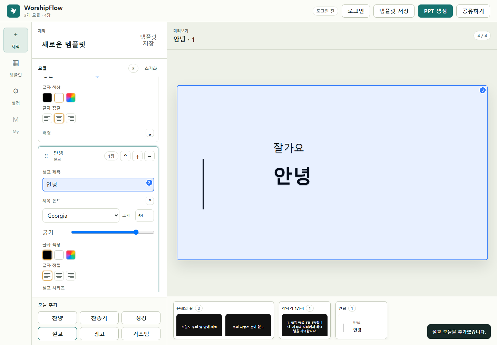

| 번호 | 화면 항목 | IA 위치 | 설명 | 관련 동작 |
|---:|---|---|---|---|
| 1 | 설교 제목 | 2.5.3.1 | 설교 제목 슬라이드의 주요 제목을 입력한다. | 4.3.6 |
| 2 | 설교 시리즈 | 2.5.3.3 | 제목보다 작은 보조 텍스트를 입력한다. | 4.3.6 |
| 3 | 설교 미리보기 | 2.5.4.1 | 설교 모듈은 1장의 설교 슬라이드를 생성한다. | 4.3.6 |

### 27. 설교 폰트/배경

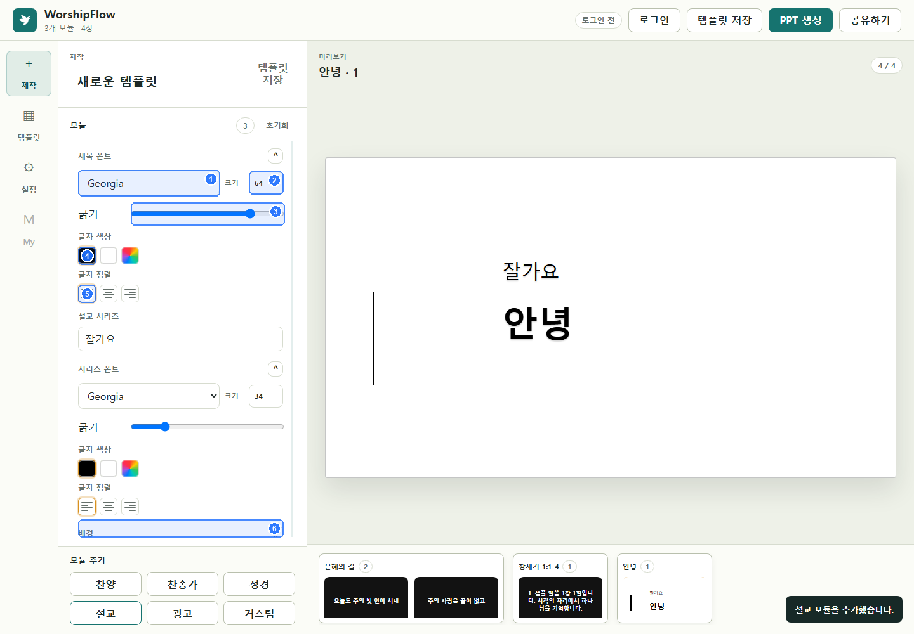

| 번호 | 화면 항목 | IA 위치 | 설명 | 관련 동작 |
|---:|---|---|---|---|
| 1 | 폰트 패밀리 | 2.5.3.2.1 | 제목/시리즈 폰트를 선택한다. | 4.3.6 |
| 2 | 크기 | 2.5.3.2.1 | 제목/시리즈 글자 크기를 조정한다. | 4.3.6 |
| 3 | 굵기 | 2.5.3.2.1 | 제목/시리즈 글자 굵기를 조정한다. | 4.3.6 |
| 4 | 색상 | 2.5.3.2.1 | 제목/시리즈 글자 색상을 선택한다. | 4.3.6 |
| 5 | 정렬 | 2.5.3.2.1 | 제목/시리즈 정렬을 선택한다. | 4.3.6 |
| 6 | 배경 섹션 | 2.5.3.5 | 설교 슬라이드 배경 설정을 제공한다. | 4.3.7 |

### 28. 광고 항목 목록

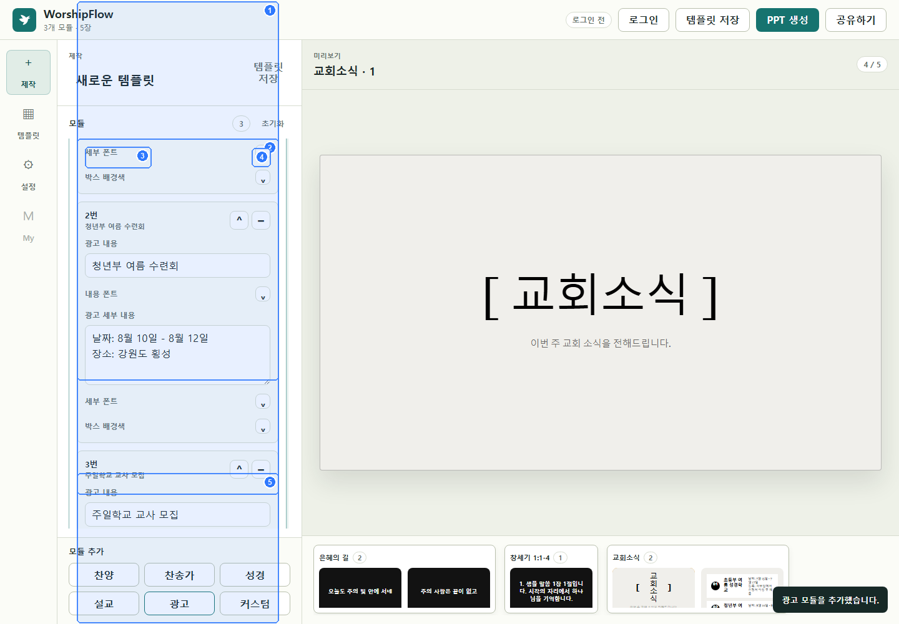

| 번호 | 화면 항목 | IA 위치 | 설명 | 관련 동작 |
|---:|---|---|---|---|
| 1 | 광고 항목 목록 | 2.6.3.1.1 | 기본 광고 항목 3개가 생성되어 표시된다. | 4.4.1 |
| 2 | 광고 항목 카드 | 2.6.3.1.2 | 각 항목은 독립 입력/스타일 설정을 가진다. | 4.4.1 |
| 3 | 항목 토글 | 2.6.3.1.2 | 항목 상세 설정을 접거나 펼친다. | 4.4.1 |
| 4 | 항목 삭제 | 2.6.3.1.3 | 광고 항목이 2개 이상일 때 표시된다. | 4.4.3 |
| 5 | 광고 추가 | 2.6.3.7.1 | 새 광고 항목을 목록 마지막에 추가한다. | 4.4.2 |

### 29. 광고 항목 상세

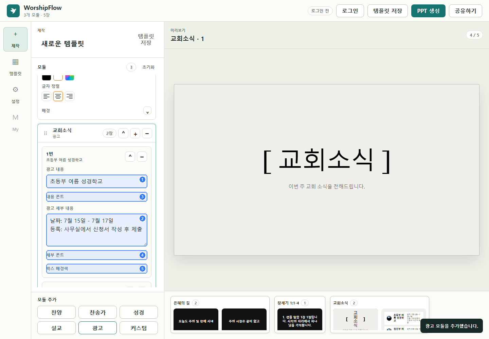

| 번호 | 화면 항목 | IA 위치 | 설명 | 관련 동작 |
|---:|---|---|---|---|
| 1 | 광고 내용 | 2.6.3.2.1 | 내용 슬라이드의 번호 옆 제목을 입력한다. | 4.4.4 |
| 2 | 광고 세부 내용 | 2.6.3.4.1 | 줄바꿈 가능한 세부 내용을 입력한다. | 4.4.4 |
| 3 | 내용 폰트 | 2.6.3.3 | 광고 제목의 폰트 설정 섹션이다. | 4.3.6 |
| 4 | 세부 폰트 | 2.6.3.5 | 세부 내용의 폰트 설정 섹션이다. | 4.3.6 |
| 5 | 박스 배경색 | 2.6.3.6 | 광고 항목 박스 배경색 설정 섹션이다. | 4.3.7 |

### 30. 광고 박스 배경

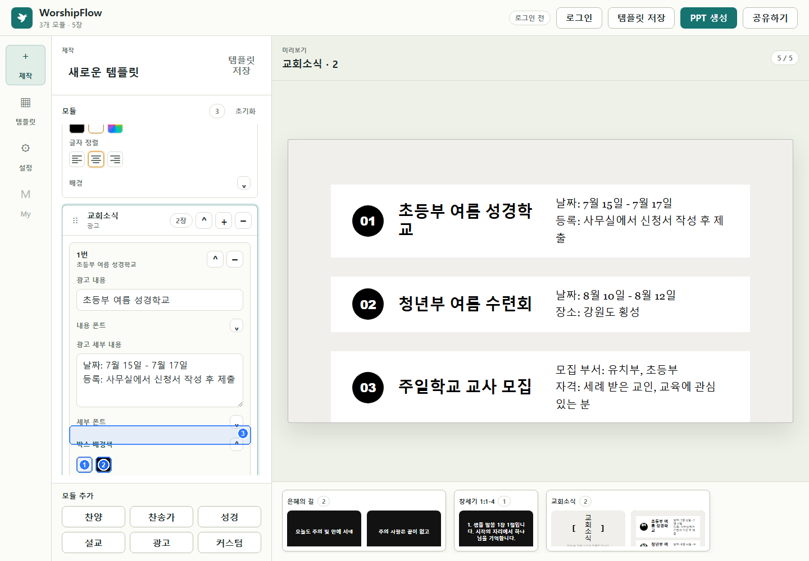

| 번호 | 화면 항목 | IA 위치 | 설명 | 관련 동작 |
|---:|---|---|---|---|
| 1 | 흰색 박스 | 2.6.3.6.1 | 광고 항목 박스 배경을 흰색으로 설정한다. | 4.3.7 |
| 2 | 검은색 박스 | 2.6.3.6.1 | 광고 항목 박스 배경을 검은색으로 설정한다. | 4.3.7 |
| 3 | 광고 추가 | 2.6.3.7.1 | 항목이 늘면 3개 단위로 내용 슬라이드가 추가된다. | 4.4.2 |

### 31. 커스텀 제목 타입

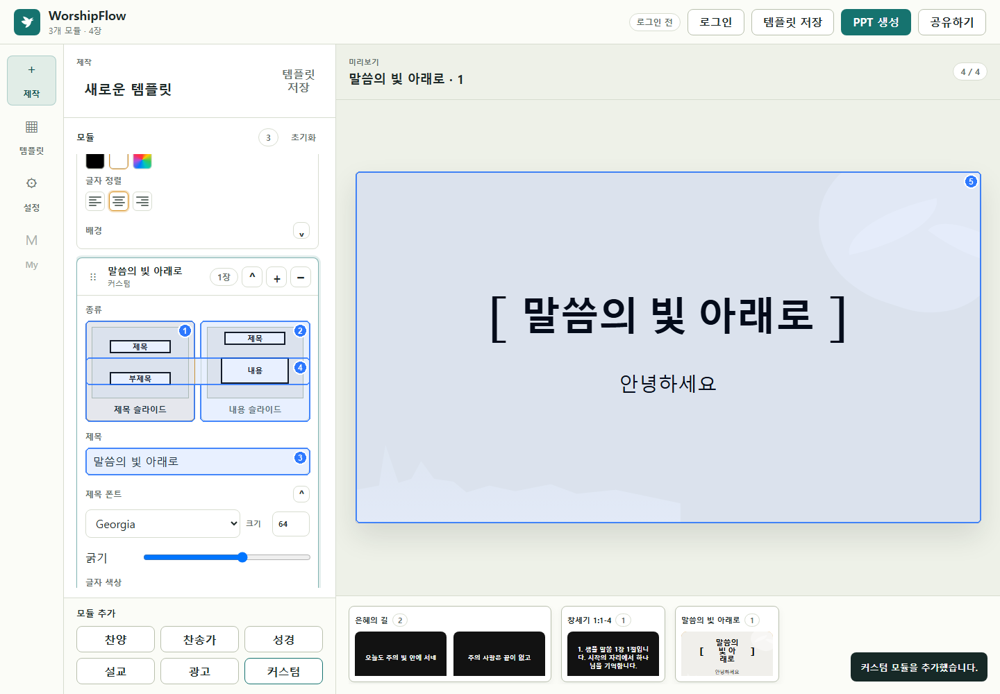

| 번호 | 화면 항목 | IA 위치 | 설명 | 관련 동작 |
|---:|---|---|---|---|
| 1 | 제목 슬라이드 | 2.7.3.1.1 | 제목/부제목 중심 커스텀 슬라이드 타입이다. | 4.5.1 |
| 2 | 내용 슬라이드 | 2.7.3.1.1 | 제목/본문 중심 커스텀 슬라이드 타입이다. | 4.5.1 |
| 3 | 제목 입력 | 2.7.3.2.1 | 제목 슬라이드의 제목을 입력한다. | 4.5.3 |
| 4 | 부제목 입력 | 2.7.3.2.3 | 제목 슬라이드의 부제목을 입력한다. | 4.5.3 |
| 5 | 커스텀 미리보기 | 2.7.4.1 | 선택 타입에 따라 1장의 슬라이드를 생성한다. | 4.5.1 |

### 32. 커스텀 내용/프리셋

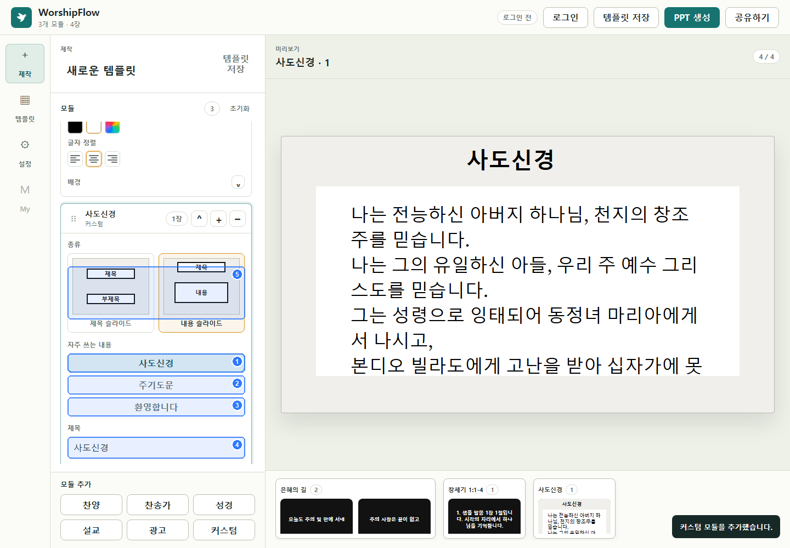

| 번호 | 화면 항목 | IA 위치 | 설명 | 관련 동작 |
|---:|---|---|---|---|
| 1 | 사도신경 | 2.7.3.3.2 | 사도신경 프리셋을 적용한다. | 4.5.2 |
| 2 | 주기도문 | 2.7.3.3.2 | 주기도문 프리셋을 적용한다. | 4.5.2 |
| 3 | 환영합니다 | 2.7.3.3.2 | 환영 문구 프리셋을 적용한다. | 4.5.2 |
| 4 | 내용 제목 | 2.7.3.3.4 | 내용 슬라이드 제목을 입력한다. | 4.5.3 |
| 5 | 본문 입력 | 2.7.3.3.6 | 내용 슬라이드 본문을 입력한다. | 4.5.3 |

### 33. 커스텀 폰트/배경

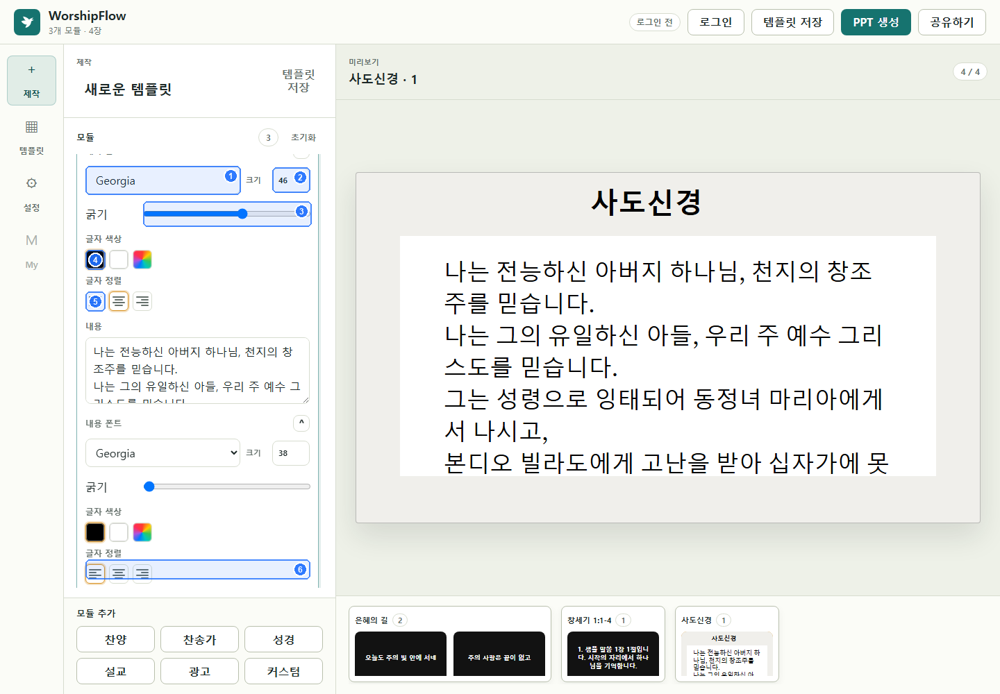

| 번호 | 화면 항목 | IA 위치 | 설명 | 관련 동작 |
|---:|---|---|---|---|
| 1 | 폰트 패밀리 | 2.7.3.3.5 | 제목 또는 본문 폰트를 선택한다. | 4.3.6 |
| 2 | 크기 | 2.7.3.3.5 | 제목 또는 본문 글자 크기를 조정한다. | 4.3.6 |
| 3 | 굵기 | 2.7.3.3.5 | 제목 또는 본문 글자 굵기를 조정한다. | 4.3.6 |
| 4 | 색상 | 2.7.3.3.5 | 제목 또는 본문 글자 색상을 선택한다. | 4.3.6 |
| 5 | 정렬 | 2.7.3.3.5 | 제목 또는 본문 정렬을 선택한다. | 4.3.6 |
| 6 | 배경 섹션 | 2.7.3.2.5, 2.7.3.3.8 | 커스텀 슬라이드 배경 설정을 제공한다. | 4.3.7 |

## 3. 템플릿 설명 스토리보드

### 34. 현재 템플릿 컨트롤

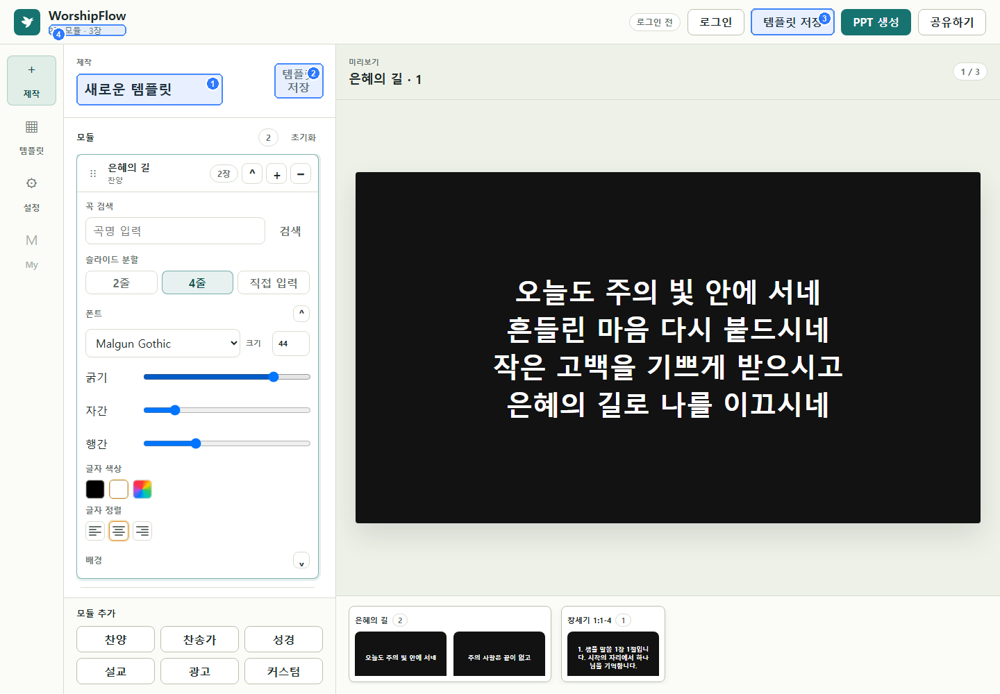

| 번호 | 화면 항목 | IA 위치 | 설명 | 관련 동작 |
|---:|---|---|---|---|
| 1 | 템플릿 이름 | 3.2.1.1 | 제작 중인 템플릿 이름을 입력한다. | 4.7.3 |
| 2 | 제작탭 저장 | 3.2.2.1 | 상단바 저장 버튼과 같은 저장 흐름을 실행한다. | 4.7.1 |
| 3 | 상단바 저장 | 3.2.2.1 | 현재 작업 상태를 템플릿으로 저장한다. | 4.7.1 |
| 4 | 작업 요약 | 3.4.2.3, 3.4.2.4 | 저장 스냅샷에 포함될 모듈/슬라이드 상태를 요약한다. | 4.7.3 |

### 35. 템플릿 저장 모달

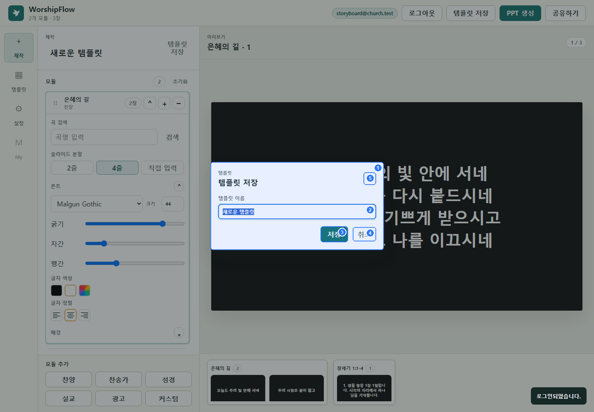

| 번호 | 화면 항목 | IA 위치 | 설명 | 관련 동작 |
|---:|---|---|---|---|
| 1 | 저장 모달 전체 | 3.2.2.2 | 로그인 상태에서 새 템플릿 저장 시 표시된다. | 4.7.3 |
| 2 | 템플릿 이름 입력 | 3.2.1.1 | 저장할 템플릿 이름을 입력한다. | 4.7.3 |
| 3 | 저장 | 3.2.2.2 | 입력 이름으로 새 저장 템플릿을 만든다. | 4.7.3 |
| 4 | 취소 | 3.2.2.2 | 저장하지 않고 모달을 닫는다. | 4.7.4 |
| 5 | 닫기 | 3.2.2.2 | 저장 흐름을 취소하고 모달을 닫는다. | 4.7.4 |

### 36. 템플릿탭 섹션

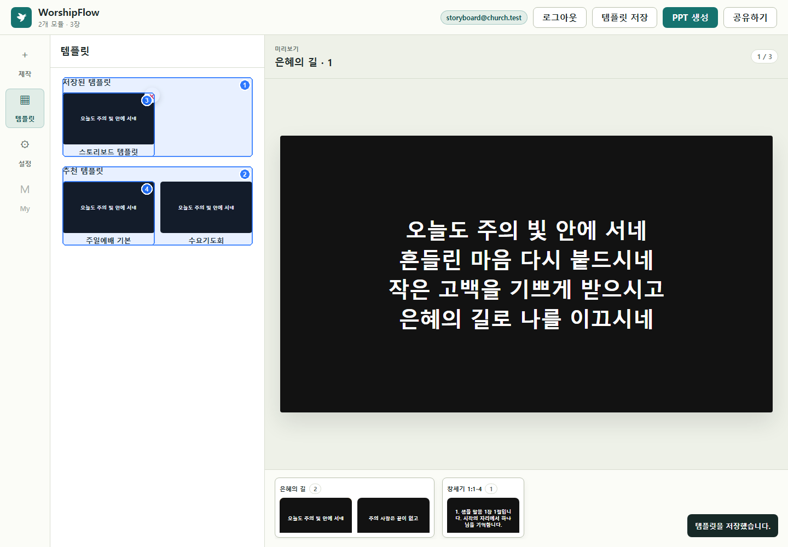

| 번호 | 화면 항목 | IA 위치 | 설명 | 관련 동작 |
|---:|---|---|---|---|
| 1 | 저장된 템플릿 | 3.3.1.1 | 로그인 사용자의 저장 템플릿 목록을 표시한다. | 4.8.1 |
| 2 | 추천 템플릿 | 3.3.2.1 | 코드에 기본 제공되는 추천 템플릿 목록을 표시한다. | 4.8.1 |
| 3 | 저장 템플릿 카드 | 3.3.1.2 | 썸네일, 이름, 삭제 버튼으로 구성된다. | 4.8.2 |
| 4 | 추천 템플릿 카드 | 3.3.2.3 | 썸네일과 이름만 표시하며 삭제 버튼은 없다. | 4.8.3 |

### 37. 저장된 템플릿 카드

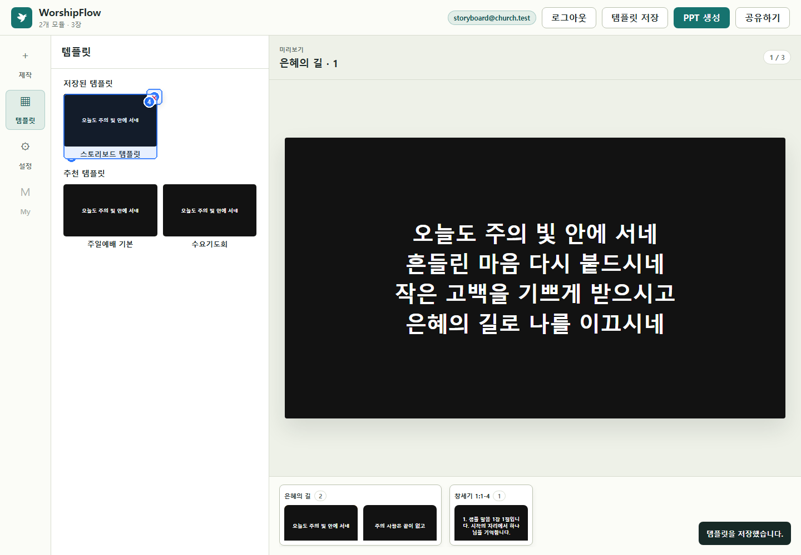

| 번호 | 화면 항목 | IA 위치 | 설명 | 관련 동작 |
|---:|---|---|---|---|
| 1 | 저장 템플릿 썸네일 | 3.3.1.2.1, 3.3.1.3 | 첫 번째 슬라이드를 축소 미리보기로 표시한다. | 4.8.2 |
| 2 | 저장 템플릿 이름 | 3.3.1.2.2 | 저장 시 입력한 템플릿 이름을 표시한다. | 4.8.2 |
| 3 | 삭제 버튼 | 3.3.1.2.3 | 저장 템플릿에만 표시되는 삭제 버튼이다. | 4.8.5 |
| 4 | 카드 클릭 영역 | 3.3.3.1 | 클릭하면 템플릿 미리보기 화면으로 이동한다. | 4.8.2 |

### 38. 추천 템플릿 카드

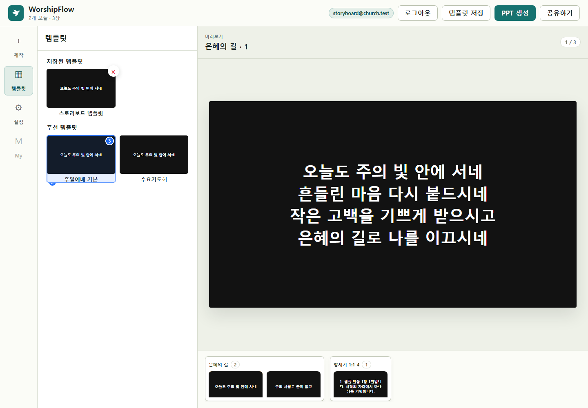

| 번호 | 화면 항목 | IA 위치 | 설명 | 관련 동작 |
|---:|---|---|---|---|
| 1 | 추천 템플릿 썸네일 | 3.3.2.3.1 | 추천 템플릿의 첫 번째 슬라이드를 표시한다. | 4.8.3 |
| 2 | 추천 템플릿 이름 | 3.3.2.3.2 | `주일예배 기본`, `수요기도회` 등 이름을 표시한다. | 4.8.3 |
| 3 | 카드 클릭 영역 | 3.3.2.5 | 추천 템플릿도 미리보기와 적용하기가 가능하다. | 4.8.3 |

### 39. 템플릿 미리보기

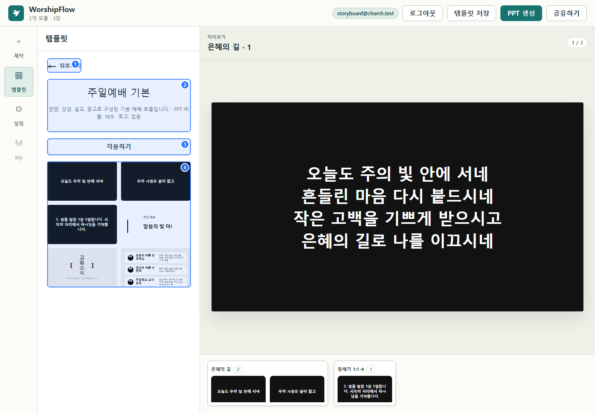

| 번호 | 화면 항목 | IA 위치 | 설명 | 관련 동작 |
|---:|---|---|---|---|
| 1 | 뒤로가기 | 3.3.3.2.1 | 템플릿 목록 화면으로 돌아간다. | 4.8.4 |
| 2 | 이름/설명 | 3.3.3.2.2, 3.3.3.2.3 | 템플릿 이름과 설명 문구를 표시한다. | 4.8.2 |
| 3 | 적용하기 | 3.3.3.2.4 | 선택한 템플릿을 현재 작업에 적용한다. | 4.8.6 |
| 4 | 슬라이드 미리보기 목록 | 3.3.3.2.5 | 해당 템플릿으로 생성되는 슬라이드 목록을 표시한다. | 4.8.6 |

### 40. 적용하기 버튼/슬라이드

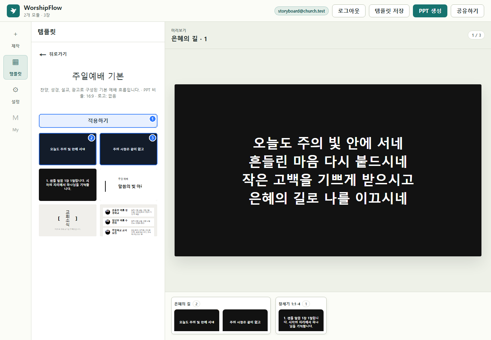

| 번호 | 화면 항목 | IA 위치 | 설명 | 관련 동작 |
|---:|---|---|---|---|
| 1 | 적용하기 버튼 | 3.3.3.2.4 | 클릭 시 저장 여부 확인 후 템플릿을 불러온다. | 4.8.6 |
| 2 | 첫 번째 슬라이드 | 3.3.3.2.5 | 적용될 템플릿의 첫 번째 슬라이드 미리보기이다. | 4.8.6 |
| 3 | 두 번째 슬라이드 | 3.3.3.2.5 | 적용될 템플릿의 추가 슬라이드 미리보기이다. | 4.8.6 |

### 41. 로그아웃 상태 템플릿탭

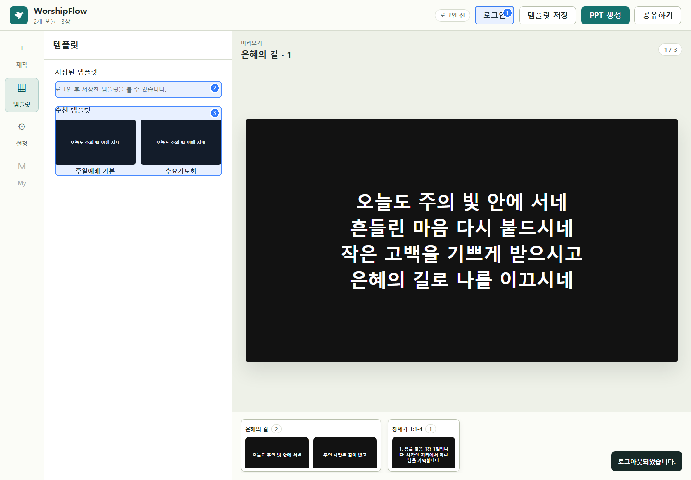

| 번호 | 화면 항목 | IA 위치 | 설명 | 관련 동작 |
|---:|---|---|---|---|
| 1 | 로그인 버튼 | 3.1.4 | 저장 템플릿을 보려면 로그인이 필요하다. | 4.10.1 |
| 2 | 저장 템플릿 안내 | 3.3.1.6 | 로그아웃 상태 안내 문구를 표시한다. | 4.10.1 |
| 3 | 추천 템플릿 섹션 | 3.3.2.1 | 추천 템플릿은 로그아웃 상태에서도 표시된다. | 4.8.3 |

### 템플릿 저장 데이터 매핑

| 데이터 항목 | IA 위치 | 저장/표시 방식 | 관련 동작 |
|---|---|---|---|
| 스키마 버전 | 3.4.2.1 | 템플릿 스냅샷의 버전 값으로 저장된다. | 4.7.3 |
| 템플릿 이름 | 3.4.2.2 | 제작탭/저장 모달 입력값을 기준으로 저장된다. | 4.7.3 |
| 모듈 ID 순서 | 3.4.2.3 | 현재 모듈 목록 순서를 배열로 저장한다. | 4.2.3 |
| 모듈 타입 순서 | 3.4.2.4 | 찬양, 성경, 설교 등 타입 순서를 저장한다. | 4.7.3 |
| 선택 모듈/슬라이드 | 3.4.2.5, 3.4.2.6 | 현재 선택 상태를 저장해 불러오기 때 복원한다. | 4.8.6 |
| PPT 표시 설정 | 3.4.2.7 | 비율, 로고 사용 여부, 로고 위치를 저장한다. | 4.9 |
| 모듈 전체 데이터 | 3.4.2.8 | 각 모듈의 입력값과 스타일 설정을 함께 저장한다. | 4.7.3 |

## 사용 메모

- 스토리보드는 IA 1번 화면 구성, IA 2번 모듈 설명, IA 3번 템플릿 설명을 팀원이 실제 화면에서 찾을 수 있도록 세부 캡쳐로 나눈 문서이다.
- 이미지 위 번호는 위치 식별용이며, 정확한 설명은 각 표의 `IA 위치`와 `설명`을 기준으로 확인한다.
- 상세 동작 플로우는 [IA_STORYBOARD_ACTIONS.md](IA_STORYBOARD_ACTIONS.md)를 함께 참고한다.
- [storyboard/screen/raw](storyboard/screen/raw), [storyboard/modules/raw](storyboard/modules/raw), [storyboard/templates/raw](storyboard/templates/raw) 폴더에는 주석 없는 원본 캡쳐가 보관되어 있다.

