# IA 동작 스토리보드

> 기준 문서: [IA_TEMPLATE_ACTIONS.md](IA_TEMPLATE_ACTIONS.md)의 `4. 동작`  
> 화면 기준: 데스크톱 1440x1000 캡쳐  
> 이미지 위치: [storyboard/actions](storyboard/actions)  
> 화면 위치 참조: [IA_STORYBOARD.md](IA_STORYBOARD.md)

## 01. 미리보기 썸네일 클릭 전

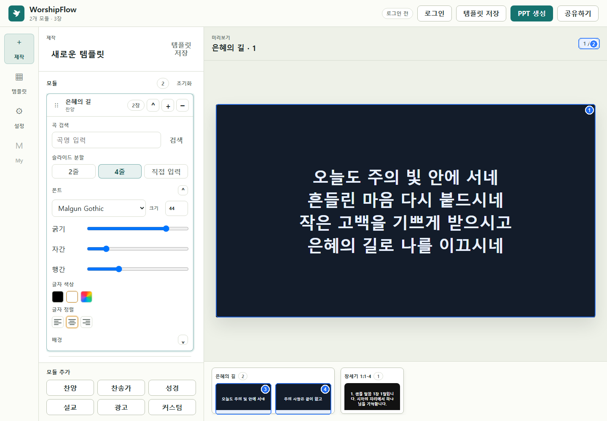

| 번호 | 화면 항목 | IA 위치 | 설명 | 확인 포인트 |
|---:|---|---|---|---|
| 1 | 현재 PPT 미리보기 | 4.1.1.3, 4.1.1.5 | 현재 선택된 슬라이드 내용을 표시한다. | 클릭 전 선택 슬라이드 기준 화면이다. |
| 2 | 슬라이드 카운터 | 4.1.1.4 | 현재 순번 / 전체 PPT 장 수를 표시한다. | 썸네일 클릭 후 값이 바뀐다. |
| 3 | 현재 썸네일 | 4.1.3.1 | 현재 선택된 썸네일이다. | 활성 스타일을 확인한다. |
| 4 | 이동 대상 썸네일 | 4.1.1.1, 4.1.1.2 | 클릭할 썸네일이다. | 클릭 시 slideId/moduleId가 변경된다. |

## 02. 미리보기 썸네일 클릭 후

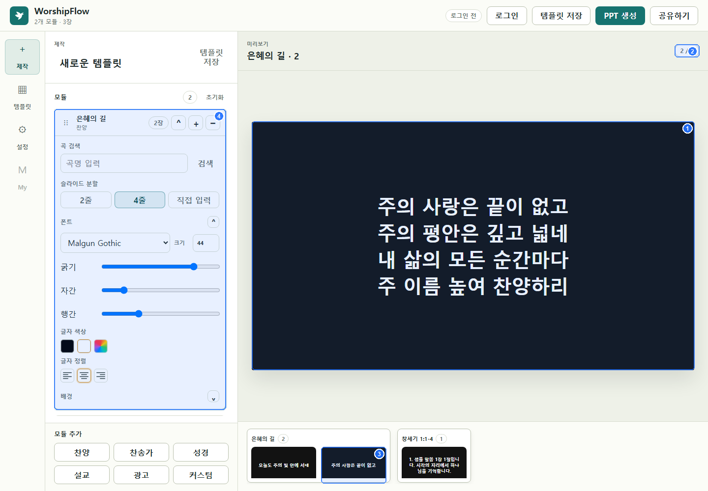

| 번호 | 화면 항목 | IA 위치 | 설명 | 확인 포인트 |
|---:|---|---|---|---|
| 1 | 변경된 미리보기 | 4.1.1.5 | 클릭한 썸네일의 슬라이드 내용으로 변경된다. | 본문이 대상 슬라이드로 바뀐다. |
| 2 | 변경된 카운터 | 4.1.1.4 | 클릭한 슬라이드 순번 기준으로 갱신된다. | `현재 / 전체` 값이 갱신된다. |
| 3 | 활성 썸네일 | 4.1.1.1 | 클릭한 썸네일이 활성 상태가 된다. | active 스타일을 확인한다. |
| 4 | 선택 모듈 카드 | 4.1.1.6 | 제작탭의 선택 모듈도 함께 하이라이트된다. | 모듈 카드 선택 상태를 확인한다. |

## 03. 모듈 추가 전

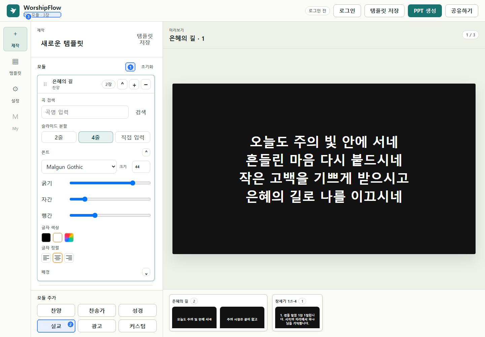

| 번호 | 화면 항목 | IA 위치 | 설명 | 확인 포인트 |
|---:|---|---|---|---|
| 1 | 전체 모듈 수 | 4.2.2.5 | 추가 전 모듈 수를 표시한다. | 클릭 후 증가한다. |
| 2 | 설교 추가 버튼 | 4.2.2.1 | 설교 모듈을 새로 추가하는 버튼이다. | 버튼 클릭이 시작 조건이다. |
| 3 | 프로젝트 요약 | 4.2.2.5 | 모듈 수와 PPT 장 수 요약이다. | 클릭 후 함께 갱신된다. |

## 04. 모듈 추가 후

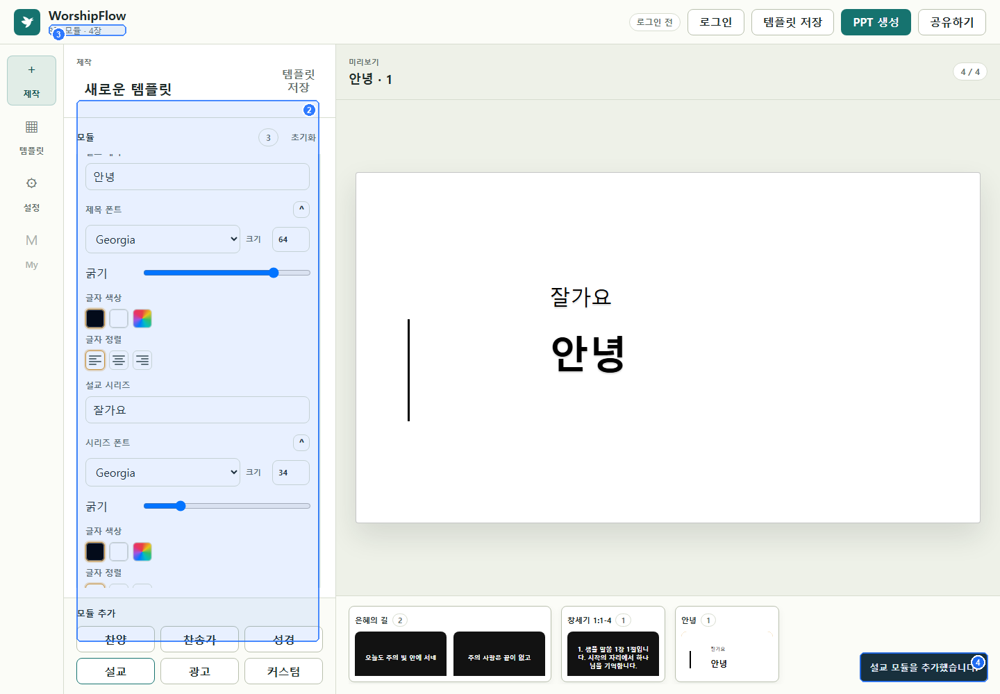

| 번호 | 화면 항목 | IA 위치 | 설명 | 확인 포인트 |
|---:|---|---|---|---|
| 1 | 증가한 모듈 수 | 4.2.2.5 | 새 모듈 추가 후 모듈 수가 증가한다. | 숫자 배지가 갱신된다. |
| 2 | 새 선택 모듈 | 4.2.2.2, 4.2.2.3 | 새 모듈이 목록 마지막에 추가되고 선택된다. | 새 카드가 하이라이트된다. |
| 3 | 갱신된 프로젝트 요약 | 4.2.2.5 | 전체 모듈 수와 슬라이드 수가 갱신된다. | 상단바 요약과 일치해야 한다. |
| 4 | 토스트 | 4.2.2.7 | `{모듈 종류} 모듈을 추가했습니다.` 안내가 표시된다. | 화면 하단 토스트를 확인한다. |

## 05. 모듈 복제 전

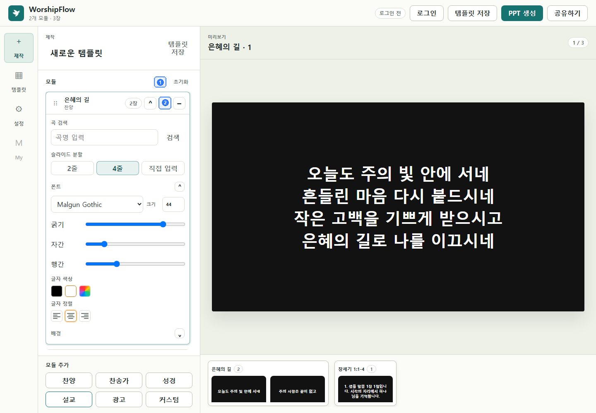

| 번호 | 화면 항목 | IA 위치 | 설명 | 확인 포인트 |
|---:|---|---|---|---|
| 1 | 복제 전 모듈 수 | 4.2.4.8 | 복제 전 전체 모듈 수이다. | 클릭 후 증가한다. |
| 2 | 복제 버튼 | 4.2.4.1 | 같은 설정을 가진 모듈을 바로 아래에 복제한다. | 클릭 대상이다. |

## 06. 모듈 복제 후

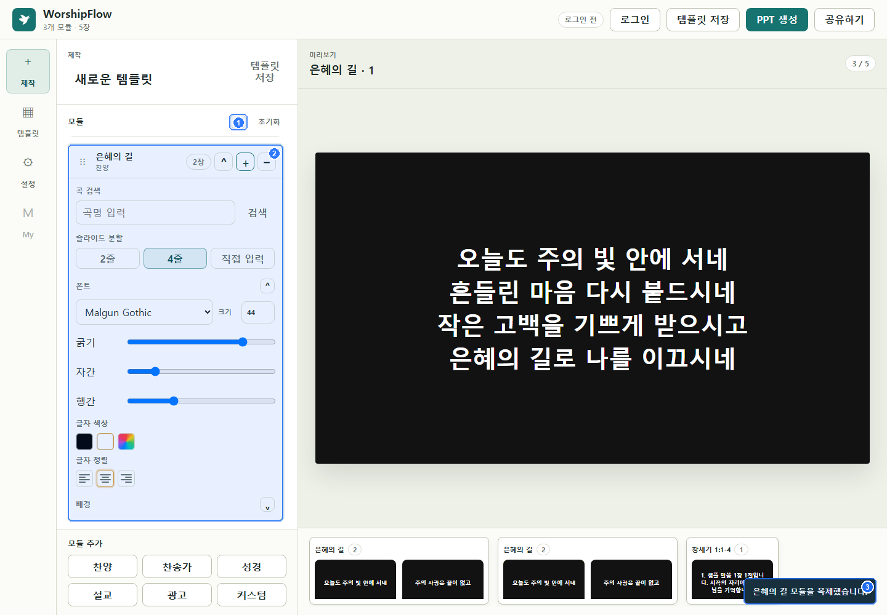

| 번호 | 화면 항목 | IA 위치 | 설명 | 확인 포인트 |
|---:|---|---|---|---|
| 1 | 복제 후 모듈 수 | 4.2.4.8 | 복제된 모듈이 추가되며 모듈 수가 증가한다. | 숫자 배지가 바뀐다. |
| 2 | 복제된 모듈 | 4.2.4.5, 4.2.4.6 | 복제된 모듈이 선택 모듈이 된다. | 선택 하이라이트를 확인한다. |
| 3 | 토스트 | 4.2.4.9 | `{모듈 이름} 모듈을 복제했습니다.` 안내가 표시된다. | 화면 하단 안내 문구를 확인한다. |

## 07. 모듈 삭제 버튼

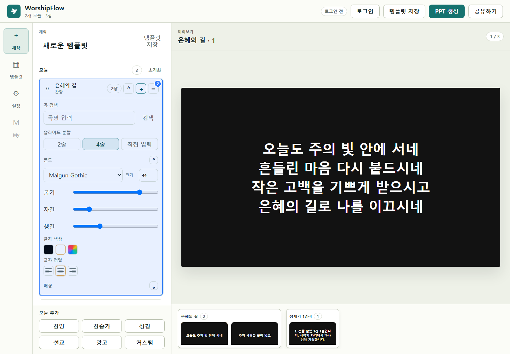

| 번호 | 화면 항목 | IA 위치 | 설명 | 확인 포인트 |
|---:|---|---|---|---|
| 1 | 삭제 버튼 | 4.2.5.1 | 클릭 시 브라우저 기본 확인창이 표시된다. | PNG에는 기본 확인창이 찍히지 않는다. |
| 2 | 삭제 대상 모듈 | 4.2.5.2 | 확인을 누르면 해당 모듈이 목록에서 제거된다. | 취소 시 상태 변경이 없다. |

## 08. 모듈 접기 전

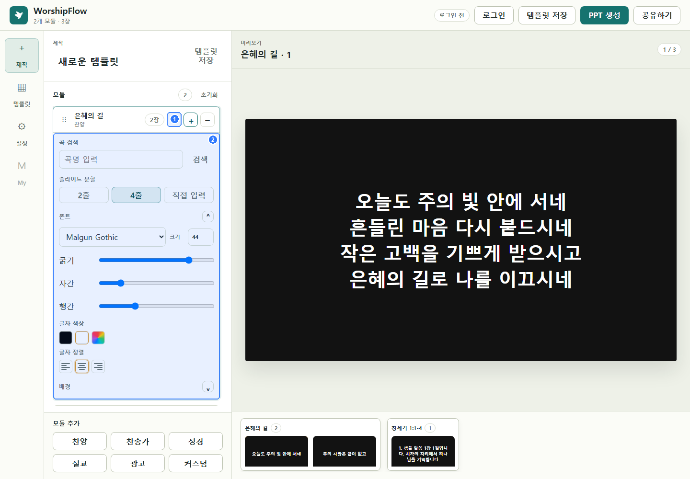

| 번호 | 화면 항목 | IA 위치 | 설명 | 확인 포인트 |
|---:|---|---|---|---|
| 1 | 접기 버튼 | 4.2.6.2 | 펼쳐진 상태에서 클릭하면 상세 설정을 숨긴다. | 버튼 아이콘 방향을 확인한다. |
| 2 | 상세 설정 영역 | 4.2.6.2 | 현재 모듈 상세 설정이 표시된 상태이다. | 클릭 후 숨김 처리된다. |

## 09. 모듈 접기 후

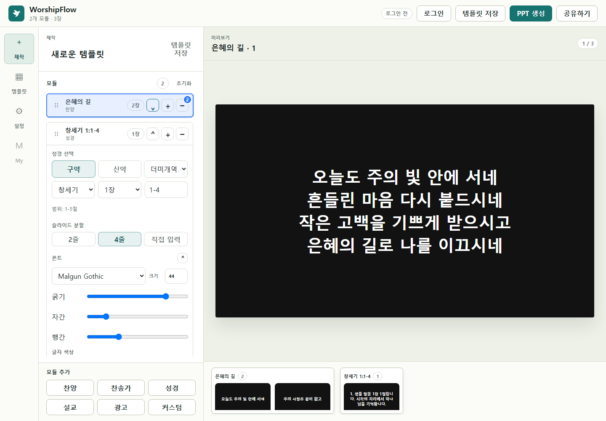

| 번호 | 화면 항목 | IA 위치 | 설명 | 확인 포인트 |
|---:|---|---|---|---|
| 1 | 펼치기 버튼 | 4.2.6.1 | 접힌 상태에서 클릭하면 상세 설정을 다시 펼친다. | 버튼 아이콘 방향이 바뀐다. |
| 2 | 접힌 모듈 카드 | 4.2.6.3 | 모듈의 접힘 상태가 저장된다. | 상세 설정 영역이 사라진다. |

## 10. 검색어 입력/결과

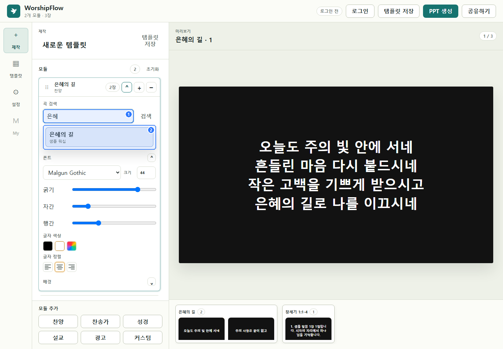

| 번호 | 화면 항목 | IA 위치 | 설명 | 확인 포인트 |
|---:|---|---|---|---|
| 1 | 검색어 입력 | 4.3.1.1 | 검색어가 모듈 상태에 저장된다. | 입력 즉시 결과 목록이 열린다. |
| 2 | 검색 결과 목록 | 4.3.1.2, 4.3.1.3 | 일치하는 곡 목록 또는 결과 없음 문구를 표시한다. | 샘플 데이터 기준 결과를 확인한다. |

## 11. 검색 결과 선택 후

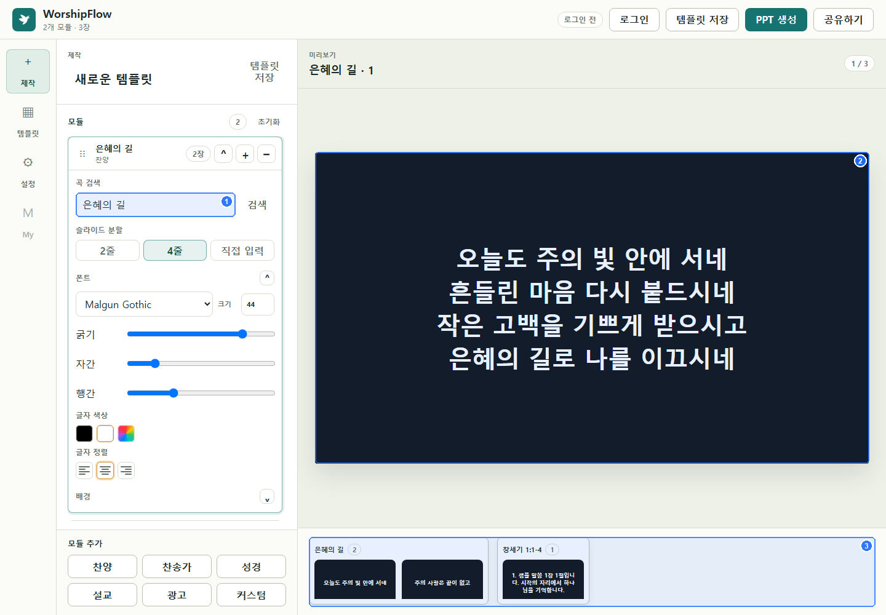

| 번호 | 화면 항목 | IA 위치 | 설명 | 확인 포인트 |
|---:|---|---|---|---|
| 1 | 선택 곡 입력값 | 4.3.2.2 | 검색창이 선택한 곡명으로 변경된다. | 결과 목록은 닫힌다. |
| 2 | 미리보기 갱신 | 4.3.2.4 | 선택 곡 기준 슬라이드 내용이 변경된다. | 현재 미리보기 본문을 확인한다. |
| 3 | 썸네일 갱신 | 4.3.2.4 | 선택 곡 기준 썸네일 목록이 변경된다. | 썸네일 수와 내용이 맞는지 확인한다. |

## 12. 성경 절 범위 오류

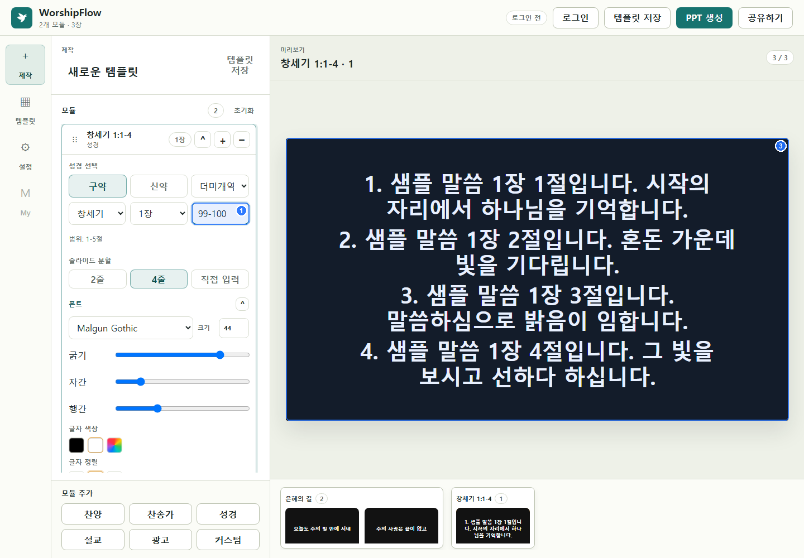

| 번호 | 화면 항목 | IA 위치 | 설명 | 확인 포인트 |
|---:|---|---|---|---|
| 1 | 잘못된 절 범위 | 4.3.4.1 | 유효하지 않은 절 범위가 모듈 상태에 저장된다. | 입력 필드가 오류 상태가 된다. |
| 2 | 오류 문구 | 4.3.4.3 | 데이터 범위를 벗어나면 오류 문구가 표시된다. | `DB에 있는 절 범위` 문구를 확인한다. |
| 3 | 미리보기 오류 | 4.11.2.3 | PPT 생성 전에도 미리보기에서 오류 상태를 확인할 수 있다. | PPT 생성 시 파일이 생성되지 않는다. |

## 13. 템플릿 저장 모달

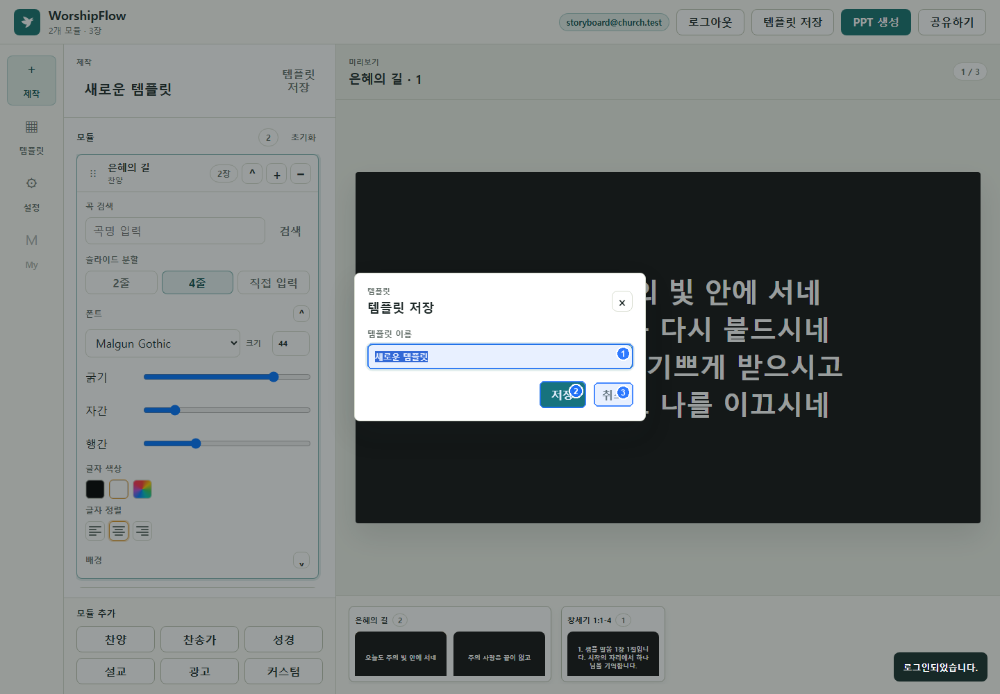

| 번호 | 화면 항목 | IA 위치 | 설명 | 확인 포인트 |
|---:|---|---|---|---|
| 1 | 템플릿 이름 입력 | 4.7.3.1, 4.7.3.2 | 현재 템플릿 이름이 기본값으로 입력되고 선택된다. | 로그인 후 저장 흐름에서 열린다. |
| 2 | 저장 버튼 | 4.7.3.3 | 입력한 이름으로 새 템플릿을 저장한다. | 저장 후 토스트가 표시된다. |
| 3 | 취소 버튼 | 4.7.4.1 | 저장하지 않고 모달을 닫는다. | 대기 중 작업은 취소될 수 있다. |

## 14. 템플릿 적용 화면

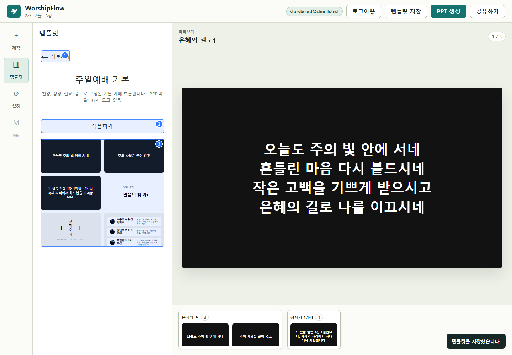

| 번호 | 화면 항목 | IA 위치 | 설명 | 확인 포인트 |
|---:|---|---|---|---|
| 1 | 뒤로가기 | 4.8.4.1 | 미리보기 상태를 해제하고 목록으로 돌아간다. | 목록 화면 복귀를 확인한다. |
| 2 | 적용하기 | 4.8.6.1, 4.8.6.2 | 저장 여부 확인 후 선택 템플릿을 불러온다. | 완료 시 제작탭으로 이동한다. |
| 3 | 적용 대상 슬라이드 | 4.8.6.9 | 불러올 템플릿의 슬라이드 구성을 보여준다. | 적용 후 모듈/설정이 이 구성으로 바뀐다. |

## 15. 설정 비율/로고

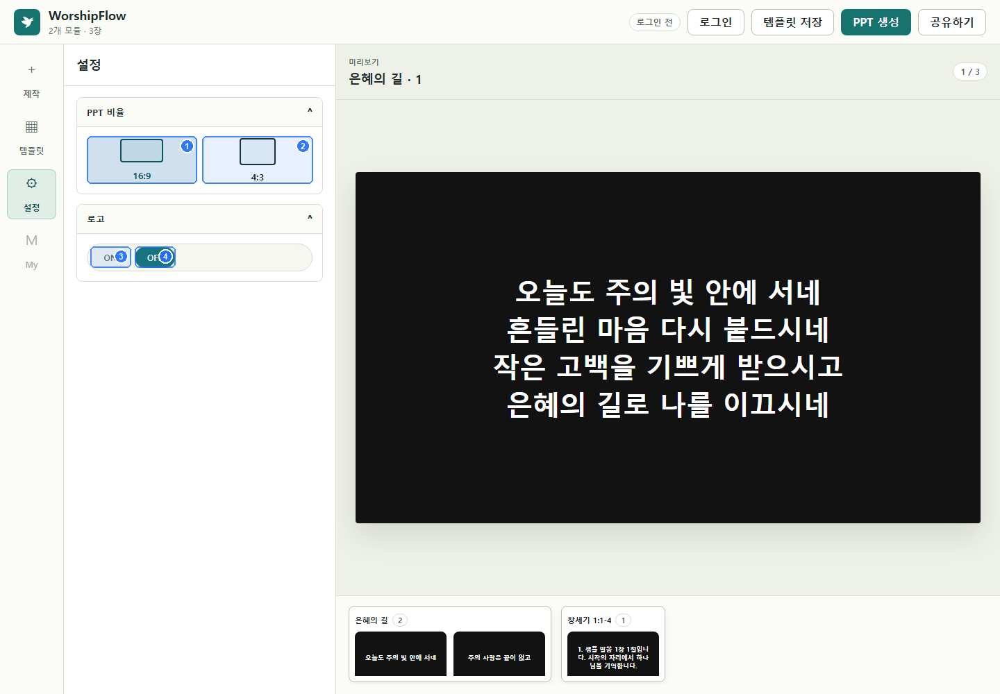

| 번호 | 화면 항목 | IA 위치 | 설명 | 확인 포인트 |
|---:|---|---|---|---|
| 1 | 16:9 | 4.9.3.1 | PPT 비율을 16:9로 저장한다. | 미리보기 비율이 갱신된다. |
| 2 | 4:3 | 4.9.4.1 | PPT 비율을 4:3으로 저장한다. | PPT 생성 시 4:3이 적용된다. |
| 3 | 로고 ON | 4.9.6.1 | 로고 사용 여부를 켠다. | 상세 설정 영역이 표시된다. |
| 4 | 로고 OFF | 4.9.7.1 | 로고 사용 여부를 끈다. | 미리보기/PPT에서 로고가 제외된다. |
| 5 | 로고 위치 | 4.9.10.1 | 좌상단, 우상단, 좌하단, 우하단 위치를 선택한다. | 로고 위치가 즉시 저장된다. |

## 16. 공유 모달/링크 복사

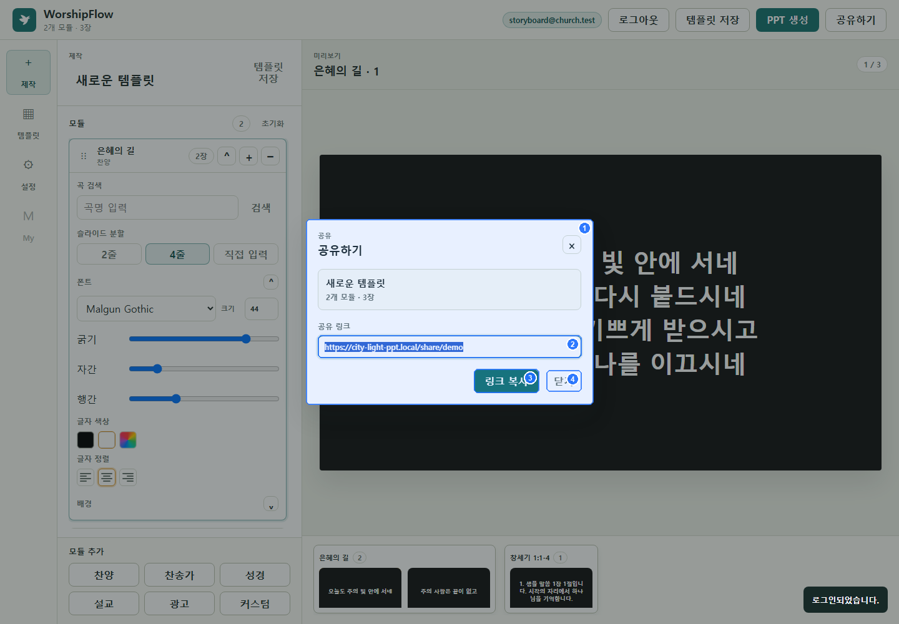

| 번호 | 화면 항목 | IA 위치 | 설명 | 확인 포인트 |
|---:|---|---|---|---|
| 1 | 공유 모달 | 4.12.2 | 로그인 상태에서 공유하기 클릭 시 열린다. | 템플릿 이름과 요약이 표시된다. |
| 2 | 공유 링크 | 4.12.2.4, 4.12.2.5 | 현재 템플릿 ID 또는 `demo` 기준 공유 URL을 표시한다. | 입력값이 선택된 상태로 열린다. |
| 3 | 링크 복사 | 4.12.3.1, 4.12.3.3 | 링크를 선택하고 클립보드 복사를 시도한다. | 복사 완료 토스트가 표시된다. |
| 4 | 닫기 | 4.12.4.1 | 공유 모달을 닫는다. | 모달이 숨김 처리된다. |

## 동작 보강 메모

- 브라우저 기본 `confirm` 창은 headless 캡쳐에 포함되지 않으므로, 삭제/초기화/덮어쓰기 확인창은 버튼 위치와 표 설명으로 표시했다.
- PPT 생성은 실제 다운로드가 발생하는 동작이므로, 본 문서에서는 로그인 필요 조건, 성경 범위 검증, 성공 토스트 흐름을 IA 설명 기준으로 연결한다.
- 드래그앤드롭은 정적 캡쳐보다 전후 순서 비교가 중요하므로, 공통 모듈 카드의 드래그 핸들 위치와 IA `4.2.3` 설명을 함께 확인한다.
- 주석 없는 원본 캡쳐는 [storyboard/actions/raw](storyboard/actions/raw)에 보관되어 있다.
